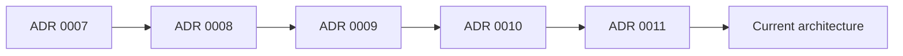
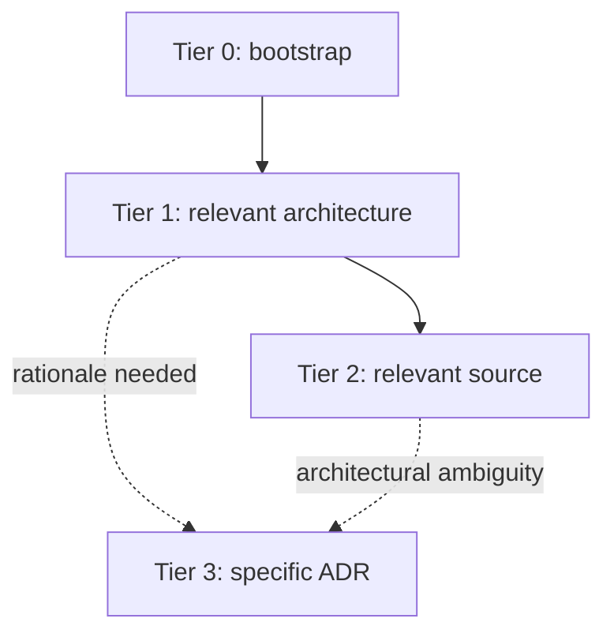
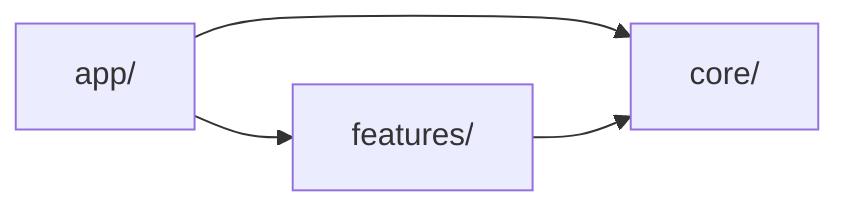
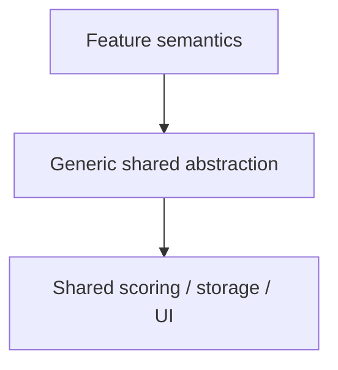
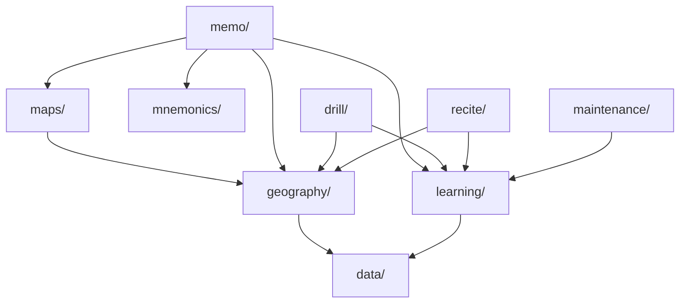
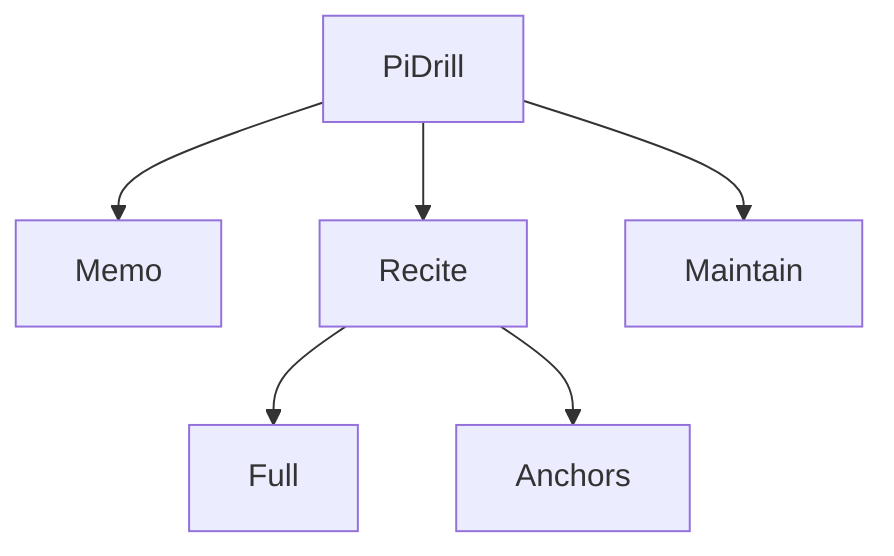
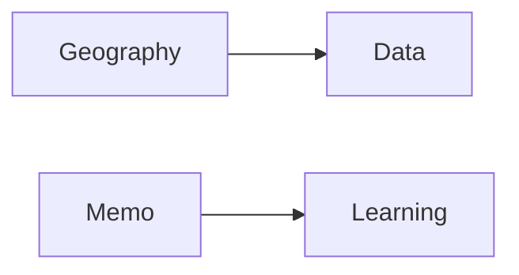
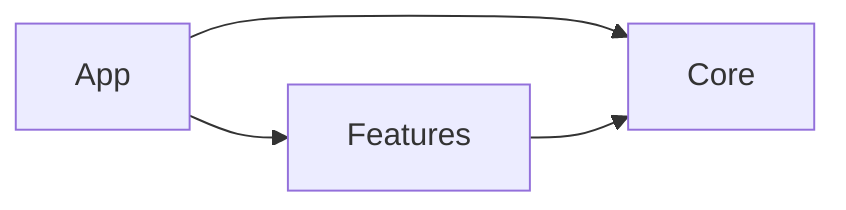

# ADR 0012 — Agent-Oriented Current-State Architecture Documentation

* **Status:** Accepted
* **Date:** 2026-08-09
* **Scope:** Repository-wide coding-agent context and architecture documentation
* **Goal:** Route coding agents to the minimum sufficient context required to make structurally correct changes while preserving architectural invariants

---

## Context

This repository is maintained by a very small number of developers and is developed heavily through coding agents.

The primary consumers of architecture documentation are therefore coding agents.

The documentation system should optimize for three outcomes:

1. agents load the minimum sufficient context for the task;
2. agents make structurally correct ownership and dependency decisions;
3. agents preserve architectural invariants.

A fourth requirement follows from these:

> Agents must know when their current context is insufficient and exactly what additional context to load.

The repository already contains substantial architectural history in ADRs.

Existing decisions cover areas such as:

* repository structure;
* Cards and PAO organization;
* Pi architecture;
* shared learning;
* shared mnemonics;
* World Countries workflows;
* Subregion identity and ordering;
* World Countries structural reorganization;
* later corrections to World Countries capability ownership.

ADRs are useful because they preserve **why** architectural decisions were made.

They are not suitable as the normal source of **current architecture** for coding agents.

For example, the current World Countries architecture is the resolved outcome of several decisions:



An agent performing normal World Countries work should receive the current result, not reconstruct the ADR chain.

The current World Countries implementation is approximately:

```text
src/features/world-countries/
  WorldCountries.tsx
  index.ts

  data/
  geography/
  learning/
  maps/
  mnemonics/

  memo/
  drill/
  recite/
  maintenance/
```

The repository also exposes architecture through several overlapping context sources:

```text
CLAUDE.md
AGENTS.md
src/features/*/AGENTS.md
CONTEXT.md
PRODUCT.md
docs/agents/*
docs/adr/*
```

This creates agent-specific hazards:

* excessive auto-loaded context;
* duplicated architecture;
* stale architecture snapshots;
* unnecessary ADR loading;
* broad source-tree discovery;
* inspection of unrelated features;
* incorrect reconstruction of historical structures;
* uncertainty about where new code belongs;
* structural violations that compile and pass tests.

World Countries currently represents an active version of this problem: repository-level agent context can present an incomplete feature inventory even though World Countries is a substantial current feature.

The project therefore needs a small current-state architecture layer designed explicitly for **agent context routing and structural correctness**.

---

# Decision

Introduce:

```text
docs/
  architecture/
    SYSTEM.md
    CORE.md
    PERSISTENCE.md
    INVARIANTS.md

    features/
      PI.md
      WORLD_COUNTRIES.md

  adr/
    ...
    0012-agent-oriented-current-state-architecture-documentation.md
```

Additional feature documents may be introduced when they materially improve agent correctness or reduce discovery cost.

The documentation system will use explicit context tiers.

---

# 1. Context tiers

Agent context is divided into four tiers.

## Tier 0 — bootstrap context

Tier 0 is always available or mandatory before normal code modification.

It contains:

```text
CLAUDE.md
applicable AGENTS.md instructions
compact global architectural invariants
```

Tier 0 must remain small.

Its purpose is to tell the agent:

* which rules always apply;
* which discovery boundaries apply;
* which context to load next;
* when broader context is required;
* how to validate the change.

Tier 0 must not become a complete architecture handbook.

---

## Tier 1 — task-selected architecture

Tier 1 is loaded only when relevant.

Examples:

```text
docs/architecture/SYSTEM.md
docs/architecture/CORE.md
docs/architecture/PERSISTENCE.md
docs/architecture/features/PI.md
docs/architecture/features/WORLD_COUNTRIES.md
```

Tier 1 contains current architectural decision support.

Agents must not load every Tier 1 document by default.

---

## Tier 2 — implementation context

Tier 2 contains the relevant:

```text
source files
tests
types
stores
direct dependencies
```

Source discovery should start from source anchors provided by Tier 1 documents or feature `AGENTS.md`.

Agents should avoid recursive repository-wide exploration when the relevant scope is already known.

---

## Tier 3 — historical context

Tier 3 consists of specific ADRs.

Tier 3 is opt-in.

Agents should load historical ADRs only when architectural rationale is actually required.

---

# 2. Default agent flow

The normal context flow is:



The objective is:

> **minimum sufficient context**

not minimum context at any cost.

Agents should stop loading additional context once they can safely perform the task.

---

# 3. Bootstrap contract

The eventual `CLAUDE.md` should be small and contain guidance equivalent to:

```text
Follow applicable AGENTS.md instructions.

Preserve the global architectural invariants below.

Architecture entry point:
docs/architecture/SYSTEM.md

Load only architecture relevant to the task.

Feature task:
load that feature's architecture document when one exists.

Shared-core change:
load CORE.md.

Persistence change:
load PERSISTENCE.md.

Do not load ADRs unless historical rationale is required.

Do not scan sibling features unless the task crosses feature boundaries.
```

Bootstrap content should prioritize routing rules and global constraints over descriptive architecture.

---

# 4. Global invariants are Tier 0 context

Architectural invariants are higher priority than descriptive architecture because many invariant violations can compile and pass tests while still being structurally wrong.

`docs/architecture/INVARIANTS.md` is the canonical source of global architectural invariants.

A compact copy of the global invariants must also appear directly in Tier 0 bootstrap context, normally `CLAUDE.md`.

Agents must not be required to remember to load `INVARIANTS.md` before ordinary code changes.

Feature-specific invariants remain in selectively loaded feature architecture documents.

Candidate global invariants to verify include:

```text
core/ must not depend on app/ or feature domains.

features may depend on core/.

app/ owns high-level composition.

feature-specific domain semantics do not belong in generic core infrastructure.

external consumers should use feature public boundaries where defined.

feature persistence must not modify unrelated feature persistence.

shared mnemonic infrastructure treats feature-defined target IDs as opaque.
```

Only verified invariants belong in the canonical file.

The Tier 0 copy should contain concise rules only.

`INVARIANTS.md` may contain:

* scope;
* clarification;
* intentional exceptions;
* links to relevant ADR rationale.

When a global invariant changes, both the canonical version and its Tier 0 representation must be updated in the same change.

---

# 5. `SYSTEM.md` is a context router

`SYSTEM.md` must remain deliberately small.

Its job is not to explain every feature.

It should help an agent answer:

```text
What are the top-level architectural areas?

Which dependency directions are legal?

Which feature or capability likely owns this change?

Which architecture document should I load next?

Does this task cross a feature boundary?
```

A suitable top-level dependency model is:



Unless explicitly stated otherwise, arrows in architecture diagrams mean:

> **source depends on / uses target**

Therefore:

```text
Features --> Core
```

means:

```text
features/ depends on core/
```

not the reverse.

Where a diagram represents composition, data flow, ownership, or another relationship instead of dependency, that meaning must be stated immediately before the diagram.

`SYSTEM.md` should contain:

* runtime model;
* `app/`, `core/`, and `features/` roles;
* legal dependency direction;
* major feature inventory;
* intentional cross-feature dependencies;
* links to relevant feature documents;
* links to `CORE.md` and `PERSISTENCE.md`;
* escalation rules;
* a small number of source anchors where useful.

It should not contain detailed internal feature architecture.

---

# 6. Context escalation rules

Architecture documentation must tell agents when local context is insufficient.

Examples:

```text
Feature-local UI or behavior:
    remain inside the feature unless a shared boundary is touched.

Changing shared learning:
    load CORE.md and inspect concrete affected feature consumers.

Changing persistent state or schema:
    load PERSISTENCE.md.

Changing app/core/feature ownership:
    load SYSTEM.md and relevant feature architecture.

Changing a feature public boundary:
    load SYSTEM.md and that feature architecture.

Changing a documented invariant:
    load INVARIANTS.md and relevant historical rationale.

Questioning why a boundary exists:
    load the referenced ADR.

Cross-feature change:
    load architecture only for affected features.
```

Agents should escalate deliberately instead of broadly scanning the repository.

---

# 7. `CORE.md` is a placement decision tool

The primary purpose of `CORE.md` is to answer:

> **Does this behavior belong in `core/` or inside a feature?**

A module belongs in `core/` only when:

1. it contains no feature-domain semantics;
2. its abstraction is genuinely feature-independent;
3. it already has a cross-feature use, or there is an explicit architectural reason to share it now;
4. it does not depend on `app/` or `features/`.

Code that merely appears reusable should remain in the owning feature until a real shared abstraction exists.

Feature-domain concepts that should not leak into generic core infrastructure include examples such as:

```text
Country
Capital
Subregion
PiPair
PiSegment
PAO-specific concepts
```

The dependency model is:



Again, arrows mean dependency.

`CORE.md` should also describe:

* shared learning;
* shared mnemonics;
* scoring;
* scheduling;
* shared storage helpers;
* shared UI primitives;
* important shared invariants;
* source anchors;
* when implementation should remain feature-local.

It should not become a narrative inventory of every file under `core/`.

---

# 8. `PERSISTENCE.md` is required

`PERSISTENCE.md` is a required current-state architecture document.

Persistence contains architectural constraints that are not reliably discoverable through feature-local exploration.

A concrete example is the IndexedDB ownership model.

The current IndexedDB connection/version is centrally owned through:

```text
core/scoring/attemptStore.ts
```

Other capabilities that use that database must reuse the existing ownership model rather than independently opening or versioning the same IndexedDB database.

A second connection using a competing database version can create blocked upgrade behavior and runtime hangs even when the implementation compiles and ordinary tests pass.

This makes persistence ownership a high-risk agent correctness boundary.

`PERSISTENCE.md` must document:

* browser persistence technologies;
* the IndexedDB connection/version owner;
* significant object stores;
* rules for adding IndexedDB stores;
* localStorage versus IndexedDB ownership;
* shared versus feature-local persistence;
* stable identifiers where architectural;
* feature isolation;
* migration constraints;
* backup/import/export relationships where architectural.

The document should answer:

```text
Who owns this persisted state?

Which storage system contains it?

Who owns database/version changes?

How should a new store be added?

Which other feature state must this change not affect?
```

It should not list every trivial UI preference.

---

# 9. Feature `AGENTS.md` files are task bootstrap files

A feature `AGENTS.md` should answer one primary question:

> **I am starting a task in this feature. What must I load or know before touching code?**

It should contain:

* required architecture document;
* additional context triggers;
* required domain context if applicable;
* allowed discovery scope;
* directories normally outside scope;
* validation commands;
* known implementation traps;
* important starting files.

It should not contain:

* a full architecture description;
* duplicated persistence architecture;
* ADR history;
* large source-tree walkthroughs.

For example:

```text
For World Countries work:

Read:
  docs/architecture/features/WORLD_COUNTRIES.md

Load CORE.md only if changing shared capability behavior.

Load PERSISTENCE.md only if changing persisted state.

Normally remain inside:
  src/features/world-countries/
  plus direct core dependencies.

Do not inspect sibling features unless the task explicitly crosses those boundaries.
```

---

# 10. Feature architecture document format

Feature architecture documents should use a predictable structure:

```text
# Feature

## Agent loading
## Purpose
## Entry points
## Ownership
## Decision rules
## Dependencies
## Persistence
## Public boundary
## Invariants
## Source anchors
## Historical rationale
```

The two routing-oriented sections have distinct responsibilities.

## `Agent loading`

Answers:

> **What context must I load before modifying this feature?**

It contains:

* mandatory architecture context;
* optional architecture context and its trigger;
* domain context;
* discovery boundaries;
* relevant feature `AGENTS.md`.

It does not contain ownership or placement rules.

## `Decision rules`

Answers:

> **Given that I am already working in this feature, where should new behavior or state belong?**

It contains rules for:

* capability versus workflow ownership;
* feature-local versus shared placement;
* authoritative data ownership;
* persistence ownership;
* public versus internal APIs;
* allowed internal dependency direction.

Context-routing instructions do not belong in this section.

---

# 11. `WORLD_COUNTRIES.md`

World Countries has the highest immediate need for a current-state feature architecture document.

Its architecture is the resolved result of several recent decisions and should not be reconstructed from historical ADRs.

Current ownership is approximately:

```text
data/
    canonical Geography identity and reference data

geography/
    Geography queries
    Subregion metadata
    effective Country ordering
    metadata persistence

learning/
    answer evaluation
    session mechanics
    learning-flow state
    durable learning state

maps/
    SVG infrastructure
    map definitions
    CountryId ↔ SVG-ID translation
    map assets

mnemonics/
    Geography mnemonic targets and content

memo/
    instructional learning workflow

drill/
    deliberate-practice workflow

recite/
    ordered-recall workflow

maintenance/
    system-directed review workflow
```

The dependency model should use dependency-direction arrows:



Feature invariants should include verified rules such as:

```text
CountryId and SVG ID are distinct identities.

data/ owns canonical Geography identity and membership.

SubregionMetadata.countryOrder changes user ordering, not canonical membership.

shared Geography and learning behavior must not become workflow-owned.

workflow folders must not depend on one another's internals.

WorldCountries.tsx owns composition rather than capability rules.

World Countries persistence must not modify unrelated feature state.
```

Historical structures such as:

```text
quiz/
domain/
persistence/
common/
root learning.ts
```

must not appear as current architecture.

The `Historical rationale` section should state:

```text
The current architecture described above resolves:

- ADR 0007
- ADR 0008
- ADR 0009
- ADR 0010
- ADR 0011

These ADRs are not required to understand the current structure.
Load them only when historical rationale is needed.
```

The word **resolves** is intentional: it tells agents that the current document already represents the combined current effect of those decisions.

---

# 12. `PI.md`

`PI.md` should describe current Pi architecture rather than preserving an older structural snapshot.

For composition, the relationship must be stated explicitly.

The following diagram shows **feature composition**, not dependency direction:



A separate dependency statement may describe that:

```text
memo/ uses shared/
recite/ uses shared/
maintain/ uses shared/
```

The document should help agents decide:

* where Pi-specific behavior belongs;
* Memo versus Recite versus Maintain ownership;
* Full versus Anchors ownership inside Recite;
* what belongs in Pi `shared/`;
* pair/segment model boundaries;
* persistence ownership;
* dependency on Major System words;
* public feature boundary;
* important invariants;
* source anchors.

Historical Pi architecture remains in ADR history.

---

# 13. Other feature documents

Major System and Cards should be evaluated based on agent value, not symmetry.

Create:

```text
features/MAJOR_SYSTEM.md
features/CARDS.md
```

only if one compact document materially improves agent correctness or reduces recurring source discovery.

The test is:

> **Does this document prevent meaningful placement errors or eliminate significant repeated discovery for common tasks?**

The current complexity of Major System and Cards suggests they may justify dedicated documents, but this should be verified during consolidation.

---

# 14. ADRs are historical, opt-in context

ADRs answer:

> **Why does this architectural rule or structure exist?**

They are not normal task context.

Agents should read a specific ADR when:

* reconsidering a decision;
* creating a new architectural decision that builds on it;
* investigating legacy behavior;
* resolving a contradiction between architecture and implementation;
* understanding the rationale for an unusual invariant;
* explicitly instructed by a current architecture document.

Agents should not load all ADRs related to the feature being edited.

Current architecture documents must already contain the resolved current result.

---

# 15. Historical-rationale routing

A separate `DECISION_INDEX.md` is not required initially.

Each architecture document should contain a concise `Historical rationale` section linking directly to relevant ADRs.

Example:

```text
## Historical rationale

The current shared-learning architecture resolves:
- ADR 0005

Load ADR 0005 only if the reasoning behind this boundary is needed.
```

This avoids introducing another navigation hop.

A separate ADR index may be introduced later if the number of decisions becomes large enough that direct routing no longer scales.

---

# 16. Mermaid diagram rules

Use Mermaid when it communicates architecture more efficiently than equivalent prose.

Good uses include:

* dependency direction;
* ownership relationships;
* feature composition;
* persistence ownership;
* state transitions;
* cross-feature relationships.

Unless explicitly stated otherwise:

> **An arrow means the source depends on / uses the target.**

Example:



means:

```text
geography/ depends on data/
memo/ depends on learning/
```

If a diagram instead represents:

```text
composition
data flow
ownership
event flow
state transition
```

the relationship must be stated immediately before the diagram.

Do not use unlabeled arrows where the meaning could reasonably be interpreted in multiple ways.

Prefer small diagrams with high semantic density.

Good:



Avoid diagrams that reproduce dozens of implementation files merely because Mermaid is available.

Mermaid is preferred over binary architecture images because it is:

* textual;
* diffable;
* GitHub-renderable;
* readable by agents;
* easy for agents to update.

ASCII remains acceptable where it is clearer or shorter.

---

# 17. Source anchors

Architecture documents should provide a small set of source anchors.

Example:

```text
## Source anchors

- `src/features/world-countries/WorldCountries.tsx`
- `src/features/world-countries/index.ts`
- `src/features/world-countries/data/countries.ts`
- `src/features/world-countries/geography/queries.ts`
- `src/features/world-countries/learning/`
```

Source anchors identify the best starting points for discovery.

They are not inventories.

Their purpose is to prevent agents from scanning entire features when a few files establish the relevant architecture.

---

# 18. `CONTEXT.md`

A root `CONTEXT.md` is not required merely because one currently exists.

During consolidation:

* move source-tree maps and architecture ownership into `docs/architecture/`;
* preserve genuinely global domain terminology only if useful;
* move feature-specific terminology closer to the relevant feature where practical;
* remove the root `CONTEXT.md` if no clear global responsibility remains.

Do not maintain another parallel architecture snapshot.

---

# 19. `CLAUDE.md`

`CLAUDE.md` currently contains too much repository architecture for an always-loaded file.

Its long-term role is Tier 0 bootstrap only.

It should contain:

* compact global invariants;
* global agent instructions that genuinely need automatic availability;
* context-routing rules;
* pointers to architecture documents;
* Claude-specific operational guidance where necessary.

It should not contain:

* full feature layouts;
* detailed persistence documentation;
* complete scoring models;
* duplicated feature architecture;
* ADR history summaries.

Architectural information must not be removed from `CLAUDE.md` until equivalent verified context exists elsewhere.

---

# 20. Step 0 — correct the World Countries bootstrap gap

Before the ADR 0012 consolidation begins, correct the current repository bootstrap so that World Countries is represented as an existing top-level feature.

This is **Step 0**.

The correction should be deliberately minimal.

It should not add the full World Countries architecture to `CLAUDE.md`.

Its purpose is only to prevent agents performing cross-cutting work from reasoning from an incomplete feature inventory while the architecture layer is being created.

Detailed World Countries architecture belongs in:

```text
docs/architecture/features/WORLD_COUNTRIES.md
```

and should be created immediately after global invariant bootstrap work.

---

# 21. Architecture-document update rule

No heavyweight tracking or governance process is introduced.

The maintenance rule is:

> **When an agent changes an architectural boundary, it must update the affected current-state architecture in the same change.**

Examples:

```text
change feature ownership
→ update relevant feature architecture

change app/core/features dependency direction
→ update SYSTEM.md

change core placement rules
→ update CORE.md

change persistent-state ownership or IndexedDB structure
→ update PERSISTENCE.md

change or introduce a global invariant
→ update INVARIANTS.md and Tier 0 invariant copy

change a feature invariant
→ update that feature architecture

new ADR changes current architecture
→ update the affected current-state architecture
```

Ordinary changes that preserve architecture do not require architecture-document updates.

Examples:

```text
UI styling
copy changes
local helper extraction
bug fixes preserving existing boundaries
small component refactors
```

---

# 22. Simplified ADR lifecycle

For future architectural changes:

```text
write ADR when architectural reasoning is needed
        ↓
implement
        ↓
update affected current-state architecture
        ↓
update invariants if changed
        ↓
update agent routing if loading rules changed
```

No additional tracking artifact is required by this ADR.

---

# 23. Initial consolidation is hazard-driven

The initial consolidation should prioritize agent correctness hazards rather than documentation completeness.

The order is:

```text
0. Correct the World Countries bootstrap omission.

1. Verify global architectural invariants.

2. Create INVARIANTS.md.

3. Copy the compact global invariant set into Tier 0 bootstrap.

4. Create features/WORLD_COUNTRIES.md.

5. Create minimal SYSTEM.md context routing.

6. Create CORE.md as a placement and dependency decision tool.

7. Create PERSISTENCE.md, including the IndexedDB single-owner/version rule.

8. Create features/PI.md.

9. Evaluate Major System for a dedicated feature architecture document.

10. Evaluate Cards for a dedicated feature architecture document.

11. Create additional feature documents where justified.

12. Convert feature AGENTS.md files into focused task-bootstrap/context-routing files.

13. Remove or reduce duplicated architecture in CONTEXT.md.

14. Verify current-state documents against implementation and tests.

15. Reduce CLAUDE.md last, after replacement context exists.

16. Remove remaining stale or competing architecture snapshots where they create agent ambiguity.
```

This order is intentional.

The highest-risk correctness hazards are addressed first.

Documentation cleanup happens later.

`CLAUDE.md` reduction happens last.

---

# 24. Example agent context loads

## World Countries feature-local task

Load:

```text
Tier 0 bootstrap
src/features/world-countries/AGENTS.md
docs/architecture/features/WORLD_COUNTRIES.md
relevant World Countries source
```

Load `SYSTEM.md` only if the task affects feature boundaries, ownership, or cross-feature behavior.

Load `CORE.md` only if shared capability behavior is involved.

Load `PERSISTENCE.md` only if persistence is involved.

Normally do not load:

```text
Pi architecture
Cards source
Major System source
ADR 0007–0011
unrelated core modules
```

---

## Pi feature-local task

Load:

```text
Tier 0 bootstrap
src/features/pi/AGENTS.md
docs/architecture/features/PI.md
relevant Pi source
```

Escalate only when the task touches shared or persistence boundaries.

---

## Shared learning change

Load:

```text
Tier 0 bootstrap
SYSTEM.md
CORE.md
relevant core learning source
architecture/source for concrete affected consumers
```

Broader context is appropriate because the architectural impact is broader.

---

## Persistence change

Load:

```text
Tier 0 bootstrap
PERSISTENCE.md
relevant feature architecture
relevant persistence implementation
```

If the change affects ownership or cross-feature boundaries, also load `SYSTEM.md`.

---

# Consequences

## Positive

* Agents receive less irrelevant context.
* Global invariants are present before ordinary modification decisions.
* High-risk structural rules are not dependent on optional discovery.
* Historical ADR chains are removed from normal task context.
* Feature work can remain feature-scoped.
* Agents receive explicit escalation rules when local context is insufficient.
* `CORE.md` directly supports shared-versus-feature placement decisions.
* `PERSISTENCE.md` exposes runtime constraints that source-local reasoning may miss.
* Feature `AGENTS.md` files become task routers rather than competing architecture manuals.
* World Countries receives a current-state structural model.
* Source anchors reduce recursive exploration.
* `CLAUDE.md` can become significantly smaller.
* Mermaid diagrams communicate structural relationships with explicit semantics.
* Documentation work is prioritized by correctness hazard rather than completeness.

## Negative

* Current-state architecture still requires maintenance when boundaries change.
* Incorrect current-state documentation can mislead agents efficiently.
* Global invariant rules are intentionally duplicated between canonical documentation and Tier 0 bootstrap.
* Tiered loading depends on agents following routing instructions.
* Initial consolidation requires verification against source and tests.

---

# Alternatives Considered

## Continue using ADRs as normal agent architecture context

Rejected.

ADRs contain historical states and require unnecessary context reconstruction.

---

## Keep full architecture in `CLAUDE.md`

Rejected.

This forces every task to pay the context cost for unrelated architecture and increases stale-snapshot risk.

---

## Load all current architecture documents for every task

Rejected.

This solves historical ambiguity but fails the context-efficiency goal.

---

## Use feature `AGENTS.md` files as the full architecture layer

Rejected.

Feature `AGENTS.md` should route agent context and behavior.

Canonical tool-independent architecture belongs under `docs/architecture/`.

---

## Keep global invariants only in `INVARIANTS.md`

Rejected.

This creates a failure mode where an agent performs a seemingly local task without loading the invariant file.

Compact global invariants therefore belong directly in Tier 0 bootstrap.

---

## Make `PERSISTENCE.md` optional

Rejected.

The IndexedDB single-owner/version constraint is a concrete example of persistence architecture that an agent may violate without compile-time or ordinary test failure.

Persistence is therefore a required architecture document.

---

## Introduce a formal documentation tracking and review process

Rejected.

The repository has very few human maintainers.

The primary problem is agent correctness, not human documentation governance.

A same-change update rule is sufficient.

---

## Introduce `DECISION_INDEX.md` immediately

Rejected for now.

Direct ADR links from the current architecture document already in context create a shorter routing path.

An ADR index can be introduced later if direct links stop scaling.

---

## Automatically generate architecture documentation from source

Rejected as the primary mechanism.

Source can reveal physical structure but cannot reliably infer:

```text
intended ownership
source-of-truth rules
architectural boundaries
intentional exceptions
why an abstraction must remain feature-local
runtime persistence constraints
```

Automated checks may enforce individual invariants where useful.

---

# Summary

The architecture documentation system exists primarily to support coding agents.

Its purpose is:

> **Route agents to the minimum sufficient context required to make structurally correct changes while preserving architectural invariants.**

Context is divided into:

```text
Tier 0 — bootstrap + global invariants
Tier 1 — task-selected architecture
Tier 2 — relevant implementation
Tier 3 — opt-in ADR history
```

Global invariants are present directly in Tier 0.

`INVARIANTS.md` remains their canonical source.

`SYSTEM.md` is a small context router.

`CORE.md` is a placement and dependency decision tool.

`PERSISTENCE.md` is mandatory because persistence includes runtime correctness constraints such as the IndexedDB single-owner/version model.

Feature architecture documents provide:

* current ownership;
* decision rules;
* dependencies;
* persistence boundaries;
* invariants;
* source anchors;
* resolved historical rationale.

Feature `AGENTS.md` files answer what an agent must load and where it may safely work.

ADRs remain opt-in historical rationale.

Mermaid diagrams are used where they communicate architecture efficiently, with explicit relationship semantics.

The initial consolidation is hazard-driven:

```text
Step 0: fix incomplete World Countries bootstrap
        ↓
global invariants
        ↓
World Countries architecture
        ↓
SYSTEM / CORE / PERSISTENCE
        ↓
remaining feature architecture
        ↓
agent-routing cleanup
        ↓
CLAUDE.md reduction last
```

There is no required tracking issue or human-oriented documentation process.

The maintenance rule is:

> **If an architectural boundary changes, update the affected current-state architecture in the same change.**
