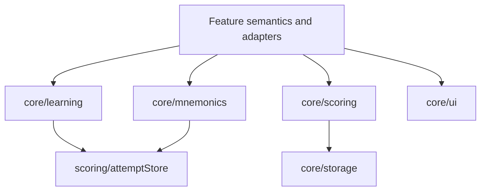

# Shared core architecture

## Agent loading

Load this document before modifying `src/core/`, extracting behavior from a
feature, or changing a shared learning, mnemonic, scoring, storage, or UI
contract. Also load:

- [PERSISTENCE.md](PERSISTENCE.md) for persisted evidence, IndexedDB, storage
  keys, migrations, or backup formats;
- the architecture and concrete source for every affected feature consumer;
- [SYSTEM.md](SYSTEM.md) if ownership or a public/cross-feature boundary moves.

## Placement test

A module belongs in `core/` only when all of these are true:

1. it contains no feature-domain semantics;
2. the abstraction is genuinely feature-independent;
3. it has a concrete cross-feature use or an explicit reason to share now;
4. it does not depend on `app/` or `features/`.

Code that merely looks reusable stays with its owning feature until a real
shared contract exists. Country, Capital, Subregion, Pi pair/segment, and
PAO-specific concepts must not leak into `core/`.

## Ownership

- `learning/` models domain-neutral recall IDs/scopes, atomic attempts,
  derived item/scope progress, mastery policy, and next-item selection.
  Attempts may carry optional `evidenceKind` (`recall` or `recognition`) and
  learner-local `localDate`; missing metadata is legacy/unknown evidence.
  Features own ID construction and the meaning of a scope.
- `mnemonics/` owns generic text-plus-image records, image processing, hooks,
  persistence access, and generic JSON encoding. Feature adapters own target
  namespaces, validation, feature metadata, and backup envelopes.
- `scoring/` owns the established Major/Pi scoring and scheduling machinery:
  per-item SM-2 state, attempt logging, timing adjustment, round scheduling,
  statistics, and related hooks.
- `storage.ts` provides guarded localStorage reads/writes; it does not assign
  ownership of keys or schemas.
- `ui/` owns reusable answer controls and primitives. It must remain free of
  feature concepts. `overlayGuard.ts` is domain-neutral coordination used to
  suppress global answer shortcuts while an app overlay is open.
- `cards.ts`, `wordsCsv.ts`, `answerMatch.ts`, and `types.ts` contain small
  domain-neutral contracts used by multiple features or by core itself.
- `createWordStore.tsx` owns the generic shipped/saved/trial layered-record
  mechanism; each feature instance owns its content and storage keys.

## Decision rules

- Feature adapters translate domain IDs to `RecallItemId`, `LearningScopeId`,
  or `MnemonicTargetId`; core treats those strings as opaque.
- Atomic learning evidence may be shared. Feature milestones, workflow phases,
  and instructional policy stay feature-local.
- Feature-specific mastery may derive directly from retained raw attempts when
  aggregate `ItemProgress` cannot express the feature policy. The generic
  mastery policy remains available and unchanged for existing consumers.
- Do not merge `core/learning` and `core/scoring` casually. `learning/` is the
  newer domain-neutral evidence/progress API; `scoring/` still owns the active
  Major/Pi SM-2 and round mechanisms plus the IndexedDB connection. A change
  spanning both needs affected consumer tests and [PERSISTENCE.md](PERSISTENCE.md).
- Scheduling constants and algorithms used by existing drills stay in
  `scoring/`; feature-specific eligibility, batching, and completion rules stay
  in the feature caller.
- A reusable UI component accepts data and callbacks. It must not import a
  feature store or encode workflow policy.
- `safeSet`/`safeRemove` make localStorage failure non-fatal. User-authored
  IndexedDB writes may deliberately propagate quota errors so the UI can report
  them.

Unless stated otherwise, arrows mean dependency:

The `learning` and `mnemonics` dependencies on `attemptStore` are persistence
reuse, not ownership transfer: `attemptStore.ts` remains the database/version
owner.

## Invariants

- No `core/` import from `app/` or `features/`.
- Core identities are opaque strings; feature meaning is not parsed in core.
- Scope progress is derived from atomic item evidence rather than separate
  scope attempts.
- The shared learning layer preserves evidence metadata without interpreting
  feature concepts such as Country, Capital, or feature-specific mastery.
- Shared mnemonic records have generic fields; feature-specific metadata may
  pass through but is interpreted only by feature adapters.
- Existing shared APIs are not expanded for hypothetical reuse.

## Source anchors

- `src/core/learning/index.ts`
- `src/core/learning/types.ts`
- `src/core/mnemonics/index.ts`
- `src/core/mnemonics/types.ts`
- `src/core/scoring/roundScheduler.ts`
- `src/core/scoring/attemptStore.ts`
- `src/core/createWordStore.tsx`
- `src/core/storage.ts`
- `src/core/ui/`

## Historical rationale

The current shared-learning boundary resolves
[ADR 0005](../adr/0005-shared-learning-domain.md). The shared mnemonic boundary
resolves [ADR 0006](../adr/0006-shared-mnemonic-content.md). Load either ADR
only when reconsidering the corresponding shared boundary.
