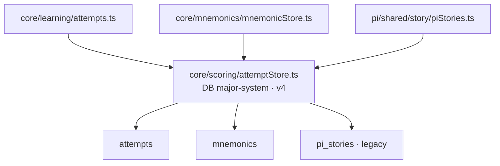

# Persistence architecture

## Agent loading

Load this document for any persisted state, browser schema, migration,
reset/delete behavior, stable persisted identifier, or backup/import/export
change. Also load the owning feature architecture. Load [SYSTEM.md](SYSTEM.md)
if ownership or a cross-feature boundary changes and [CORE.md](CORE.md) when a
shared persistence API changes.

## Storage systems and ownership

The application is client-only and uses two browser storage systems:

- localStorage for small synchronous settings, progress, schedules, histories,
  and layered editable dictionaries;
- IndexedDB for append-heavy attempts and user-authored mnemonic images/text.

`src/core/storage.ts` supplies guarded localStorage helpers but does not own
feature keys or record schemas. The module that defines a key owns that state.

## IndexedDB: one connection and version owner

`src/core/scoring/attemptStore.ts` is the single owner of the `major-system`
database, currently version 4. All capabilities using this database call its
`getDb()` and transaction helpers. Never call `indexedDB.open('major-system',
...)` elsewhere: competing connections or versions can block upgrades and hang
runtime work even when typechecks and ordinary tests pass.

The diagram shows ownership; arrows mean "owns":

Significant object stores:

| Store | Purpose and identity |
| --- | --- |
| `attempts` | Append-heavy answer evidence keyed by an auto ID and indexed by opaque string `key` and time. Records may include `evidenceKind` (`recall` or `recognition`) and a recorded learner-local `localDate`; older records omit both and are legacy/unknown. Existing namespaces include `enc:NN`, `dec:NN`, `pi:<position>`, `piseg:<segment>`, and `pi:pair:<position>`; `core/learning` exposes the same store as opaque recall-item evidence. |
| `mnemonics` | Shared user-authored `{targetId, text, image, updatedAt, ...featureMetadata}` records keyed by feature-owned `targetId`. Current namespaces include `pi:segment:<index>` and `geo:*`. |
| `pi_stories` | Legacy Pi records keyed by zero-based `seg`. Retained for lazy read migration; new writes go to `mnemonics`. |

To add an object store, change `attemptStore.ts`, increment `DB_VERSION`, create
the store in the single `onupgradeneeded` handler behind an
`objectStoreNames.contains()` guard, and test upgrade/idempotence-relevant
behavior. Reuse `getDb()` from the consuming adapter. Do not make a
feature-owned version constant or connection.

## localStorage ownership

Architecturally significant groups are:

| Owner | Keys/state |
| --- | --- |
| `core/scoring` | `major-item-data`, `major-attempts-migrated`, typing-speed state; schemas support Major/Pi scoring consumers. |
| `core/ui` and `app/settings` | global answer/UI preferences and `major-settings`, including the World Countries `worldCountriesIncludedEntityGroups` group-ID selection and `worldCountriesNewItemsPerSet` (`3`, `4`, `5`, or `all`). Settings are app-owned even when features consume them. |
| Major System | `major-word-*`, `major-soundkey-*`, sequence/speed preferences. Layered word and sound-key records use `createWordStore`. |
| Cards | `major-cardword-*`, `major-pao-*`, deck-memo histories, drill/suit/range preferences. Themed and PAO stores are independent even when PAO seeds Person values from Themed. |
| Pi | `major-pi-*` session, selection, memoed/flawless, anchor, story-era, and maintenance state. Exact keys are defined beside their owners. |
| World Countries | `world-countries-world-metadata`, `world-countries-continent-metadata`, `world-countries-subregion-metadata`, `world-countries-subregion-learning`, `world-countries-subregion-learning-membership`, and `world-countries-recite-progress`. |

Small view preferences need not be catalogued here. Their ownership still
follows the defining module and feature namespace.

## Stable identities

- Major System number keys are fixed-width `00`–`99`; attempt item keys use
  explicit namespaces.
- Pi segment indices are zero-based while pair positions are one-based. Do not
  exchange `pi:<position>`, `piseg:<segment>`, `pi:pair:<position>`, and
  `pi:segment:<segment>` merely because they contain similar numbers; they
  represent different contracts.
- World Countries persists `CountryId`, `SubregionId`, and `ContinentId`. SVG IDs
  and display labels are not persistence identity.
- Shared mnemonic target IDs are opaque to core. Feature adapters own namespace
  construction and import validation.
- World Countries Drill preferences use the small localStorage key
  `world-countries-drill-preferences` and contain only setup state: one
  Continent, selected Subregion IDs, a Drill mode, and a Country order
  (`ordered` or `random`). They never contain a flattened Country membership
  list.
- World Countries atomic Drill evidence uses the existing shared `attempts`
  store through `core/learning`. The feature constructs opaque IDs in the
  `world-countries:<skill>:<CountryId>` namespace, where the skill is one of
  `location-to-country`, `country-to-capital`, or `capital-to-country`.
  Countries + Capitals writes two atomic records when both steps are answered;
  its mode name is not part of either ID. The Capitals Drill helper is
  deliberately non-recording: its answers do not write atomic evidence or
  change durable progress. New recorded attempts preserve whether the
  interaction was recall or recognition and the local calendar date at answer
  time.
- World Countries Recite progress uses the localStorage key
  `world-countries-recite-progress`. Its versioned record stores the latest
  completed outcome and timestamp independently for each `(ReciteMode,
  CountryId)` pair. Setup preferences, prompt history, incomplete sessions,
  and flattened authored/session Country sequences remain transient; Recite
  does not write the shared Drill-attempt namespace.

## Migration and isolation rules

- A feature migration may touch only its owned keys/records plus explicitly
  delegated shared records. Never call `localStorage.clear()` in production.
- World Countries structural work may reset World Countries state when its
  feature architecture allows it, but must not alter Pi or other feature state.
- World Countries country-set policy changes are routine scope changes: the
  existing settings record stores optional group IDs only, never resolved
  Country IDs. Attempts and atomic target identities remain untouched.
  Subregion Memo completion rows preserve `countriesLearnedAt` and
  `capitalsLearnedAt` independently. The learning store records a canonical
  Country-membership fingerprint separately. Mismatched completion rows are
  hidden for the current population but retained by fingerprint so switching
  back can restore their applicability; both completion dimensions still
  describe the current Country set. User-authored Country order is not part of
  that fingerprint and therefore does not invalidate completion.
- Recite progress is mode-specific and latest-completed-run based. A completed
  Recite run may replace a prior outcome for the same mode and Country; backing
  out of an incomplete run cannot replace it. Recite progress is not imported
  into Drill proficiency or Learning Readiness.
- User-authored Country order stores stable IDs for the canonical Subregion;
  reads project that order over the active population, and saving an active
  projection preserves hidden IDs for later re-enablement.
- IndexedDB upgrade work must preserve all existing stores. Store creation is
  idempotent because users can arrive from different historical versions.
- `world-countries:<skill>:<CountryId>` attempts are currently exempt from both
  age-based and per-target count pruning. Generic retention remains unchanged
  for Major System, Pi, and every other namespace.
- Pi story reads lazily copy legacy `pi_stories` records to `mnemonics`; explicit
  deletion removes both so deleted content cannot reappear.
- Best-effort telemetry/attempt writes may swallow storage failures. Authored
  mnemonic writes propagate failures so editors can report quota problems.

## Backup, import, and export

- `core/mnemonics/backup.ts` owns generic version-1 mnemonic encoding, including
  Blob/data-URL conversion, but feature adapters validate target namespaces.
- Pi exports shared mnemonic format and accepts both it and the legacy Pi story
  array format.
- World Countries owns a version-3 feature envelope containing Geography
  mnemonics plus World, Continent, and Subregion ordering metadata, and accepts
  the earlier version-2 (mnemonics plus Subregion metadata) and mnemonic-only
  formats. The complete payload is parsed before writes begin.
- Dictionary CSV import/export remains owned by each layered store/parser;
  browser exports never rewrite bundled repository CSV files.

## Source anchors

- `src/core/scoring/attemptStore.ts`
- `src/core/storage.ts`
- `src/core/mnemonics/mnemonicStore.ts`
- `src/core/mnemonics/backup.ts`
- `src/features/pi/shared/story/piStories.ts`
- `src/features/world-countries/geography/subregionMetadataStore.ts`
- `src/features/world-countries/geography/continentMetadataStore.ts`
- `src/features/world-countries/geography/countrySet.ts`
- `src/features/world-countries/geography/worldMetadataStore.ts`
- `src/features/world-countries/learning/subregionLearningStore.ts`
- `src/features/world-countries/learning/recallProgress.ts`
- `src/features/world-countries/drill/drillPreferences.ts`
- `src/features/world-countries/recite/reciteProgress.ts`

## Historical rationale

The shared learning and mnemonic persistence boundaries resolve
[ADR 0005](../adr/0005-shared-learning-domain.md) and
[ADR 0006](../adr/0006-shared-mnemonic-content.md). The requirement to expose
the single IndexedDB owner as mandatory agent context resolves
[ADR 0012](../adr/0012-agent-oriented-current-state-architecture-documentation.md).
