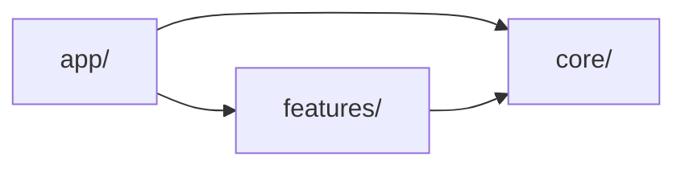

# System architecture

## Agent loading

This file is the architecture entry point and context router. Load only the
next document required by the task:

| Change area | Load next |
| --- | --- |
| Shared behavior or `src/core/` placement | [CORE.md](CORE.md) |
| Persisted state, schemas, migrations, backup/import/export | [PERSISTENCE.md](PERSISTENCE.md) |
| Pi | [features/PI.md](features/PI.md) |
| World Countries | [features/WORLD_COUNTRIES.md](features/WORLD_COUNTRIES.md) |
| Major System | [features/MAJOR_SYSTEM.md](features/MAJOR_SYSTEM.md) |
| Cards, Themed Cards, or PAO | [features/CARDS.md](features/CARDS.md) |
| A global rule itself | [INVARIANTS.md](INVARIANTS.md) |

Do not load every linked document. A feature-local change normally needs only
that feature document and relevant source.

This layer is the only current-state authority. `docs/archive/` holds retired
decision records and delivery specs; it is frozen history, excluded from
default search, and is never loaded during normal work. See `AGENTS.md` for
the working agreement and `INVARIANTS.md` for the global rules.

## Runtime model

Mnemonics is a client-only React 19 and TypeScript single-page application
built by Vite. There is no backend or router. Browser localStorage and
IndexedDB hold user state; bundled TypeScript, CSV, and SVG files supply
reference content. `src/app/main.tsx` mounts providers and `src/app/App.tsx`
selects a mode from `src/app/modes.tsx`.

## Top-level ownership

- `src/app/` owns composition, global settings, page layout, overlays, and the
  mode registry.
- `src/core/` owns domain-neutral learning, mnemonics, scoring, storage helpers,
  card primitives, CSV support, and reusable UI.
- `src/features/` owns product-domain data, rules, workflows, and feature-local
  persistence adapters.

`PageLayout` provides a standard fixed-center layout with optional side rails
and one transient expanded-center presentation. In standard presentation the
center remains 42rem / 672px at `xl+`, with the existing symmetric rail gutters
and responsive drawers. In expanded-center presentation the same center uses
the available page width, while PageLayout suppresses the registered layout
header, both rail columns, and their drawer/toggle presentation. The semantic
default for those regions is:

- left rail — feature-local navigation context, scope, state, progress, and
  sequence;
- center — the active task and focal content;
- right rail — supporting material and tools.

Feature workflow state determines the current rail composition. Feature-owned
rail composition publishes the appropriate capabilities through `useRails`, and
the current view may publish the generic transient presentation through
`usePageLayoutPresentation`. `PageLayout` owns center geometry, rail geometry,
responsive presentation, and presentation cleanup; it remains unaware of
feature workflow concepts such as recall or learning phases. Expanded-center is
not browser fullscreen and is not persisted.

Expansion is one semantic mode switch, not a set of independent flags such as
`wide`, `hideLeftRail`, and `fullscreen`. The 42rem standard center is retained
deliberately: it keeps cross-mode alignment and ordinary reading density, so
expansion stays explicit and transient rather than becoming the default width.
The browser Fullscreen API was rejected for this — the requirement is an
expanded application layout inside the existing window, and fullscreen
lifecycle and permission handling would add complexity without addressing
layout ownership. Mode-level width was part of the ownership conflict that
`PageLayout` exists to resolve and cannot express transient expansion inside a
mounted workflow; a feature-specific wide layout is equally excluded, because
`PageLayout` remains feature- and workflow-agnostic.
The layout slot context separates read access (used by `PageLayout`) from the
stable write channel used by `useRails`, `useLayoutHeader`, and
`usePageLayoutPresentation`, so publishing a slot cannot re-render the
component that publishes it. Publishers still pass
stable dependency values to avoid unnecessary re-registration; provider-boundary
tests cover accidental dependency recreation and real feature transitions.

Unless a diagram says otherwise, an arrow means the source depends on or uses
the target. The primary dependency direction is:

`core/` must not import `app/` or feature modules. Several features currently
consume narrow app-owned integration contracts: `SettingsContext`,
`PageLayoutContext`, and `Overlay`. Treat these as explicit exceptions to the
primary direction. Do not add another feature-to-app edge without reviewing
the ownership boundary here and in the affected feature document.

## Feature inventory and public boundaries

| Feature | Responsibility | Public boundary |
| --- | --- | --- |
| `major-system/` | Sound-key and 00–99 word training | `@/features/major-system` |
| `pi/` | Memo, Recite, Anchors, and Maintain workflows for Pi | `@/features/pi` |
| `cards/` | Themed and PAO card systems | `@/features/cards` |
| `world-countries/` | Geography data, maps, mnemonics, learning, and workflows | `@/features/world-countries` |

External consumers import a feature through its barrel. Internal code imports
directly from the owning module. Keep barrels small and add exports only for a
demonstrated cross-feature or app consumer.

## Intentional cross-feature dependencies

- `pi/` uses `useWords()` from the Major System public boundary.
- `cards/pao/` can seed PAO Person values from `cards/themed/`; this is an
  internal edge inside the Cards feature.

No other cross-feature dependency is implied. A task crossing a feature
boundary should load only the documents for the affected features.

## Decision and escalation rules

- Feature-local UI or behavior stays in the feature unless it changes a shared
  contract.
- A proposed generic abstraction requires [CORE.md](CORE.md) and at least one
  concrete cross-feature consumer or an explicit architectural reason.
- Any persistence, schema, migration, reset, import, or export change requires
  [PERSISTENCE.md](PERSISTENCE.md).
- Changing app/core/feature ownership, a feature barrel, an app integration
  seam, or a cross-feature edge requires this file plus affected feature docs.
- Changing a documented invariant requires [INVARIANTS.md](INVARIANTS.md).
- If current source contradicts these documents, inspect the smallest relevant
  implementation slice and correct the document. Do not reconstruct
  architecture from archived records or by scanning sibling features.

## Source anchors

- `src/app/main.tsx`
- `src/app/App.tsx`
- `src/app/modes.tsx`
- `src/core/learning/index.ts`
- `src/core/mnemonics/index.ts`
- `src/core/scoring/attemptStore.ts`
- `src/features/*/index.ts`

## Historical rationale

The package-by-feature and composition boundaries were decided in ADR 0001 and
ADR 0002; the documentation and context-loading model in ADR 0012, ADR 0021,
and ADR 0034. Those records are archived under `docs/archive/adr/` and are
history, not current authority. Read one only to understand how a rule came
about, never to establish what is true now.
