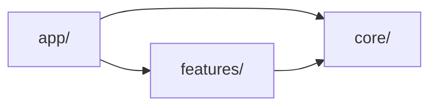

# System architecture

## Agent loading

This file is the architecture entry point and context router. Load only the
next document required by the task:

| Change area | Load next |
| --- | --- |
| Shared behavior or `src/core/` placement | [CORE.md](CORE.md) |
| Persisted state, schemas, migrations, backup/import/export | [PERSISTENCE.md](PERSISTENCE.md) |
| Pi | [features/PI.md](features/PI.md) |
| World Countries | [features/WORLD_COUNTRIES.md](features/WORLD_COUNTRIES.md) |
| Major System | [features/MAJOR_SYSTEM.md](features/MAJOR_SYSTEM.md) |
| Cards, Themed Cards, or PAO | [features/CARDS.md](features/CARDS.md) |
| A global rule itself | [INVARIANTS.md](INVARIANTS.md) |

Do not load every linked document. A feature-local change normally needs only
that feature document and relevant source. Load a specific ADR only when the
rationale behind a current rule is needed.

## Runtime model

Mnemonics is a client-only React 19 and TypeScript single-page application
built by Vite. There is no backend or router. Browser localStorage and
IndexedDB hold user state; bundled TypeScript, CSV, and SVG files supply
reference content. `src/app/main.tsx` mounts providers and `src/app/App.tsx`
selects a mode from `src/app/modes.tsx`.

## Top-level ownership

- `src/app/` owns composition, global settings, page layout, overlays, and the
  mode registry.
- `src/core/` owns domain-neutral learning, mnemonics, scoring, storage helpers,
  card primitives, CSV support, and reusable UI.
- `src/features/` owns product-domain data, rules, workflows, and feature-local
  persistence adapters.

Unless a diagram says otherwise, an arrow means the source depends on or uses
the target. The primary dependency direction is:

`core/` must not import `app/` or feature modules. Several features currently
consume narrow app-owned integration contracts: `SettingsContext`,
`PageLayoutContext`, and `Overlay`. Treat these as explicit exceptions to the
primary direction. Do not add another feature-to-app edge without reviewing
the ownership boundary here and in the affected feature document.

## Feature inventory and public boundaries

| Feature | Responsibility | Public boundary |
| --- | --- | --- |
| `major-system/` | Sound-key and 00–99 word training | `@/features/major-system` |
| `pi/` | Memo, Recite, Anchors, and Maintain workflows for Pi | `@/features/pi` |
| `cards/` | Major, themed, and PAO card systems | `@/features/cards` |
| `world-countries/` | Geography data, maps, mnemonics, learning, and workflows | `@/features/world-countries` |

External consumers import a feature through its barrel. Internal code imports
directly from the owning module. Keep barrels small and add exports only for a
demonstrated cross-feature or app consumer.

## Intentional cross-feature dependencies

- `pi/` uses `useWords()` from the Major System public boundary.
- `cards/card/` uses the Major System word provider for the Major Card deck.
- `cards/pao/` can seed PAO Person values from `cards/themed/`; this is an
  internal edge inside the Cards feature.

No other cross-feature dependency is implied. A task crossing a feature
boundary should load only the documents for the affected features.

## Decision and escalation rules

- Feature-local UI or behavior stays in the feature unless it changes a shared
  contract.
- A proposed generic abstraction requires [CORE.md](CORE.md) and at least one
  concrete cross-feature consumer or an explicit architectural reason.
- Any persistence, schema, migration, reset, import, or export change requires
  [PERSISTENCE.md](PERSISTENCE.md).
- Changing app/core/feature ownership, a feature barrel, an app integration
  seam, or a cross-feature edge requires this file plus affected feature docs.
- Changing a documented invariant requires [INVARIANTS.md](INVARIANTS.md) and
  the relevant historical rationale.
- If current source contradicts these documents, inspect the smallest relevant
  implementation slice and then the directly linked ADR; do not reconstruct
  architecture by loading all ADRs or scanning sibling features.

## Source anchors

- `src/app/main.tsx`
- `src/app/App.tsx`
- `src/app/modes.tsx`
- `src/core/learning/index.ts`
- `src/core/mnemonics/index.ts`
- `src/core/scoring/attemptStore.ts`
- `src/features/*/index.ts`

## Historical rationale

The package-by-feature and composition boundaries resolve
[ADR 0001](../adr/0001-page-layout-panel-pattern.md) and
[ADR 0002](../adr/0002-package-by-feature.md). The current documentation and
context-loading model resolves
[ADR 0012](../adr/0012-agent-oriented-current-state-architecture-documentation.md).
Load those ADRs only when their rationale is needed.
