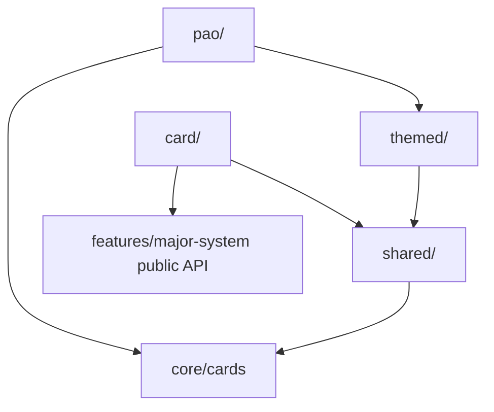

# Cards

## Agent loading

Before modifying Cards, read `src/features/cards/AGENTS.md` and this document.
Start in the owning flavor directory. Load [CORE.md](../CORE.md) for shared card,
round, UI, or layered-store changes; [PERSISTENCE.md](../PERSISTENCE.md) for
editable lists/history/migrations; and [SYSTEM.md](../SYSTEM.md) for the barrel,
app modes, or Major System dependency.

## Purpose

Cards contains three related card-memory applications: Major Cards maps cards
through the Major System word list, Themed Cards owns one editable word/person
per card, and PAO owns Person/Action/Object triples and three-card imagery.
They share generic card/deck practice mechanics where their data shapes allow
it.

## Entry points

- `index.ts` is the public boundary for app drills and provider composition.
- `card/MajorCardsDrill.tsx`, `themed/ThemedCardsDrill.tsx`, and
  `pao/PaoCardsDrill.tsx` are flavor entries.
- `shared/CardsDrill.tsx` is the single-value Card-to-Word/Number engine.
- `shared/DeckMemoDrill.tsx` is the single-value deck memorization workflow;
  `pao/PaoDeckMemoDrill.tsx` owns the structurally different PAO workflow.

## Ownership

- `shared/` — mechanics genuinely shared by Major and Themed single-value card
  drills.
- `card/` — the Major System-backed wrapper and its recording policy.
- `themed/` — themed shipped data, layered editable provider, editor overlay,
  and Themed wrapper.
- `pao/` — PAO data/parser/provider/editor, Encode/Decode/Deck Memo workflows,
  triple grouping, and role presentation.
- `core/cards.ts` — generic 52-card identity/rank/suit primitives used across
  flavors; no flavor semantics.

## Decision rules

- Put behavior in `shared/` only when multiple Cards flavors use the same
  abstraction without flavor conditionals.
- Major Cards remains a thin adapter over `CardsDrill` and the public Major
  System word provider.
- Themed data/editor/persistence stay in `themed/`.
- PAO remains separate where its three-field/multi-cue/triple data shape does
  not fit `CardsDrill` or `DeckMemoDrill`; do not force it into the single-value
  engine.
- PAO may seed Person fields from Themed effective values, but seeding writes
  only PAO state and never mutates the Themed list.
- Generic card identity, round scheduling, answer UI, overlays, and layered
  record mechanics stay with their existing core/app owners.

## Dependencies

Unless stated otherwise, arrows mean dependency:

The `PAO --> Themed` edge is limited to user-triggered Person seeding.

## Persistence

- Themed uses `major-cardword-saved`/`major-cardword-overrides` over
  `cardWords.csv`.
- PAO uses `major-pao-saved`/`major-pao-overrides` over `paoCards.csv`, plus
  PAO-specific drill, suit, range, decode-field, deck-count, and history keys.
- Shared/Major/Themed deck-memo state uses the storage prefix or history key
  provided by the owning wrapper.
- Major Cards may record through shared Major scoring; Themed and PAO session
  behavior must not silently enter global Major stats.

Load [PERSISTENCE.md](../PERSISTENCE.md) before changing keys, migration,
reset, or import/export behavior.

## Public boundary

Outside code imports `MajorCardsDrill`, `ThemedCardsDrill`, `PaoCardsDrill`, and
the providers needed by app composition from `@/features/cards`. Flavor stores,
parsers, role helpers, and drill engines remain internal.

## Invariants

- Card identity/rank/suit comes from `core/cards.ts`; flavor content does not
  redefine the deck.
- Themed and PAO editable stores are independent.
- PAO fields use composite `<NN>:person|action|object` keys and consistent role
  semantics/presentation.
- PAO Decode builds selected fields as distinct-card subquestions and advances
  only after all are answered.
- PAO Deck Memo preserves partial final triples.
- External consumers use the Cards barrel; internal flavor code imports its
  direct owner.

## Source anchors

- `src/features/cards/index.ts`
- `src/features/cards/shared/CardsDrill.tsx`
- `src/features/cards/shared/DeckMemoDrill.tsx`
- `src/features/cards/card/MajorCardsDrill.tsx`
- `src/features/cards/themed/CardWordsContext.tsx`
- `src/features/cards/pao/PaoCardsDrill.tsx`
- `src/features/cards/pao/PaoCardsContext.tsx`
- `src/features/cards/pao/triples.ts`

## Historical rationale

Cards packaging and PAO ownership resolve
[ADR 0002](../../adr/0002-package-by-feature.md) and
[ADR 0003](../../adr/0003-cards-subfolders-pao.md). Load them only when
reconsidering those boundaries.
