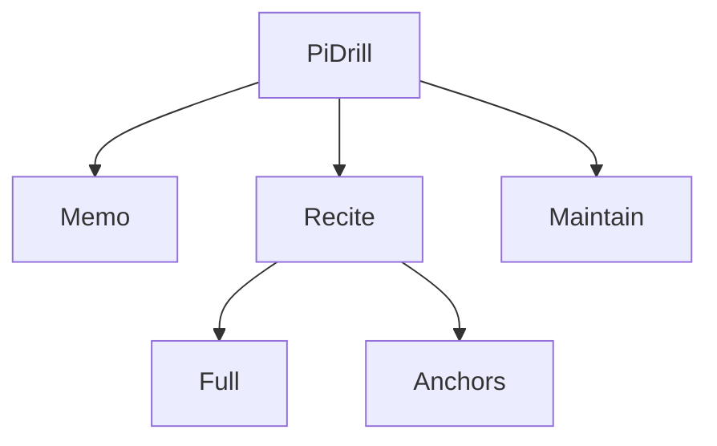

# Pi

## Agent loading

Before modifying Pi, read `src/features/pi/AGENTS.md` and this document. Start
from `PiDrill.tsx`, `index.ts`, and the directory owning the requested workflow.
Normally stay in `src/features/pi/` plus direct contracts.

Load additional context only when triggered:

- shared learning, mnemonic, scoring, or UI behavior → [CORE.md](../CORE.md);
- storage, keys, migration, story backup, or IndexedDB →
  [PERSISTENCE.md](../PERSISTENCE.md);
- public exports, Major System integration, settings/layout integration →
  [SYSTEM.md](../SYSTEM.md).

Do not scan Cards or World Countries for examples.

## Purpose

Pi supports memorizing, reciting, and maintaining decimal digits as fixed-width
two-digit pairs backed by Major System words and optional per-segment stories.
It owns Pi sequence/range rules, workflows, progress, session metrics, story
adapters, anchor pacing, and maintenance scheduling. It does not own the Major
System word dictionary, global settings/layout, shared scoring, or the shared
IndexedDB connection.

## Entry points

- `PiDrill.tsx` composes Memo, Recite, and Maintain, owns persisted tab and
  maximum-range selection, and publishes header chrome.
- `index.ts` exposes `PiDrill`, `PI_PAIRS`, selected Pi stats, and Pi adapters
  used by app/shared consumers.
- `memo/PiMemoTab.tsx`, `recite/PiReciteTab.tsx`, and
  `maintain/PiMaintainTab.tsx` are workflow entries.
- `shared/PiNumberQuiz.tsx` is the reusable Pi answer/result seam.

## Ownership

- `memo/` — segment study/recall, story editing/rails, and image-processing
  compatibility export.
- `recite/` — Full contiguous recitation, Anchors chain practice, mode/range
  setup, run-history rail, and transition pace.
- `maintain/` — due-batch selection, per-segment SM-2 schedule, and review UI.
- `shared/` — Pi data and coordinate math, common quiz mechanics, segment
  selection/status/progress/stats, generic Pi UI, and story adapters/views.
- `shared/story/` — Pi target IDs and compatibility over shared mnemonic
  storage, legacy story migration, backup acceptance, hooks, highlighting, and
  mistake review.

The following diagram shows feature composition, not dependency direction:

For dependencies, `memo/`, `recite/`, and `maintain/` use `shared/`.
`recite/` may advance the maintenance schedule after a whole-segment Full run;
Maintain remains the owner of scheduling semantics. All workflows consume the
Major System word provider through `@/features/major-system`.

## Decision rules

- Tab composition, maximum range, and shared header behavior belong in
  `PiDrill.tsx`.
- Memo teaching and story-authoring UI belong in `memo/`; reusable Pi story
  persistence/backup and read views belong in `shared/story/`.
- Full and Anchors behavior stay in their corresponding `recite/` modules;
  common switching belongs in `PiReciteTab`/`ReciteModeToggle`.
- Shared Pi answer mechanics belong in `PiNumberQuiz`; recording policy,
  eligibility, batching, and workflow completion belong in callers.
- Pi-only code belongs in `shared/` only when more than one Pi workflow needs
  it or it is part of the Pi public boundary. Generic learning, mnemonic,
  scoring, storage, or UI behavior must pass the [CORE.md](../CORE.md) placement
  test.
- Pair/segment conversion belongs in `piSegments.ts` and established constants;
  callers do not duplicate coordinate arithmetic.
- Major System owns word selection and editable word persistence. Pi owns the
  sequence and the association of those words with Pi positions/stories.

## Dependencies

- `@/features/major-system` supplies `useWords()`.
- `core/scoring` supplies attempts, SM-2, timing, and quiz helpers.
- `core/learning` supplies domain-neutral scope/item types used by
  `piLearning.ts`; Pi constructs their IDs.
- `core/mnemonics` supplies shared authored-content storage and image/backup
  mechanics; Pi interprets `pi:segment:*` targets.
- app settings supply maximum digits, answer batch size, and maintenance batch
  size; app layout contracts receive Pi header/rail content.

## Persistence

- Attempt namespaces have distinct meanings: `pi:<one-based position>` is
  per-pair performance and `piseg:<zero-based segment>` is a fully-covered
  segment try. `pi:pair:<position>` is the newer generic learning adapter ID and
  must not silently replace an established attempt namespace.
- `major-pi-sessions` stores capped Full/Practice run summaries. Anchor runs and
  Maintain runs do not create Pi sessions.
- `major-pi-memoed-segs` and `major-pi-recited-segs` are independent sticky
  milestones; live status derives from segment-try evidence.
- `major-pi-maintain` owns per-segment SM-2 state; `major-pi-anchor-*` owns
  Anchors selection/pace. Other `major-pi-*` keys are local workflow/view state.
- New stories use shared IndexedDB `mnemonics` records keyed by
  `pi:segment:<zero-based segment>`. The legacy `pi_stories` store is read and
  lazily copied for compatibility; explicit deletion removes both.

Load [PERSISTENCE.md](../PERSISTENCE.md) before modifying any of these.

## Public boundary

Outside code imports from `@/features/pi`. The app consumes `PiDrill`, Pi digits,
and selected statistics/scope helpers. Internal workflow stores, story
implementations, segment components, and scheduling helpers remain private
unless a concrete external consumer requires them.

## Invariants

- A pair is one fixed-width two-character `PI_PAIRS` entry. A segment is 10
  pairs/20 digits. Segment indices are zero-based; pair positions/anchors and
  displayed digit ranges are one-based.
- Only whole aligned segments create `piseg:` tries, flawless milestones, or
  maintenance rescheduling.
- A completed session with `anchor === 1` is Full-from-start; other anchors are
  Practice. From-start records require strict non-zero reach improvement.
- Live segment status comes from recent `piseg:` tries. Memoed and flawlessly
  recited milestones remain separate from live status.
- Whole-segment Recite and Maintain completions both reschedule the per-segment
  maintenance schedule using their binary pass/fail result. Partial runs leave
  segment schedules unchanged.
- Maintain eligibility is recited weak/learned content. New content is excluded
  and breaks contiguous batches.
- Anchors records neither normal Pi attempts nor sessions/segment progress; its
  first answer starts the chain and later answers measure transitions.
- Story records contain freeform text and at most one image. Empty records are
  deleted/skipped and object URLs are revoked.
- `PI_PAIRS` remains fixed-width and settings-derived maximum ranges never
  exceed available data.

## Source anchors

- `src/features/pi/PiDrill.tsx`
- `src/features/pi/index.ts`
- `src/features/pi/shared/PiNumberQuiz.tsx`
- `src/features/pi/shared/piSegments.ts`
- `src/features/pi/shared/piStats.ts`
- `src/features/pi/shared/piLearning.ts`
- `src/features/pi/shared/story/piStories.ts`
- `src/features/pi/recite/PiReciteFull.tsx`
- `src/features/pi/recite/PiReciteAnchors.tsx`
- `src/features/pi/maintain/piMaintain.ts`

## Domain vocabulary

- **Pair:** two Pi digits encoded by one Major System word.
- **Position:** the one-based place of a pair in Pi.
- **Segment:** a zero-based block of 10 pairs/20 digits.
- **Anchor:** a segment's opening pair; Anchors trains segment order.
- **Memo:** story/word-chain study and recall without normal timing stats.
- **Recite:** scored recall of a selected contiguous range.
- **Maintain:** due-driven upkeep of previously recited segments.
- **Memoed:** sticky successful Memo milestone.
- **Learned/weak:** live recitation status derived from recent whole-segment
  tries; this can regress.
- **Flawlessly recited:** sticky whole-segment success milestone.
- **Reach:** consecutive correct pairs from the start of a run.

## Historical rationale

The current Pi structure resolves
[ADR 0004](../../adr/0004-pi-by-tab.md), while shared learning and mnemonic
contracts resolve [ADR 0005](../../adr/0005-shared-learning-domain.md) and
[ADR 0006](../../adr/0006-shared-mnemonic-content.md). Load them only when
reconsidering those boundaries.
