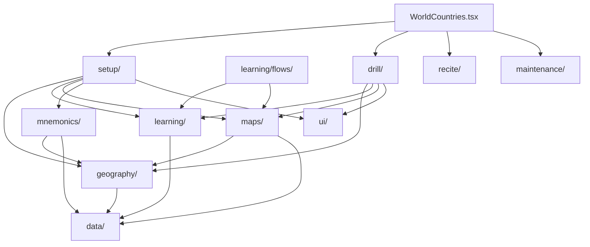

# World Countries

## Agent loading

Before modifying this feature, read
`src/features/world-countries/AGENTS.md` and this document. Load
[CORE.md](../CORE.md) for shared learning, mnemonic, UI, or storage behavior;
load [PERSISTENCE.md](../PERSISTENCE.md) for persisted state, identifiers,
migrations, reset, or backup; and load [SYSTEM.md](../SYSTEM.md) for public
exports or app integration.

The current feature architecture is documented here. Historical ADRs are not
required for ordinary implementation work.

## Purpose and entry points

World Countries has two user-directed primary activities: **Drill** and
**Recite**. **Due review** is a separate system-directed Maintenance action.
**Setup** is a structural workspace associated with Geography; it is not a
primary activity and does not start learning or practice.

`WorldCountries.tsx` resolves the Settings country-set policy once, provides
the active population, and composes Setup, Drill, Recite, and Maintenance.
`WorldCountriesDrill.tsx` owns the Drill setup coordinator, the Drill purpose,
the Learn & Practise purpose, active sessions, and results. The shell owns the
World Countries-specific Setup navigation seam: Drill can request World or
Continent Setup, and Setup exposes Back to Drill.

## Ownership

- `data/` owns canonical Country, Continent, Subregion identity, membership,
  geopolitical classification, and bundled reference data. `Country.capital`
  is the canonical Capital answer.
- `geography/` owns queries, active-population resolution, effective World →
  Continent → Subregion → Country ordering, and user-authored order metadata.
- `learning/` owns atomic recall skills, answer matching, evidence adapters,
  proficiency, pure session mechanics, durable Subregion learning facts,
  derived Learning Readiness, and reusable guided Learning flows.
- `learning/flows/` owns the Country and Capital Learning UI. Learning modes
  explicitly own their milestone writes; the guided UI is described as
  Learning, not Drill.
- `maps/` owns SVG loading, map translation, overview-map presentation, and
  workflow-neutral geographic callbacks.
- `mnemonics/` owns World Countries mnemonic target IDs, geography mnemonic
  adapters, backup behavior, and read-only mnemonic presentation. Setup owns
  mnemonic authoring controls.
- `setup/` owns structural World → Continent → Subregion inspection,
  effective-order authoring, mnemonic authoring, Learning Readiness display,
  and contextual Back to Drill navigation. It has no learning start action and
  no next-to-prepare progression.
- `drill/` owns Drill selection, Drill preferences, exactly three Drill modes,
  Learn & Practise purpose selection, shared session mechanics, Drill
  presentation, Practice presentation, and results. `Practice` is not a
  hidden Drill mode.
- `ui/` owns feature-local panels, breadcrumbs, hierarchy rows, and shared
  presentation without workflow state or persistence policy.
- `recite/` and `maintenance/` are sibling workflow owners. They may consume
  shared World Countries evidence without importing Drill internals.

There is no World Countries Quiz architecture. Do not create broad feature
`domain/`, `persistence/`, `common/`, or compatibility-wrapper layers.

## Activity model

The shell exposes `[ Drill ] [ Recite ]` and a separate `Due review` action.
Drill opens by default. Drill setup has a non-persisted Purpose selector:

- **Drill**: `Countries`, `Countries + Capitals`, and `Countries from
  Capitals`. These are the only `WorldCountriesDrillMode` values and may
  write atomic Drill evidence according to their defined semantics.
- **Learn & Practise**: one purpose with two explicit categories:
  - **Learning**: `Learn Countries`, `Learn Capitals`.
  - **Practice**: `Locate Countries`, `Capitals`.

Learning and Practice mode identities are separate from Drill mode identity.
Learning can write only the durable milestone owned by the active mode:
`Learn Countries` writes `countriesLearnedAt`, and `Learn Capitals` writes
`capitalsLearnedAt`. Practice is non-recording: it may retain transient
answers, accuracy, session progress, and results, but must not write attempts,
learning milestones, Drill proficiency, Drill preferences, or other durable
progress. Purpose-neutral mechanics may be shared, but Practice uses its own
Practice headings, rails, accessibility labels, and results presentation.

Learn & Practise defaults to `Learn Countries` and remembers its selected mode
while the coordinator remains mounted. Its geographic selection is the same
derived Drill selection and is not persisted as purpose state.

## Learning Readiness

Learning Readiness is derived from the existing
`SubregionLearningState.countriesLearnedAt` and
`SubregionLearningState.capitalsLearnedAt` fields. It has exactly three states:

1. `Not learned`
2. `Countries learned`
3. `Countries + Capitals learned`

A Capitals-first completion persists `capitalsLearnedAt`, but remains Not
learned until `countriesLearnedAt` exists. No fourth readiness state is added.
Learning Readiness is contextual map and rail information; it is not Drill
proficiency and does not create evidence.

Learn Capitals is runnable before Countries learning. The selector shows an
inline recommendation to Learn Countries first rather than locking the mode.
Learn Countries and Learn Capitals accept one or more selected Subregions.
Selected Subregions run sequentially in effective geographic order; each uses
its own effective Country order, writes its own milestone, and presents an
explicit Continue action before the next non-final Subregion. Already
completed selected Subregions remain eligible for intentional repetition.

## Decision rules and dependencies

- Canonical geography identity belongs in `data/`; user-specific order belongs
  in `geography/`. Country membership is derived at runtime and never flattened
  into persisted Drill or Learning scope.
- Recall skills are `location-to-country`, `country-to-capital`, and
  `capital-to-country`. `Countries + Capitals` combines the first two skills
  without creating a combined evidence identity.
- `learning/flows/` is a reusable capability owner. Do not move Learning or
  Capital mechanics into Drill merely because Drill launches them.
- The active population is resolved at the shell and passed into workflows.
- `WorldCountries.tsx` does not decide membership, learning transitions,
  scheduling, map translation, or mnemonic identity.
- `GeographyOverviewMap` reports geographic clicks and hover neutrally;
  callers decide whether a click selects scope, opens Setup, or starts Practice.
- PageLayout geometry, `useRails`, `useLayoutHeader`, drawer behavior, and
  rail widths remain unchanged.

## Persistence

- Existing World, Continent, and Subregion metadata keys and schemas remain
  unchanged.
- `world-countries-subregion-learning` retains independent
  `countriesLearnedAt` and `capitalsLearnedAt` fields plus the existing active
  membership fingerprint behavior.
- Geography mnemonics remain in the shared IndexedDB `mnemonics` store with
  existing `geo:*` target IDs.
- `world-countries-drill-preferences` remains the owner of the last Continent,
  selected Subregion IDs, actual Drill mode, and Drill order. Purpose state and
  Learn & Practise mode are not added to this schema.
- Atomic Drill evidence continues to use the existing `attempts` store and
  `world-countries:<skill>:<CountryId>` IDs. Practice never writes to it.
- A persisted Drill row with legacy `mode: "capitals"` is invalid under the
  current three-mode union and falls back to the normal `countries` Drill
  default on load. No migration is performed.

## Invariants

- `Country.id` and `Country.subregionId` are runtime identity; persistence and
  workflows do not reconstruct identity from labels or SVG IDs.
- Effective hierarchy order can reorder existing members but cannot add
  Countries or Subregions.
- Setup is structural and non-recording. It does not start Learning, Practice,
  Drill, or Recite.
- Drill setup and active recall are separate phases. Practice sessions are also
  separate in presentation and durable effects even when they share session
  mechanics.
- Learning completion is per Subregion and per owned milestone. A successful
  Learn Capitals completion never clears or fabricates Countries learning.
- Practice cannot change evidence, milestones, proficiency, preferences, or
  any other durable progress.
- Active Drill recall suppresses map progress treatments until feedback;
  Practice labels never present themselves as Drill labels.
- Country-set changes do not delete attempts or change atomic target IDs.
- Workflow folders do not depend on sibling workflow internals.
- World Countries persistence does not modify unrelated feature state.

## Source anchors

- `src/features/world-countries/WorldCountries.tsx`
- `src/features/world-countries/drill/WorldCountriesDrill.tsx`
- `src/features/world-countries/drill/DrillSetup.tsx`
- `src/features/world-countries/drill/DrillSetupRails.tsx`
- `src/features/world-countries/drill/DrillSession.tsx`
- `src/features/world-countries/drill/PracticeSessionRails.tsx`
- `src/features/world-countries/drill/PracticeResults.tsx`
- `src/features/world-countries/drill/drillModes.ts`
- `src/features/world-countries/drill/drillPreferences.ts`
- `src/features/world-countries/drill/drillProgressPresentation.ts`
- `src/features/world-countries/learning/learningReadiness.ts`
- `src/features/world-countries/learning/learningProgress.ts`
- `src/features/world-countries/learning/subregionLearningStore.ts`
- `src/features/world-countries/learning/flows/CountryLearningFlow.tsx`
- `src/features/world-countries/learning/flows/CapitalLearningFlow.tsx`
- `src/features/world-countries/learning/flows/GuidedLearningRails.tsx`
- `src/features/world-countries/setup/WorldCountriesSetup.tsx`
- `src/features/world-countries/setup/WorldCountriesSetupRails.tsx`
- `src/features/world-countries/setup/SetupMap.tsx`
- `src/features/world-countries/maps/GeographyOverviewMap.tsx`
- `src/app/layout/PageLayoutContext.tsx`

The durable Learning-versus-Practice boundary is recorded in
[ADR 0024](../../adr/0024-world-countries-learning-practice-boundary.md).
