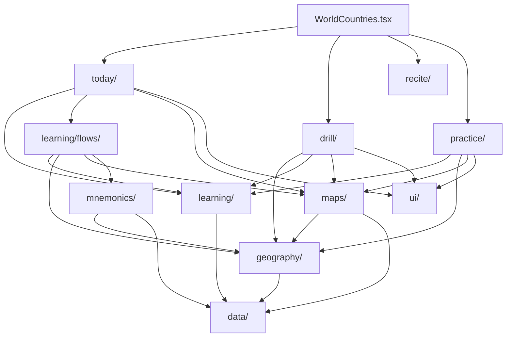

# World Countries

## Agent loading

Before modifying this feature, read this document and
`src/features/world-countries/AGENTS.md`. Load `../CORE.md` for shared
learning, mnemonic, UI, or storage behavior; load `../PERSISTENCE.md` for
persisted state, identifiers, migrations, reset, or backup; and load
`../SYSTEM.md` for public exports or app integration.

## Purpose and entry points

World Countries opens on a map-centered **Home**. Home is the default guided
entry: it shows World mastery, the interactive World map, and a map-attached
**Next Step** action hub. The hub presents semantically independent Review,
Journey, Strengthen, and contextual freeform activities in priority order.
Playground remains the normal freeform action; on a Continent hub, an
explicitly focused Subregion whose Learning is complete may replace it with a
direct Drill shortcut scoped to that Subregion. A transient
**Continent hub** provides the same guided composition over a Continent-scoped
active Country population.
**Playground** is the learner-facing top-level freeform activity destination for Recite, Quiz,
non-recording Practice, and configurable recorded Drill. **Progress** is a
derived supporting view, not a separate evidence or analytics system.

The stable feature root is Home. Home and Continent guided surfaces keep
Review and Journey state in supporting rails, while the geography left rail
provides a concise current-scope Progress entry after its geography list. The
Next Step hub owns the primary contextual action surface.
Playground uses its own breadcrumb/back context to return to the originating
Home or Continent hub. The user-facing entry hierarchy is Home -> Continent
hub / Progress / Playground -> existing workflow owners. Structural authoring
is contextual rather than a separate workflow:

- Drill's existing World Geography rail authors Continent order.
- Drill's existing Continent Geography rail authors Subregion order.
- Learning's stable Subregion rail authors Country order and the existing
  Subregion mnemonic.

`WorldCountries.tsx` resolves the Settings country-set policy once, provides
the active population, and continues to own the top-level Home/Continent/
Playground composition. It composes those entry views with the existing Today,
Drill, Recite, Quiz, Practice, and Learning owners; the underlying workflow
semantics remain unchanged, while Playground selects the activity before setup.
`WorldCountriesDrill.tsx` owns the shared Geography/proficiency setup
coordinator, recorded Drill and fixed non-recording Practice entry, active
sessions, and results. Geography metadata changes reach mounted consumers
through the feature-owned geography subscription signal.

## Ownership

- `data/` owns canonical Country, Continent, Subregion identity, membership,
  geopolitical classification, and bundled reference data. `Country.capital`
  is the canonical Capital answer; `landBorders.ts` owns the reviewed static
  land-border pair graph and its effective active-population filtering queries.
- `geography/` owns active-population queries, effective World -> Continent ->
  Subregion -> Country ordering, the shared pure World-wide Subregion-scope
  normalization/toggling/count/label/effective-membership seam, order metadata,
  the semantic order-saving seam used by contextual editors, and the
  feature-owned geography subscription signal published after successful
  metadata mutations.
- `learning/` owns recall skills, answer matching, evidence adapters,
  raw per-target history, Today introduction and review scheduling,
  proficiency, pure session mechanics, durable Subregion learning facts and
  their feature-local subscription signal, Learning Readiness, and reusable
  guided Learning flows.
- `practice/` owns non-recording Practice execution and presentation reusable
  outside the Drill entry point, including the map-backed Learn & Practise
  path, transient Practice results, and the top-level Capitals, Countries from
  Capitals, and Neighbours Quizzes. Quiz is a Practice-semantic user-facing
  area with transient randomized runs, scoring, miss review, and retry; it owns
  no evidence,
  milestones, preferences, scheduling, or other durable learner state.
- `today/` owns the derived guided plan, independent curriculum and
  Review/practice opportunities, bounded due-review and targeted consolidation
  queues with retry state, guided setup/checkpoint states, and delegation into
  existing Learning flows. Its Review opportunity chooses scheduled due review
  when at least three due targets exist; otherwise it chooses bounded
  unfinished-core consolidation. Curriculum Learning remains independently
  available. It consumes learning, geography, maps, and
  feature-local UI but not Drill or Recite internals.
- `learning/flows/` owns Country and Capital Learning UI and orchestration.
  Learning modes own their milestone writes; the guided UI is not Drill
  implementation detail.
- `maps/` owns SVG loading, Country-to-SVG translation, overview and learning
  map presentation, the authored `SubregionId` learning-frame registry, and
  the workflow-neutral semantic camera-intent boundary. Active learning and
  recall callers request one intent at a time: default/overview,
  Subregion-learning, explicit Country fit, or target-local neighbourhood.
  The map layer resolves Country/Subregion identities to SVG IDs and
  viewBox coordinates. It also owns generic caller-controlled Country
  visibility, explicit Country fitting, target-centric local-neighbourhood
  zoom, and task-scoped answer-selection interaction points,
  map-owned synthetic dot metadata for visually weak source geography,
  representative learning anchors, map-owned pointer-intent resolution,
  existing Country sequence annotations, and workflow-neutral geographic
  callbacks.
- `mnemonics/` owns World Countries mnemonic target IDs, geography mnemonic
  adapters, backup behavior, read presentation, the reusable contextual
  Subregion mnemonic editor, and the feature-local mnemonic subscription over
  shared core mnemonic persistence.
- `drill/` owns Drill selection, preferences, the three core-skill Drill modes,
  recorded Drill sessions, Drill results, and the shared World/Continent
  Geography and proficiency setup used by recorded Drill and fixed Practice
  entries. It also
  owns World/Continent order authoring in the existing Geography rails. It does
  not expose a Drill Subregion detail or Country-order editor; it delegates
  non-recording Practice execution and presentation to `practice/`.
- `ui/` owns feature-local panels, breadcrumbs, hierarchy rows, inline reorder
  and opt-in Country click-sequence presentation, shared active map-task,
  task-context, and session-progress presentation, map-surface/dock
  presentation, task-dock status/action styling,
  the reusable World/Continent Geography selection rail and its common copy,
  the shared typed-answer lifecycle for primary World Countries recall, shared
  reusable answer-kind semantics across active workflows, and draft movement
  without persistence policy. Workflows provide the active answer kind from
  their task or skill, and workflow owners provide classification, disclosure
  copy, evidence, and transitions. Multi-answer Practice workflows reuse that
  feedback presentation and lifecycle while retaining their own
  repeated-answer state and transitions. Fuzzy remediation creates no
  evidence, and ordinary Drill, Today, and Recite incorrect answers retain
  their existing correction/retry lifecycle. The lifecycle contract itself is
  stated once, under Decision rules and dependencies.
- `recite/` owns the ordered World Countries Recite setup, its three typed-recall
  modes, transient setup/session state, current-run outcomes, completion flow,
  and mode-specific latest-outcome status. It consumes geography, answer
  matching, map, and UI seams without importing Drill internals.

There is no broad feature `domain/`, `persistence/`, or `common/` layer and no
compatibility wrapper for the removed authoring workflow.

There is no `quiz/` package. `practice/` owns the user-facing Quiz
orchestration. The Capitals and Countries from Capitals types use the
purpose-neutral finite `learning/recallSession.ts` Country/skill cursor;
Neighbours uses a separate Practice-owned multi-answer run/session because one
target accepts several Country answers. Neither model owns evidence,
persistence, rails, or maps.

The entry hierarchy is Home, transient Continent exploration, Playground, and
derived Progress. Progress remains a derived supporting view entered from the
geography/progress left rail rather than a second progress authority. The
activity semantics remain exactly Drill, Learning, and
Practice; Quiz is Practice and does not introduce an Assessment semantic.
Today remains the owner of guided planning/review and delegation into the
existing Learning flows. When Today launches Learning, the completed Learning
surface can present a parent-provided next Journey handoff: the flow writes its
durable milestone first, Today observes the feature-local learning revision,
and the latest derived curriculum recommendation remains authoritative for a
direct Country-to-Capital or later Journey continuation. Review and weak-spot
practice remain independently selectable from Home rather than becoming a
completion handoff. If there is no further Journey recommendation, completion
returns to the current World/Continent guided surface. Guided Learning remains
caller-owned and does not receive a fabricated Today handoff.

Mounted World Countries consumers subscribe directly to the external state they
derive: geography metadata, durable Subregion learning, and World Countries
mnemonics each publish through a feature-local revision signal. Workflow
coordinators do not carry generic version counters solely to force a re-read.

## Activity model

### Today and the derived plan

Today derives its plan from raw core evidence and applicable Learning
milestones. It reviews only `location-to-country` and `country-to-capital`,
derives the current whole-Subregion Learning recommendation independently of
Review, and when no scheduled work is due it can expose a bounded, scope-local
consolidation queue containing only introduced, non-mastered core targets whose
corresponding Learning layer is established. All queues, retry state, actions,
and checkpoints remain transient; consolidation uses the same typed
free-recall/evidence seam as guided review.

Target introduction is intentionally separate from curriculum readiness:
successful evidence can make an atomic target introduced for curriculum
planning and contributes to its recall evidence, but it does not by itself
make the target eligible for Review or consolidation. Those queues require the
corresponding established Learning layer. Today keeps recommending Country
Learning until that layer has its durable `countriesLearnedAt` milestone,
except when every active `location-to-country` target has historically
satisfied the existing three-date explicit free-recall mastery evidence. That
display/planning-only fallback avoids redundant Country Learning without
writing a synthetic milestone; it uses historical qualification rather than
current post-failure proficiency. Later failures therefore remain visible to
current Mastery and Review without re-opening the Learning track. Once
Countries are established by either route, Country targets become Review and
consolidation eligible and Capital Learning may be layered on top; the durable
milestone meaning remains unchanged. Capital Learning uses the same
distinction: `capitalsLearnedAt` establishes the Capital layer, while a
display/planning-only fallback may treat every active `country-to-capital`
target with historical three-date explicit free-recall mastery evidence as
already known without writing a synthetic milestone. Capital targets likewise
remain outside Review and consolidation until the Capital layer is
established.

Today exposes all derived due candidates for urgency/counts, then snapshots at
most 8 candidates into a bounded interleaved review block. Priority
tiers remain authoritative: latest failures, missing successful typed recall,
then scheduled/overdue review. Interleaving prefers unseen Countries, a
different Continent, a different Subregion, and a different skill within the
active tier before using the existing due-candidate rank, so variety never
displaces more urgent work.

The plan also derives the underlying curriculum recommendation independently
of review priority. It computes the same readiness-based next action for each
active Subregion, then chooses the first available action in effective order
as the planner recommendation. Home/Continent resolves one transient active
Subregion: an explicit learner selection wins while it remains in the active
population, otherwise the planner-derived focus is used. When no curriculum
recommendation exists, the first incomplete core-recall Subregion remains
recall orientation only and is not presented as unfinished Journey curriculum;
review/consolidation queue order does not choose the active focus. The Review
opportunity exposes the bounded block that will launch, while Home support copy
distinguishes it from total due work when those values differ.

The 8-item Review/consolidation block is a repeatable learner choice rather
than a daily or visit gate. Consolidation remains derived from retained
evidence: an established, non-mastered target that has already received
successful qualifying explicit recall on the current learner-local date rests
from consolidation for that date. This does not mark the target Mastered;
Today surfaces scheduled Review and consolidation candidates only after a
five-minute cooldown from the newer of the latest attempt and applicable
Learning milestone. This planning filter does not modify retained evidence,
proficiency, or scheduler state.
scheduled due Review remains authoritative and independent. After a completed
block, Today refreshes retained evidence and can expose another
scheduler-derived block immediately: when other eligible weak targets remain,
the next consolidation block uses them, and when none remain there is no
consolidation opportunity. Blocks never auto-chain. Today does not track a
transient list of targets completed by the last Strengthen session; retained
atomic recall evidence plus learner-local date is the source of truth, so remounting or
reloading Home produces the same eligibility. Within-block delayed retries
remain owned by the existing Review queue.

Guided Country and Capital Learning retain their staged Meet, Find/Recall,
Mix, and Final recall pedagogy. The normal forward action from a completed
practice checkpoint starts Final recall directly; the final-gate state remains
available for legitimate Back/resume navigation and offers an explicit,
confirmed `Skip as completed` path that establishes the same Learning-layer
milestone.

The whole-scope ordered Final recall is a third evidence writer alongside Drill
and Today. Each answered Final recall prompt writes one `recall` attempt for
that Country's owning core skill — `location-to-country` for Country Learning,
`country-to-capital` for Capital Learning — with `attemptType: 'learning'`.
Curriculum Final recall and Relearn Final recall intentionally use the same
provenance: both are guided acquisition/relearning evidence and neither can
advance a core target above Weak on its own. The flow's evidence permission
remains independent from its milestone permission, so Relearn can retain
evidence without writing a milestone. Recording the staged Meet, Find/Recall,
and Mix phases too is rejected: those repeat to criterion inside one session,
so they would add many attempts on a single local date without adding a
mastery date, while letting one session's repetition drive the proficiency
band.

The confirmed `Skip as completed` path writes exactly the asserted Learning
evidence a completed pass implies: one successful `recall` attempt per Country
in the scope, with `attemptType: 'learning'` and non-finite `ms`. The ordered
session only completes on a clean pass over every Country, so both routes
assert the same acquisition fact. Evidence is written only when the skip also
writes the Learning milestone; a Relearn skip that establishes no new
milestone mints no asserted pass. Learning attempts establish Weak but never
provide performance or mastery dates, so self-assertion cannot directly create
Developing, Strong, or Mastered.

`learning/capitalEvidenceBackfill.ts` remains an explicit compatibility
utility for Capital milestones recorded before Final recall wrote evidence.
Rows it reconstructs are historical Learning evidence and therefore use
`attemptType: 'learning'`. The app-owned logical `0 -> 1` migration also
reconstructs missing Country and Capital Learning rows for every valid
persisted membership snapshot, including retained Subregion membership history;
it does not depend on the active Country population at migration time. The
backfill remains exported for callers that still need its plan/apply surface.
Its apply path uses strict persistence and reports a reconstruction only after
the Learning row is durably stored; if a later row fails, earlier rows remain
and a subsequent run resumes safely. Both paths are idempotent and never
overwrite earned evidence. Review, Strengthen, Drill,
Legacy, and untyped evidence never substitutes for the Learning provenance row
during this historical reconstruction.

Learning and Review
completion surfaces use existing milestone/evidence truth. Checkpoint docks
own completion and next-action narration while map context remains scope
orientation. Completed Review counters are transient Home feedback rather than
another progress authority.

### Derived Progress view

The derived Progress view keeps World -> Continent and Continent -> Subregion
hierarchy. Its rows combine strict complete-Country totals, separate Country
and Capital atomic state distributions, and, for Subregions, the existing
Journey presentation. Scope progress derives the primary displayed Mastery
percentage as the lower of the two current Country and Capital mastered-
Country ratios:
`min(Country mastered / active Countries, Capital mastered / active Countries)`.
`Countries fully mastered` remains a separate strict overlap count where both
canonical core skills are currently Mastered. Compact bars use two touching
tracks with Country on top and Capital below; detailed Progress rows label the
two atomic ladders separately. Continent rows also show a core-recall-complete
region rollup. Progress rails explain scope and state semantics and do not
choose Review or Journey actions.

### Scope status headline

The guided Home geography rail headlines each Continent/Subregion row and its
own scope footer, and the derived Progress view headlines its mastery card and
each of its rows, with the **highest status the scope has reached** rather than a
mastery percentage.

There are seven statuses, in `WORLD_COUNTRIES_STATUSES`:

| Status | Meaning |
|---|---|
| `Not learned` | The Countries layer is not established |
| `Countries learned` | Locations taught; Capitals not yet |
| `Learned` | Both layers taught; no recall attempt has moved the Country |
| `Weak` | A recall attempt failed |
| `Developing` | One success since the last miss |
| `Strong` | Two or more successes since the last miss |
| `Mastered` | Correct on three different days since the last miss, on both skills |

The first three are Learning milestones and the last four are recall health.
`Learned` is the join between them, and it is the floor of the recall scale
rather than a separate concept: a success from there goes to `Developing` and
a failure goes to `Weak`, so **`Weak` is only ever reached by failing**. The
recall statuses stay gated behind Learning Readiness exactly as
`deriveWorldCountriesPrimaryStatus` gates them. The percentage is the share of
the scope sitting on that status, and the supporting count restates it.

A full status is a finished status, so a scope at 100% of anything below the
top reports the next one at 0%: that is the work that remains. The three
Learning statuses are milestones rather than a health share, so they carry no
percentage and never promote - a fully learned scope reads `Learned`, not
`Weak 0%`. A status that has been reached never rounds down to 0%, because
that is indistinguishable from the empty promoted status.

`Early recall` was removed. It was the label for an internal `unpractised`
state that finishing guided Learning immediately overwrote with `weak`, so it
was unreachable in normal use and only ever surfaced as a data gap, while
`Weak` conflated "just taught" with "keeps failing". The state was renamed to
`learned` and the acquisition bump dropped, which makes it the reachable
`Learned` milestone and leaves `Weak` meaning only what it says.

Headlining the top rung was rejected after it shipped: every scope read
`Mastery 0%` until Countries were fully mastered, which restated the
`0 / n Countries fully mastered` line directly beneath it and hid all
intermediate progress.

A rung is per-Country and conjunctive, matching how the map colours Countries:
a Country is Mastered only when both core skills are. A scope can therefore
report `Mastered 0%` while the compact bars show Mastered segments on both
atomic tracks, because those tracks are a finer per-skill view - one Country
can be Mastered on Location → Country while a different one is Mastered on
Country → Capital, leaving neither Country Mastered. Deriving the rung from
the weaker atomic track instead was rejected: it agrees with the bars but its
percentage describes no actual set of Countries, so it cannot share the
`n / total Countries fully mastered` count.

`WorldMasterySummary` takes the rung as an optional prop and keeps the strict
`min(Country, Capital)` headline when it is omitted. It belongs to surfaces
whose subject is progress itself; Drill setup no longer renders it, because a
configure-a-run screen's subject is the scope, and the card's recall rungs
would in any case be gated behind guided-Learning milestones that Drill
evidence never sets. The gate stays a guided-curriculum concept.

### Review spacing and recall projection

World Countries review spacing is also derived from retained raw attempts. The
fixed `1, 3, 7, 14, 30, 60` day ladder advances on clean typed-recall days and
regresses one level for an isolated lapse or two levels for repeated
difficulty. Multiple attempts on one local date count as one event; difficulty
is not persisted and clears after two clean recall days. The guided Home
presents the resulting reason as concise `Why now` summary counts and the
Review flow gives a per-prompt `Why now` explanation, including repeated
difficulty and useful overdue wording. Proficiency is a projection of the
retained attempts, not a stored status or a Learning milestone. For the core
Country and Capital skills, explicit `learning` attempts are acquisition
evidence. The first legacy effective-local-day cluster is
acquisition-equivalent only when the target has no explicit Learning
provenance; once explicit Learning exists, every Legacy/untyped/unknown row is
performance evidence. Acquisition establishes Weak only, never provides
performance or mastery dates, and never downgrades a higher
performance-derived result. `review`, `strengthen`, and `drill` attempts are
performance evidence and may advance a target without prior Learning. Later
legacy clusters are performance evidence too. Additional skills retain their
existing performance interpretation for legacy attempts.
The performance timeline is filtered before lapse/recovery projection, so
Learning-only failures cannot create a lapse. Current Mastery and
`hasEverMastered` require successful qualifying explicit performance recall on
three distinct learner-local dates after the applicable failure boundary;
recognition and missing/unknown evidence kinds remain ineligible for that
explicit-recall requirement. An isolated performance failure lowers one band
(Mastered -> Strong); a same-date retry remains Strong, while the first later
qualifying explicit-recall date restores Mastered. A later processed failure
before that recovery clears the accelerated recovery and returns the target to
the normal three-date post-failure progression. A later Learning/Relearn
attempt does not alter the performance projection.

Historical attempts without provenance are migrated conservatively. A
milestone-matched same-day successful non-recognition attempt may become
`learning`; other recognized World Countries attempts become `legacy`. For
core skills with no explicit Learning row, the first legacy local-day cluster
is acquisition-equivalent and later clusters are performance-equivalent; when
explicit Learning exists, all Legacy rows are performance evidence. The
app-owned global `0 -> 1` migration invokes this feature-owned converter before
normal application providers mount. It covers the complete persisted learning
model: the current snapshot associated with its membership fingerprint and
every retained `history[fingerprint]` snapshot. Fingerprints are accepted only
when they contain canonical Country IDs belonging to that Subregion; malformed
data cannot invent Country identity. A Country/skill with several milestone
dates needs only one durable Learning row: the latest qualifying historical
attempt is recovered, or a synthetic row uses the earliest valid milestone.
Valid typed rows remain untouched, and milestones do not become runtime
proficiency state. Strict synthetic writes must succeed before the global app
version can advance; partial conversion remains idempotent/resumable within
that step. `WorldCountries.tsx` no longer gates entry or runs migration, and
later Country-set changes do not rerun it because all retained memberships were
converted before app model version `1` was committed. The exported Capital
compatibility backfill uses the same provenance distinction: only a successful same-day
`recall` row with `attemptType: 'learning'` counts as already reconstructed
Learning evidence. Same-day Review, Strengthen, Drill, Legacy, or untyped
evidence never substitutes for that row.

Three tempting alternatives are intentionally rejected: deriving Weak
directly from Learning milestones would create a second status authority;
treating every old untyped attempt as performance would let historical
Learning Final Recall inflate users directly to Developing/Strong; and
guessing old Review versus Strengthen versus Drill would invent provenance
that was never persisted even though those activities share proficiency
semantics. `legacy` preserves the uncertainty honestly. Applying both the
explicit-Learning and first-Legacy acquisition rules simultaneously was also
rejected: migration can reconstruct an explicit Learning row while leaving
other historical rows as Legacy, and consuming another Legacy cluster as
acquisition would double-count acquisition and suppress genuine retained
performance evidence. The feature-local atomic evaluator can expose a
diagnostic trace of these classifications and status-after decisions; it is
derived by the same evaluator as production progress and is not a second
status authority.

### Playground activities

Continent, Playground, and Progress are transient views within the Home
composition. Playground selects the activity before entering the shared setup
coordinator:

- **Drill**: `Countries + Capitals` is the main mode; `Countries` and
  `Capitals` are its single-skill sub modes. These are the only
  `WorldCountriesDrillMode` values and they may write atomic Drill evidence
  according to their defined semantics. Recorded Drill covers only the two core
  recall skills: Shape → Country and Capital → Country moved to Playground
  Practice, because offering them as peer Drill modes made recorded evidence
  look like progress toward a finish line they never advanced.
- **Practice**: `Locate Countries`, `Countries from Capitals`,
  `Capital Practice`, and `Country from Shape` enter fixed non-recording
  Practice setup intents. Practice retains only transient answers, accuracy,
  progress, and results; it does not select or write Learning milestones.
  Country from Shape uses the ordinary Country-name answer lifecycle while the
  map adapter isolates the target's source geometry and explicitly fits it;
  incorrect feedback reveals the active Countries in that target's Subregion
  on the same mounted map and highlights the target. Countries from Capitals
  is one mode with a learner-chosen answer interaction, typed or map click; a
  separate `Locate Capitals` mode was rejected because it described the same
  prompt and the same skill and differed only in how the answer was given.

- **Quiz**: a top-level non-recording Practice experience with three types:
  Capitals is randomized Country → Capital, Countries from Capitals is
  randomized Capital → Country, and Neighbours is the existing land-border
  multi-answer quiz. Both Country/Capital directions use the finite
  `learning/recallSession.ts` Country/skill model and keep setup, active-run
  membership/order, answers, score, miss review, Retry missed, New quiz, and
  Change setup transient; they do not record learner evidence or progress.
  Neighbours uses the shared World-wide Subregion scope for target candidates,
  resolves required land-border neighbours from the canonical `data/` graph
  filtered to the active Country population, and snapshots unique targets,
  Country records, and effective neighbours at launch. Its multi-answer state
  is Practice-owned and does not use Drill preferences or presentation;
  active-run membership/order and effective neighbours are unaffected by later
  Settings or geography changes. During an active Neighbours run, session
  tools own found progress, hints, reveal, and secondary review state in the
  standard PageLayout right rail; expanded mode keeps the task progress, map,
  and answer/checkpoint dock without a workflow companion. The center
  checkpoint dock owns the complete resolved-neighbour summary and sole
  explicit continuation. Each resolved target waits at an explicit checkpoint
  for the Quiz coordinator to advance it, and no completion timer advances the
  run.

### World mastery overview

The World mastery summary is a compact, derived overview rendered by the
Progress view. It aggregates independent Country and Capital atomic
recall states over the active Country population, so the population is both the
denominator and the source of every displayed state count. Its primary
`Mastery N%` is the lower of the Country and Capital mastered-Country ratios;
the separate `X / Y Countries fully mastered` count is the strict overlap where
both existing Location → Country and Country → Capital core skills are
Mastered. Capital → Country remains an additional skill.

The summary is non-persisted presentation state. It is independent of Drill
purpose and mode, while activity-specific map progress, Learning Readiness, and
Recite outcomes remain separate concepts.

### One status-map composition

Home and Drill setup read the same Country status, so they present it the same
way: a single `MapSurface` whose context is `ui/WorldCountriesMapHeader`
(scope title, an optional qualifier, the shared legend), the map itself, and an
attached dock carrying that screen's action — Home's action menu, Drill setup's
scope confirmation and Start. Drill setup keeps its settings in the rails and
no primary action there.

Two screens showing one status ladder must not disagree about how it reads, so
the header and the `learningComplete` predicate behind the legend are shared
rather than reimplemented per screen. A bespoke setup layout was rejected twice
before this: it duplicated the layout header's title, gave the loudest slot to
a progress card instead of the map, and pushed Start below the fold.

Drill and Recite consume the same feature-local geography seam for a World-wide
selection of stable `SubregionId` values.
`WorldCountriesDrill.tsx` keeps `setupContinent` as transient setup navigation:
opening a Continent, returning to World, and opening a different Continent do
not change the selected scope. World setup derives each Continent's unchecked,
mixed, or checked state from the selected Subregions; full-Continent actions
are bulk operations over those IDs. The World rail and summary are the
authoritative selection surfaces, while the World map remains navigation. The
same reusable selection rail/copy is used by Recite; Drill persists its
configured selection while Recite keeps its setup selection transient.

Geography-backed Drill, non-recording Practice, Learn Countries, and Learn
Capitals may span multiple Continents. Ordered Country membership follows the
effective World Continent, Subregion, and Country order, and guided Learning
advances between selected Subregions with each flow receiving its active
Continent.
Geography and proficiency are the two mutually exclusive scope sources, chosen
by one explicit Countries control rather than inferred from which selection
happens to be non-empty. Only the active source contributes to a launch, so
each keeps its own selection across a switch; clearing the inactive source was
rejected because it silently discarded work the learner had done and wrote that
loss into persisted Drill preferences.

That control belongs in the Drill/Practice panel beside Drill mode and Drill
order, not in the geography rail. The rail is also the World/Continent
navigation, so a rail-level source switch either stacked a second scope picker
under the one it excludes or hid the navigation while proficiency was active;
both were tried and rejected.

Proficiency searches the breadth the open setup level already shows: a
Continent hub searches that Continent, World searches the whole active
population. A separate breadth picker was rejected as a third way to say
something Geography already says.

Weak/Developing proficiency scope reads the same shared status the map paints:
the worst recall health across the skills the selected Drill mode or Practice
activity exercises, and no reading at all until the Country has finished both
Learning layers.
The resolved Country membership is ordered through `geography/` and snapshotted
into the active Drill/Practice session when it starts. Guided Learning resolves
its own scope and milestone semantics through `today/` and `learning/flows/`.

### Learning sets and staged flows

World Countries Learning introduces items in bounded Sets. The persisted
`New items per set` setting is snapshotted when a multi-Subregion Learning run
starts and applied independently to each Subregion. The feature-local plan
partitions each effective Country order without exceeding the selected maximum
or creating a one-item tail. Country Learning uses Review, map Location, and
typed Country-name Practice for each Set; Capital Learning uses Review and
typed Country-to-Capital Practice. After the second and later Sets, cumulative
Combined practice is inserted before the next Set, with a required full-scope
Combined practice before Final recall. A one-Set scope has no duplicate
Combined stage.

Active Learning keeps its context rail registered from walkthrough through
in-session Location, Practice, Combined, and Final recall phases. The
walkthrough rail is the rich authoring presentation; later in-session phases
use a reduced, non-authoring inline orientation with the geography, staged
scope, and full ordered Subregion visible rather than a nested stage card.
Set-local phases identify and emphasize
the current Set, mark preceding Sets as completed for this Learning pass, and
keep upcoming Countries subdued. Combined phases present the cumulative
introduced scope without a current-Set claim, while Final phases present the
full scope without Set-state distinctions. Walkthrough maps use the same
full-order sequence labels as the rail while rendering only the active Set as
the unmuted working scope. Map metadata names the active Set or combined scope
and the full Subregion count. The full order remains the authoring surface, so
Set emphasis does not restrict Country-order editing or change staged
membership.

All temporary Learning Practice scopes use the shared
`core/scoring/roundScheduler.ts` through a feature-local adapter with a
non-limiting speed threshold and actual answer latency. Location, Country-name,
Capital, and Combined scopes each start fresh scheduler state. Only the
whole-Subregion ordered Final recall or an explicitly confirmed `Skip as
completed` action at the Final recall gate writes the owning Learning milestone;
journey and scheduler state are not persisted. Answered Final recall prompts
write `recall` evidence with `attemptType: 'learning'` whenever the flow is
configured to retain it, including Today Relearn; the skip writes one
successful Learning attempt per Country only when it also writes the
milestone. The staged practice scopes remain evidence-free.

### The learner-facing Journey

The learner-facing Journey is a derived presentation over existing Subregion
milestones and recall/proficiency evidence. Its guided learning path is
Countries -> Capitals -> Region learned; long-term Mastery is a separate
recall outcome built through Review and practice. No journey-step,
current-Continent, curriculum focus, or active Subregion selection field is
persisted. The Country
Learning milestone satisfies the Countries layer and is sufficient to layer
Capital Learning on top; historically qualified Country recall is a
non-persisted fallback for already-known Countries, while partial target
practice is not. Capital Learning is likewise established by its durable
milestone or historically qualified Country-to-Capital recall, while incidental
Capital practice remains insufficient. Capital learning extends existing
Country knowledge and does not reset Country evidence. Once both layers are
established, Region learned is complete even when core recall is still
developing; current Mastery becomes Mastered only when the existing core recall
evidence is complete. On Home and the
Continent hub, Today resolves one active Subregion from the transient explicit
selection or the planner-derived default. That same focus drives the geography
rail selection, Journey presentation, map outline, and the selected-subregion
Learning launch. A selected learned Subregion remains active and shows its
completed Journey/Mastery state without a curriculum CTA. The Next Step hub
uses that active Learning recommendation when available, otherwise falling
back to the scope's planner recommendation when unfinished curriculum remains
elsewhere. The selection is not persisted and is cleared or ignored when it
leaves the active scope/population. World Home associates the
active Subregion with its containing Continent row while preserving the same
map progress. Normal Home/Continent maps keep Learning presentation until
both layers are established for a Country. Before handoff, Not learned is
neutral and Countries learned is a warm-neutral diagonal pattern. After
handoff, the Country atomic proficiency owns polygon fill and the Capital
atomic proficiency owns the clipped inner edge/glow; both use the shared
warm-to-green ladder and no display mode is offered. The Learning patterns are
derived from durable Subregion milestones or the existing historical
established-layer fallback; they do not add per-Country flags or a new store.
While Capital Learning is active after the Country layer is established, the
diagonal pattern remains the stable underlying status through walkthrough,
practice, mix, and final recall. When the Capital Learning milestone is
completed, the Learning pattern is removed and both atomic Recall channels
become available.
Durable guided Learning completion can expose a
same-focus Country-to-Capital handoff before a later planner-derived
next-region handoff; it keeps an explicit return action and never auto-starts
that recommendation. On Home and the Continent hub, the map-attached Next Step
 hub chooses presentation priority as scheduled Review; when Review is clear,
 available consolidation/Strengthen moves ahead of unfinished Journey only
 under high derived consolidation pressure, otherwise Journey remains first,
 followed by available consolidation/Strengthen and the contextual freeform
 action.
Review, Journey,
Strengthen, and the freeform action remain semantically independent activities: Review
scheduling and curriculum derivation are separate sources of truth. A selected
learned Subregion can remain the Journey orientation while the hub falls back to
the scope's planner recommendation when unfinished curriculum remains elsewhere.

A learned Subregion can be relearned from the guided rails. A Relearn run is
non-durable with respect to Learning milestones: it writes no milestone, but
answered whole-scope Final recall prompts write `learning`-provenance recall evidence. It
exposes no next-region handoff and never clears existing completion. Completion
celebration level is derived from learning completeness and never from the run
Subregion's position in the effective Continent order. A completed run
celebrates at Continent level when every Country in the run's Continent has an
established Countries + Capitals layer, and at Subregion level otherwise. The
Continent completion badge follows the same predicate, so relearning any
Subregion of a still-complete Continent re-presents it, while a run that leaves
the Continent incomplete presents neither the Continent celebration nor the
badge. The badge's next-Continent handoff is optional: it is omitted when the
World Journey has no remaining Continent, and the badge is suppressed entirely
while the World planner still recommends Journey work inside the completed
Continent.

Guided Learning presents the internal staged phases with learner-facing
language: Meet, Find, Recall, Mix, and Final recall. One-Set learner-facing
context uses the item or pair count without meaningless Set 1 ceremony;
multi-Set plans retain truthful Set identity. The walkthrough rail keeps
geography, Set/count context, the full order, order authoring, and eligible
mnemonic support in one compact orientation surface. It does not expose
implementation-shaped numbered steps or duplicate progress/stage narration;
active and Final phases retain a quiet, read-only context rail.
World Progress summarizes Continents; Continent Progress summarizes
Subregions.

During active scheduler-driven Learning Practice, the flows expose temporary
scheduler progress through the feature-local task-context seam on the shared
map surface. The progress section is session-scoped and phase-specific; the
Learning context rail does not duplicate it. Active Drill,
Practice, Recite, Today Review, and map-backed Learning phases also provide
semantic task/context/progress data to the shared World Countries map-activity
surface; setup, overview, readiness, and completion screens retain their own
presentation. Active Learning uses learner-facing progress language rather than
exposing the internal Learning Readiness label. Home and Continent guided rails
present supporting Review counts/status, completion feedback, and Journey
orientation; they do not own Review or Strengthen action buttons. The compact
Learning context rail stays present through Final recall as a quiet, full-scope,
read-only orientation surface.

## Learning Readiness and map status

Durable Learning Readiness is derived from `countriesLearnedAt` and
`capitalsLearnedAt` and has exactly three internal curriculum states:
`NOT_LEARNED`, `COUNTRIES_LEARNED`, and
`COUNTRIES_AND_CAPITALS_LEARNED`. The last is a curriculum milestone and
handoff boundary, not a separate learner-facing map-status rung. Normal map
presentation exposes only Not learned and Countries learned during Learning,
using `#5A5E66` as the neutral base and a `#3E3719` diagonal pattern at 0.46
opacity, 1.8 width, and 11 pitch for Countries learned. Learning presentation
remains until both layers are established for each Country; after handoff,
`location-to-country` owns the polygon fill and `country-to-capital` owns a
clipped inner edge/glow inside that same Country geometry. Both channels use
the shared atomic Learned, Weak, Developing, Strong, and Mastered ladder;
there is no Country/Capital display mode or toggle. A display-only Drill-evidence
bridge may promote a Subregion to Countries learned when every active Country
has current Location -> Country proficiency of Developing or better. It never
writes a Learning milestone or changes Drill evidence. This Drill setup
readiness is not the Today curriculum gate: the guided planner requires the
durable Country milestone or the separate complete-recall fallback described
above before recommending Capital Learning.

Today map status uses the established-layer form of this truth: a durable
layer is authoritative, while the existing all-active-Country historical
`hasEverMastered` fallback may establish the display/planning signal without
writing a milestone. `Learned` is the floor of the recall scale and the
last Learning milestone; primary status surfaces gate it until both Learning
layers are established. Later failures can weaken current recall and increase
Review urgency, but do not reopen a Learning pattern. The Home legend and
Country accessible descriptions expose the current status in text: Learning
lists Not learned, Countries learned - with a real diagonal pattern swatch -
and Learned; Recall health lists Weak, Developing, Strong, and Mastered with
solid swatches.

Per-skill distributions and the compact two-track bars read each track
against **its own** Learning layer through `isWorldCountriesSkillLearned`, so
a skill below its layer reports `NOT_LEARNED` rather than the `Learned`
floor - that floor asserts the Country was taught, which is not true of one
the learner has never met. Scope progress therefore takes Learning Readiness
as an optional argument; omitting it treats every skill as learned, which is
what Drill setup does deliberately, because Drill evidence never sets a
Learning milestone and gating there would hide real progress. Dedicated readiness surfaces may use text to describe the
internal Countries + Capitals milestone, but do not add a third map pattern.

The standalone Learn Capitals flow remains runnable from its intentional
non-Today entry points. The Today guided recommendation uses the Country
establishment gate above rather than target introduction alone.

## Recite

Recite is a sibling activity with exactly three ordered modes: Countries,
Countries + Capitals, and Countries from Capitals. It resolves the same
World-wide selected Subregions and Countries through `geography/`, snapshots
that effective order when a run starts, and keeps retries, reveals, and
completion outcomes inside `recite/`. Recite uses typed free recall and never
writes Drill evidence, Learning milestones, Learning Readiness, or Maintenance
evidence. Its setup retains only a transient global Subregion selection, mode,
and map assistance; it may span multiple Continents and incomplete sessions
are discarded without persistence. During an active multi-Continent run the
map and read-only Geography rail follow the current prompt Country's
Continent, while the rail remains grouped in effective World/Subregion order.

A completed Country outcome is exactly one of `recalled` (every required prompt
correct on first submission, nothing revealed), `recovered` (nothing revealed,
but at least one required prompt needed another attempt), or `revealed` (at
least one required prompt used Reveal / Skip). Absence of a persisted outcome
means `unrecited`. Where one Country carries several required prompts, such as
Countries + Capitals, the composed outcome is the worst of them under
`recalled < recovered < revealed`.

Recite progress remains stored independently by mode. Countries setup derives
its displayed status from the stronger of the latest Countries and Countries +
Capitals outcomes, while Countries + Capitals and Countries from Capitals remain
mode-isolated views. Active sessions suppress historical setup status and use
only current-run outcomes. `GeographyOverviewMap` and the underlying SVG
controller accept
caller-selected hidden Country IDs; hidden geometry, labels, hover, clicks, and
accessible descriptions are suppressed generically, without map-layer Recite
semantics. Active Recite maps are non-interactive geographic scaffolds. Recite,
Today, Drill typed recall, standalone Practice, and Learning typed Practice and
Final recall use the feature-local typed-answer lifecycle. Exact answers
transition automatically after the shared success dwell; ordinary resolved
incorrect answers transition after the correction dwell. Recite is the workflow
exception: an incorrect answer keeps the expected answer hidden, then resets
the same prompt for another focused attempt, while Reveal / Skip resolves and
advances automatically after the correction dwell.

## Maps and camera presentation

An authored Subregion learning frame is a deliberate learning composition, not
merely a structurally valid rectangle, and structural validation does not
establish frame quality. Structural validation covers exactly one effective
frame per current `SubregionId`, correct authoritative map applicability,
finite positive bounds inside the source coordinate system, no duplicate
Subregion records, and no workflow-specific or Country-specific frame identity.
Frame quality is the separate product concern:

- Ordinary compact Countries keep a comfortable interior safe zone. A normal
  Country must not touch or cross a viewport edge, or sit at an extreme edge
  merely because the rectangle technically contains it. Poland in Central
  Europe and Serbia in the Balkans are the representative cases.
- Huge, transcontinental, or highly distributed Countries are an explicit
  exception to naive whole-geometry containment. Eastern Europe may show only
  the geographically useful western portion of Russia while composing Romania,
  Moldova, Ukraine, Belarus, and their context well. A learning frame is a
  pedagogical window, not the union of every Country bound.
- Sparse and island geography may need a broader composition. Micronesia,
  Polynesia, Melanesia, and Australia & New Zealand keep targets legible while
  showing enough surrounding geography for spatial memory, avoiding both an
  isolated tight crop and a tiny target lost in empty ocean.

World Countries maps use the shared quiet treatment of `#202326` background,
`#2A2D33` / 1.05 Country borders, and `#DDE0E5` labels at 0.8 opacity.
Geographic selection uses `#73CDD4`; answer-domain task accents remain owned by
the existing Country/Capital answer semantics.

Applicable active Today, Drill, Learning, Practice, Quiz, and Recite
learning/recall surfaces use the authored frame for their current Subregion,
independent of workflow, prompt order, retry state, or Country/Capital answer
kind. A Country change inside one Subregion changes target presentation only;
the frame changes when the Subregion changes. Setup, navigation, selection,
progress, and authoring maps retain their default or explicit overview
semantics. Neighbours and Country-for-Shape retain their stronger explicit
target-local and Country-fit cameras respectively.

## Contextual authoring rules

- The effective hierarchy order comes from `geography/` for World, Continent,
  Subregion, and Country lists.
- During Learning walkthrough, the visible rail list is the authoring surface.
  `Edit order` transforms that list in place; it never opens a modal, overlay,
  drawer, second rail, side panel, or separate screen. The persistent
  non-walkthrough Learning rail keeps the same order read-only for orientation.
- World and Continent Drill rails edit only their represented hierarchy.
  Learning rails edit Country order only.
- The Learning Subregion Country editor keeps drag/drop available and may opt
  into an inline `Click order` mode. Click mode starts an empty local sequence
  over the current full Country draft, gives selected Countries contiguous
  1-based positions, and keeps Save disabled until the complete membership is
  selected exactly once. While active, the map is the primary pointer surface
  for that same sequence and receives the full order-authoring membership,
  even when the current Learning stage is a smaller subset; the rail remains
  the synchronized status and keyboard-accessible secondary surface. A
  complete sequence becomes the current full draft and saves through the same
  `geography/orderAuthoring.ts` seam; an incomplete sequence is discarded when
  returning to drag/drop.
- Draft changes are local to the mounted context. Save writes through
  `geography/orderAuthoring.ts`; Cancel or unmount discards the draft. Reset
  canonical and map auto-order are draft-only actions requiring explicit Save.
- Subregion learning maps may render Country sequence annotations. World and
  Continent overview maps do not render custom Continent or Subregion names;
  their left rails remain the visible hierarchy-order surface. Maps never
  persist order.
- A failed order write keeps the editor open with its draft and a recoverable
  error. Existing best-effort storage helpers may silently swallow browser
  storage failures, so reliable detection of every failure is not required.
- The stable Learning Subregion walkthrough rail exposes `Edit mnemonics` for
  the existing Subregion mnemonic target. Order and mnemonic authoring are
  hidden in the reduced in-session rail, ordered recall, active recall, and
  completion.
- Drill gives concise Country-order guidance in its existing setup/map context.
  It does not add a Subregion detail, Country list, or navigation shortcut.

## Decision rules and dependencies

- Canonical identity belongs in `data/`; user order belongs in `geography/`.
  Country IDs are intrinsic canonical record data and must never be inferred
  from array position. `COUNTRY_RECORDS` owns both canonical Country identity
  and canonical Country order; user-order metadata may reorder stable IDs
  without changing identity.
- `GeographyOverviewMap` and `CountryLearningMap` report clicks and hover
  neutrally; callers decide selection, navigation, and learning behavior.
- During Learning Country `Click order`, `InlineOrderEditor` remains the sole
  click-sequence owner. The Learning flow routes both rail and map activation
  into that owner, while `CountryLearningMap` receives the full authoring
  membership plus semantic Country-ID position labels as presentation inputs;
  staged Learning scope must not narrow order-authoring map clickability.
- `learning/flows/` may use geography and maps but never Drill internals.
- Active Learning map-backed phases use a flow-local map host with the feature
  `ui/` map surface/dock presentation. The host owns the mounted map while
  flow stages change; phase-specific content owns task status, controls, and
  dynamic map presentation through that host.
- Active World Countries map sessions use one feature-local task/activity
  presentation seam. Workflow owners provide direction, cue, compact hidden-
  rail context, and meaningful progress; the shared UI adapts that semantic
  input between standard and expanded MapSurface presentations. Expanded mode
  promotes only essential task context and progress while keeping the map and
  compact interaction dominant. The active task is rendered once, without
  redundant activity or answer-kind badges; accessible form and map labels
  remain workflow-owned.
- `MapSurface` keeps lightweight context above a relative map container and
  supports optional map metadata, a centered map-relative feedback overlay,
  explicit overlay, attached, and stacked dock placement, and the one common
  World Countries expand/collapse affordance. Expansion publishes the generic
  transient `expanded-center` PageLayout presentation, keeps the same map and
  dock mounted, reserves the complete bottom task row before sizing the active
  SVG as contain content within the actual remaining desktop map slot.
  The map controller retains semantic camera intent separately from the
  concrete viewBox, while expansion, collapse, and expanded-slot resize
  preserve the exact concrete viewBox already visible. The expanded SVG
  surface fills the available slot and uses SVG contain alignment to center
  that unchanged camera without stretching or cropping it. Standard
  presentation restores source-aspect sizing. Explicit workflow camera
  changes continue to derive their normal source-aspect viewBox framing
  through the existing camera methods. Authored Subregion learning
  frames are finite map-coordinate metadata and are not generated from target
  geometry; an unresolvable frame falls back to the complete authoritative
  regional map. The map controller's target-centric neighbourhood
  intent resolves target geometry components against required context-Country
  geometry, keeps the smallest stable component set that covers those
  relationships, and adds bounded nearest local path samples (with a
  conservative bbox fallback) without fitting complete context-Country bounds;
  generic Country zoom keeps
  its full selected-bounds contract. Expansion resets when the owning surface
  unmounts or the viewport leaves `xl`.
  `MapSurface` may also compose an expanded-only generic companion beside the
  primary dock for callers that need it. Drill promotes its Country-position
  and step-progress semantics into a compact expanded header summary instead
  of supplying a bottom progress companion. `TaskDock`
  provides compact navigation, checkpoint, form,
  hint, and completion variants; checkpoint and completion docks compose their
  status copy and action group as one unit at desktop widths. Typed Practice,
  Final Recall, and typed Drill use the form dock below the map so answer entry
  does not obscure map labels; review navigation remains a compact map overlay,
  while multiple-choice and location-click interactions may remain attached
  below the map. Learning flows choose placement by task rather than treating
  every dock as a generic card. Overlay docks attach at desktop widths and fall
  back to normal flow below `xl`.
- Primary typed World Countries recall uses `ui/WorldCountriesTypedAnswer`.
  Its owner-provided prompt key clears stale value and feedback, and its
  explicit accessible answer label is separate from visual placeholder copy.
  Enter, the Check button, and native form submission share one deduplicated
  path, and a blank answer is never submitted. Exact, fuzzy, incorrect, and
  revealed feedback is presented in the
  centered map-relative overlay; the dock contains only answer entry and
  answerable-state actions. Exact feedback lasts 500 ms; incorrect and
  revealed feedback lasts 1800 ms. There is no generic post-answer Continue
  or Next action. Fuzzy remediation is the accepted-answer exception by
  default: its inline overlay practice requires two consecutive exact
  spellings, focuses the spelling input while open, then focuses Continue on
  completion. Today delayed-retry Skip and Recite
  Reveal / Skip remain answerable-state actions owned by those workflows.
- Active Drill, Practice, Recite, Today Review, and map-backed Learning tasks
  use the shared World Countries task/activity presentation: a direction when
  meaningful, one main cue, compact session context, and workflow-owned
  progress. They do not repeat an explicit `ANSWER · COUNTRY` /
  `ANSWER · CAPITAL` badge or redundant activity chrome in the active task or
  dock. Standard presentation keeps selected geography in the left rail, the
  task/map/interaction in the center, and workflow status/actions in the right
  rail. Expanded presentation uses one dominant task card and an optional
  secondary progress-only card for useful hidden-rail context; it does not
  recreate the rails or move progress into a separate workflow-specific
  header. Reusable answer-kind semantics are shared across active World
  Countries workflows: Country-answer highlights use cyan `#0891b2` and
  Capital-answer highlights use violet `#8b5cf6` across Drill, Practice, Today
  Review, Learning, and Recite. This active-task palette is separate from
  setup, progress, proficiency, status, result, and geography palettes.
- `SvgMapController` owns one explicit task-assistance layer for map-answer
  candidates and an intentional task target. Generic `selectableIds`,
  hoverable IDs, highlighted/progress state, semantic colors, click-handler
  presence, and map level never activate tiny-Country assistance. For an active
  answer-selection task, each candidate owns zero or more task interaction
  points. Points may be derived from compact source geometry or supplied as
  authored synthetic dots for a source Country whose genuine map geometry is
  not a usable dot-like target at the displayed scale; configured synthetic
  dots replace, rather than add to, derived component clouds. A
  location-question/task target is separate and owns at most one
  representative learning anchor; explicit multi-dot metadata is authoritative
  only for that deliberate representative decision. `SvgMapView` carries the
  generic task contract separately from ordinary map interaction, while
  `CountryLearningMap` translates canonical Country IDs and map definitions
  into SVG-level task data. Source Country paths remain authoritative for
  discovery, semantic styling, identity, direct hits, and `getBBox()`-based
  zoom. A single map-owned pointer-intent resolver evaluates exact assisted
  source geometry, then the nearest bounded interaction region, then ordinary
  selectable source geometry; its `{ Country, interaction point? }` result
  drives task hover color, local marker/ring emphasis, and click dispatch.
  Generated task geometry is presentation-only (`pointer-events` does not
  decide identity), is placed in root SVG user space through source/root CTM
  conversion, and uses screen coordinates for pointer distance and
  screen-space sizing. Positions and radii are recomputed on resize, zoom, and
  presentation changes. Hidden Countries have no task target or interaction
  point. When task assistance is absent, ordinary maps render only their
  original SVG geometry. Native geometry-derived points and authored synthetic
  dots use the same task interaction/presentation pipeline; synthetic dots are
  task-scoped map presentation and never alter canonical geography or ordinary
  map rendering.
- The generic `SvgMapGroupOutline` presentation seam supports outline, halo,
  and lightweight `outer-boundary` effects with underlay/overlay placement.
  World Continent hover uses `outer-boundary` so only the exterior Continent
  edge is emphasized while Country progress fills and strokes remain untouched.
  The effect derives from current member Country paths through a prebuilt
  luminance mask, suppressing internal borders without introducing a second
  geographic source of truth. Outer-boundary definitions are pre-materialized
  and retained for the loaded map, then toggled through transient visibility.
  Mask content and boundary stroke are each one concatenated path per distinct
  member transform, not one clone per member Country: cloning every member
  twice pre-materialized roughly 418 extra paths on the World map before any
  hover. Concatenation must promote each member's leading `m`, because a
  path's own first moveto is absolute while the same command following other
  geometry is relative, and only its first coordinate pair is absolute. The
  mask region is sized to the group's own bounds plus a stroke width; covering
  the whole source viewBox made a Continent-sized effect pay a world-sized
  offscreen raster. The stroke must stay an overlay, because along a land
  border with a non-member Country its outer half falls inside that
  neighbour, so an underlay relying on paint order loses the boundary across
  frontiers such as Russia's. Runtime morphology/filter union was rejected
  because large World Continent groups rendered poorly; separately authored
  duplicate Continent geometry was rejected because it would drift from the
  World map; runtime polygon-boolean union stays rejected because only 2.5% of
  authored border segments are vertex-shared between neighbours, so union by
  segment cancellation does not work and a robust union needs tolerance
  snapping to avoid sliver artefacts. Geography adapters translate
  caller-owned per-Country edge treatments into grouped, multipart-safe
  underlays. Persistent edge layers omit hidden or muted Countries and render
  below source Country paths, while transient hover, selection, task, and answer
  styling remains in the overlay layer; declarative rendering restores the
  edge and recall fill after interaction. Capital status uses a separate
  generic caller-owned `SvgMapCountryInnerGlow` seam: one SVG filter per
  distinct glow, referenced from the authored Country paths themselves, so
  multipart and wrapped copies carry the treatment without projected clones.
  Hidden and muted Countries omit the glow; transient hover, selection, task,
  and answer treatments retain precedence, and filter definitions are
  reconciled only when assignments or the camera scale change. Because the
  glow composites with each Country's own graphic it cannot be covered by that
  Country's fill, so the Country keeps its semantic fill instead of being made
  transparent behind a generated base-fill copy. Filter primitives are sized
  in user space, so the profile divides by the live camera scale to keep the
  constant on-screen band the earlier `non-scaling-stroke` form had. The band
  is drawn inward from every edge, so it is also capped to a share of the
  geometry's short side and snapped to a short ladder of widths: uncapped, the
  band met in the middle of 161 of the 209 bundled World Countries and only
  read correctly on the ten or so largest. The cap is measured per authored
  path rather than per Country, so each part of a multipart Country is fitted
  to its own geometry; it is in source units while the requested width shrinks
  with the camera, so zooming a small Country up restores the full on-screen
  band. Stacking
  36 clipped stroke copies per Country path was rejected after measurement: it
  grew with progress, so a fully learned World map materialized thousands of
  cloned complex paths. Reusing the grouped outline/halo seam
  for Capital status is rejected because it is outside-oriented and may group
  adjacent geometry, while Capital status must remain an inward, per-Country
  boundary treatment.
- The generic `SvgMapCountryPattern` presentation seam renders caller-owned
  diagonal or crosshatch fills from SVG `<pattern>` definitions. World
  Countries Learning uses only the diagonal variant; the generic seam retains
  crosshatch capability for workflow-neutral callers. Geography
  adapters translate per-Country patterns to every authored multipart path;
  muted, hidden, task, and focus treatments retain precedence and declarative
  rerenders restore the semantic pattern or solid fill. World Countries uses
  the seam for neutral Learning presentation while retaining group outlines
  for generic focus/selection and other workflows.
- For the same map source, Continent, effective scope membership, and
  intentional zoom behavior, Learning updates map highlights, names, hover,
  and sequence annotations declaratively. Workflow phase alone must not
  remount the SVG or show its loading placeholder again.
- Learning Review arrows are traversal-only and stop at item boundaries.
  Safe `Enter` targets the single visible primary action in non-editing states;
  native controls retain their key behavior, and feature shortcuts are
  suppressed for modifiers, repeats, editable controls, absent/disabled
  actions, and timer-owned feedback. Ready/gate status uses polite accessible
  status semantics and focuses its primary action after transition.
- Active Drill question queues are constructed at session start and are not
  mutated by later order edits. Random versus In-order Drill scheduling is
  independent from authored geographic order.
- Recite question queues are constructed at session start from effective
  Subregion/Country order and are not mutated by later population or order
  changes. Recite mode and map assistance are fixed for the run; only the
  typed prompt/task controls advance it.
- Standard PageLayout geometry, `useRails`, `useLayoutHeader`, drawer behavior,
  and rail widths remain unchanged. `MapSurface` may publish the transient
  expanded-center presentation through the shared PageLayout context; this
  generically suppresses registered header and rail presentation without
  moving expansion state or breakout CSS into Today, Drill, Practice, Learning,
  or Recite.
- Today follows the World Countries map-centered spatial grammar: the map and
  immediate primary task stay in the center, geographic context stays in the
  left rail, and Today workflow/session status and controls stay in the right
  rail. Today owns this presentation and remains independent from Drill
  workflow internals.

## Persistence

- Existing World, Continent, and Subregion metadata keys and schemas remain
  unchanged.
- The feature exposes order-only Settings export/import/reset through the
  existing version-3 Geography JSON family. Export returns raw saved World,
  Continent, and Subregion metadata without materializing canonical rows;
  restore replaces all three saved metadata collections, reset clears them,
  and neither action writes Geography mnemonics or learning/activity state.
- `world-countries-subregion-learning` retains independent milestone fields
  and active membership fingerprint behavior.
- Geography mnemonics remain in the shared IndexedDB `mnemonics` store with
  existing `geo:*` target IDs.
- `world-countries-drill-preferences` remains the owner of the selected
  World-wide Subregion IDs, actual Drill mode, and Drill order. Setup activity
  state is not added to this schema. `../PERSISTENCE.md` owns the stored shape
  and its legacy read-compatibility.
- Proficiency filter selection and any resolved Country membership remain
  transient Drill setup/session state; no resolved Country list or new
  persistence key is stored.
- `major-settings` owns the persisted World Countries `New items per set`
  preference (`3`, `4`, `5`, or `all`), defaulting to `3`. No intermediate
  Learning plan, scheduler, or resume record is persisted.
- `world-countries-recite-progress` owns versioned latest-completed Recite
  outcomes keyed by `(ReciteMode, CountryId)`, including completion timestamps.
  It stores no flattened session sequence, setup preference, incomplete run, or
  prompt history. Recite outcomes are independent from Drill attempts and
  Learning milestones.
- Today may persist one stable Continent-ID Journey preference in
  `world-countries-journey-preference`. It biases only the selection of the
  World curriculum recommendation while that Continent has unfinished Journey
  Learning; it does not modify authored geography order, Review scheduling,
  Learning milestones, or per-Subregion readiness. When the preferred Continent
  has no remaining Journey recommendation, the preference is cleared and normal
  effective World order resumes.
- A Journey switch is not implemented by moving a Continent in
  `worldMetadata.continentOrder`: authored geography order and the learner's
  temporary current Journey are separate responsibilities, and conflating them
  would permanently rewrite navigation/order merely to express a learning-path
  preference.
- Atomic Drill, Today review, Strengthen, and guided Final recall evidence
  continue to use the existing attempts store and
  `world-countries:<skill>:<CountryId>` IDs. Durable World Countries attempts
  carry `attemptType: 'drill'`, `'review'`, `'strengthen'`, or `'learning'`;
  the feature-local migration uses `'legacy'` for uncertain historical
  provenance. Practice never writes it.
- Capitals, Countries from Capitals, and Neighbours Quiz are transient
  Practice: they write no attempts, Drill preferences/proficiency, Learning
  milestones/readiness, Today state, Recite progress, Quiz history, or other
  durable learner signal. Their setup, active Country snapshots, question
  order, outcomes, results, and missed retries live only for the mounted Quiz
  area. Neighbours keeps its multi-answer target state separate from the
  single-answer Country/Capital records.
- Today reads raw core evidence through `learning/recallHistory.ts` and writes
  typed `recall` evidence through the existing feature adapter. It owns no
  schedule, plan, queue, retry, or checkpoint persistence; its sole durable
  Journey preference is the stable Continent ID described above.
- A persisted legacy Drill `mode: "capitals"` remains invalid under the
  current four-mode union and falls back to the normal `countries` default.
  No migration is performed.

## Invariants

- Country IDs and Subregion IDs are runtime identity; persistence and
  workflows do not reconstruct identity from labels or SVG IDs.
- Effective hierarchy order can reorder existing members but cannot add
  Countries or Subregions.
- Contextual authoring is non-recording. It does not start Learning, Practice,
  Drill, or Recite and does not write evidence, proficiency, milestones,
  Practice progress, Drill preferences, or mnemonic data when saving order.
- Drill setup and active recall are separate phases. Practice is separate in
  presentation and durable effects even when it shares session mechanics.
- Geographic Learning completion is per Subregion and per owned milestone.
  Proficiency Learning completion is temporary and does not create a partial
  Subregion milestone. Successful Learn Capitals completion never clears or
  fabricates Countries learning.
- Durable Learning completion may be presented to learners as Countries learned
  or Capitals learned; internal establishment/readiness names and milestone
  semantics remain unchanged.
- Continent celebration level and the Continent completion badge derive from
  Continent learning completeness. A Subregion's position in the effective
  Continent order is never a proxy for completion: the last authored Subregion
  carries no completion meaning, and reordering Subregions cannot change which
  runs celebrate.
- Active Drill recall suppresses map progress treatments until feedback.
- Geography and proficiency scope sources are never combined. Selecting
  proficiency clears Subregions; selecting a Subregion, Entire Continent, or
  a map Country clears proficiency filters.
- Proficiency-derived Drill/Practice sessions retain their concrete Country
  membership for the session lifetime, even if later evidence changes.
- Proficiency-derived Learning runs retain their concrete Country membership for
  the run lifetime and do not write Learning milestones.
- Task assistance is never scoped to the current correct answer. Eligibility
  follows the active candidate set and map geometry; deriving it from answer
  correctness leaks the answer in map-click tasks.
- Assistance eligibility is never a hard-coded Country allowlist in workflow or
  UI code. A manual list drifts as map assets evolve and guarantees omissions.
- Canonical `data/` carries no selectable product policy. Fields such as
  `countsTowardWorldMastery` or `includedInPrimaryList` do not belong on a
  canonical entity, and workflows never interpret classification
  independently; `geography/` resolves it once so active populations cannot
  diverge.
- Country-set changes do not delete attempts or change atomic target IDs.
- Temporary Set and Combined scheduler progress is session-only and never
  writes Drill evidence or Learning milestones.
- Primary typed-answer interaction is workflow-neutral presentation and
  lifecycle only. Classification, answer disclosure, evidence, queue or
  scheduler mutation, Recite outcomes, and Learning repair semantics remain
  owned by Today, Drill, Learning, or Recite.
- Final recall is the normal pedagogical finish for Learning. A confirmed
  `Skip as completed` action from the Final recall gate may establish the same
  Learning-layer milestone and writes asserted `learning`-provenance recall
  evidence for that completion; it is not a performance or mastery date.
  Skipped temporary scopes do not establish durable completion or fabricate
  evidence.
- Workflow folders do not depend on sibling workflow internals.
- Quiz run membership, Country records, and question order are snapshots;
  live Settings/geography changes affect only a later run.
- World Countries persistence does not modify unrelated feature state.

## Source anchors

- `src/features/world-countries/WorldCountries.tsx`
- `src/features/world-countries/WorldCountriesPlay.tsx`
- `src/features/world-countries/drill/WorldCountriesDrill.tsx`
- `src/features/world-countries/drill/DrillSetup.tsx`
- `src/features/world-countries/ui/WorldMasterySummary.tsx`
- `src/features/world-countries/geography/effectiveOrder.ts`
- `src/features/world-countries/geography/subregionScope.ts`
- `src/features/world-countries/today/WorldCountriesToday.tsx`
- `src/features/world-countries/today/GuidedHomeRails.tsx`
- `src/features/world-countries/learning/scopeStatus.ts`
- `src/features/world-countries/today/ContinentCompletionDialog.tsx`
- `src/features/world-countries/today/WorldCountriesProgressView.tsx`
- `src/features/world-countries/today/journeyPresentation.ts`
- `src/features/world-countries/today/TodayReviewSession.tsx`
- `src/features/world-countries/today/todayPlan.ts`
- `src/features/world-countries/learning/recallHistory.ts`
- `src/features/world-countries/learning/todayIntroduction.ts`
- `src/features/world-countries/learning/reviewSchedule.ts`
- `src/features/world-countries/drill/DrillSetupRails.tsx`
- `src/features/world-countries/ui/GeographySelectionRail.tsx`
- `src/features/world-countries/drill/drillProficiencyScope.ts`
- `src/features/world-countries/learning/countryStatusMap.ts`
- `src/features/world-countries/recite/WorldCountriesRecite.tsx`
- `src/features/world-countries/practice/WorldCountriesQuiz.tsx`
- `src/features/world-countries/practice/RecallQuizSession.tsx`
- `src/features/world-countries/practice/practiceRun.ts`
- `src/features/world-countries/learning/recallSession.ts`
- `src/features/world-countries/geography/worldScope.ts`
- `src/features/world-countries/ui/WorldCountriesTypedAnswer.tsx`
- `src/features/world-countries/recite/reciteSession.ts`
- `src/features/world-countries/recite/reciteProgress.ts`
- `src/features/world-countries/recite/recitePresentation.ts`
- `src/features/world-countries/drill/DrillSession.tsx`
- `src/features/world-countries/ui/WorldCountriesAnswerFeedback.tsx`
- `src/features/world-countries/ui/MiniSpellingPractice.tsx`
- `src/features/world-countries/learning/flows/CountryLearningFlow.tsx`
- `src/features/world-countries/learning/flows/CapitalLearningFlow.tsx`
- `src/features/world-countries/learning/stagedLearningPlan.ts`
- `src/features/world-countries/learning/schedulerLearningSession.ts`
- `src/features/world-countries/learning/stagedCountryLearningFlow.ts`
- `src/features/world-countries/learning/stagedCapitalLearningFlow.ts`
- `src/features/world-countries/learning/flows/GuidedLearningRails.tsx`
- `src/features/world-countries/geography/queries.ts`
- `src/features/world-countries/geography/orderBackup.ts`
- `src/features/world-countries/geography/geographyRefresh.ts`
- `src/features/world-countries/geography/orderAuthoring.ts`
- `src/features/world-countries/maps/GeographyOverviewMap.tsx`
- `src/features/world-countries/maps/learningAnchors.ts`
- `src/features/world-countries/maps/learningAnchors.test.ts`
- `src/features/world-countries/maps/geographyMapAdapter.ts`
- `src/features/world-countries/learning/CountryLearningMap.tsx`
- `src/features/world-countries/mnemonics/GeographyMnemonicEditor.tsx`
- `src/features/world-countries/ui/InlineOrderEditor.tsx`
- `src/app/layout/PageLayoutContext.tsx`

## Historical rationale

These questions are settled. Each cost real iteration; reopening one needs new
evidence, not a fresh opinion.

- **Authored camera frames are not derived from geometry.** Several iterations
  of adaptive framing — sparsity detection, target fill thresholds, dominance
  limits, component selection, aspect fitting — still produced contradictory
  over- and under-zoom. Runtime geometry cannot infer the desired teaching
  context. Inferring a frame per Subregion from Country bounds fails the same
  way for sparse island regions. Geometry may help author or validate a value;
  the committed metadata is authoritative. A frame per Country was rejected
  separately: it moves the camera between neighbouring prompts and works
  against repeated spatial context.
- **Pointer precedence deliberately favours the assisted interaction point.**
  Keeping direct source geometry ahead of all halos makes microstates embedded
  in or adjacent to a larger Country fundamentally hard to select, which
  defeats the forgiving target. A microstate winning over Italy, Spain, or
  France is the intent, not a bug. Enlarging the halo radius instead was
  rejected: the failure was precedence, not radius, and a bigger halo that
  still loses to source geometry only adds accidental overlap.
- **Hover emphasis is local to the component under the pointer.** Enlarging
  every component of a multi-dot Country at once was rejected; Country-level
  colour may identify the entity, but size emphasis follows the local point.
- **Review scheduling is derived, never persisted.** A stored `nextReviewAt`
  or SRS record is duplicate state that drifts from the learning evidence it
  is supposed to summarise. Writing synthetic attempts on every new Learning
  completion remains rejected: a milestone is not a new answer. The
  compatibility migration may synthesize a one-time historical Learning row
  only when an existing milestone has no recoverable atomic row, so old
  acquisition evidence is not lost while normal runtime milestones remain
  separate from proficiency.
- **Recite keeps latest-outcome-per-(mode, Country), not run history.**
  Product behaviour needs current status, not analytics, streaks, or run
  inspection. Keeping the status fully transient was also rejected, because
  mode-specific setup colouring must survive navigation and restarts. Reusing
  Drill attempts would make sequence practice indistinguishable from scheduled
  item recall and would move Drill proficiency.
- **One Country status ladder, painted from one place.** Learning until both
  layers are done, then recall health with the Country in the fill and the
  Capital on the inner edge. Home, Drill setup, Practice setup, and Drill
  results all read `learning/countryStatusMap.ts`. Per-activity ladders were
  rejected: a Drill-mode-specific perspective made the same colour mean
  different things on Home and in setup, and the learner had to relearn the
  legend on every surface.
- **Learning Readiness is cumulative, so there is no Capitals-only state.**
  Countries is the foundation and Countries + Capitals is the combined
  milestone. An early Capitals fact is preserved without displaying a fourth
  state. The durable Learning-versus-Practice boundary is settled in the same
  place: an activity that intentionally writes durable evidence is modelled as
  Drill or Learning, never as Practice.
- **Map visibility stays a map capability.** Hiding Countries through Recite's
  own DOM or CSS was rejected; a generic caller-controlled hidden-ID capability
  keeps SVG manipulation with the map owner without teaching the map about
  Recite.

The decisions above were recorded as ADRs 0022, 0024, 0026, 0027, 0030, 0031,
and 0033 before those records were archived.
