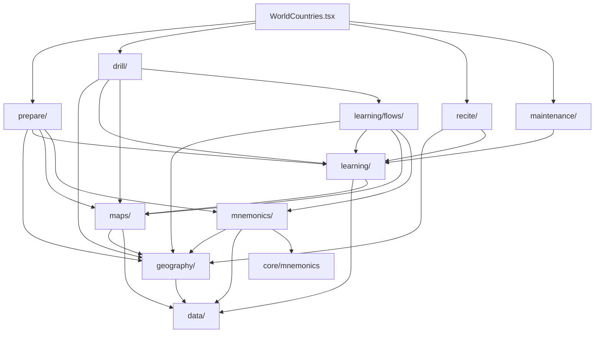

# World Countries

## Agent loading

Before modifying this feature, read
`src/features/world-countries/AGENTS.md` and this document. Normally remain in
`src/features/world-countries/` plus direct dependencies.

Load additional context only when triggered:

- shared learning, mnemonic, UI, or storage behavior →
  [CORE.md](../CORE.md);
- persisted state, identifiers, migration, reset, or backup →
  [PERSISTENCE.md](../PERSISTENCE.md);
- public exports, app integration, or cross-feature ownership →
  [SYSTEM.md](../SYSTEM.md).

Do not scan sibling features or load ADR 0007–0011 for ordinary work. The
current result of those decisions is documented here.

## Purpose

World Countries is one application with three user-directed activities:
Prepare constructs and inspects memory structures; Drill acquires, reviews, and
practises Country and Capital memories over a chosen scope; Recite is complete
ordered recall. Maintenance is a separate system-directed review capability.
The feature owns canonical geography, geography-specific learning and mnemonic
adapters, map infrastructure, workflows, and World Countries persistence.
Memo readiness remains the internal name for the durable coarse milestones.

## Entry points

- `WorldCountries.tsx` composes Prepare, Drill, Recite, and a high-level
  Maintenance entry. It resolves the Settings country-set policy once and
  provides the resulting active population to those workflows; capability
  rules do not belong here.
- `index.ts` is the public boundary.
- `prepare/WorldCountriesPrepare.tsx` is the implemented preparation workflow
  entry.
- `drill/WorldCountriesDrill.tsx`, `recite/WorldCountriesRecite.tsx`, and
  `maintenance/WorldCountriesMaintenance.tsx` are their workflow entries.
- `maps/workarea/MapWorkarea.tsx` is an experimental app-visible map surface.

## Ownership

- `data/` — canonical Country, Continent, Subregion identity, membership,
  geopolitical classification, and bundled reference data. The canonical
  dataset contains all 200 known entities; it is not the learner's active
  population. `Country.capital` is the canonical Capital answer taught by
  World Countries; Subregions define the Country scope and never duplicate
  Capital data.
- `geography/` — geography queries, country-set group definitions and the pure
  active-population resolver, user-authored ordering metadata at all hierarchy
  levels (World → Continent, Continent → Subregion, and Subregion → Country
  order), the effective-order resolvers, and metadata persistence.
- `learning/` — reusable World Countries recall semantics and guided flows:
  skill-specific
  answer matching, Country + skill target IDs, atomic evidence adapters,
  feature-local proficiency/mastery, core-vs-additional Country aggregation,
  direct Country-population scope progress, reusable learning map presentation,
  pure learning session mechanics, durable Subregion learning facts, the
  derived three-state Memo readiness model, and `flows/` presentation and
  orchestration for guided Country and Capital learning. Capital learning recalls
  Country → Capital; Drill also defines the independent Location → Country and
  Capital → Country skills.
- `maps/` — SVG controller/view, map definitions/assets, Country-to-SVG
  adapters, the reusable World/Continent `GeographyOverviewMap` presentation,
  temporary display-label overrides, and experimental workarea. Overview-map
  callbacks are workflow-neutral; callers interpret geographic clicks.
- `mnemonics/` — feature target IDs, geography mnemonic semantics, feature
  backup envelope, adapters over shared mnemonic storage, and workflow-neutral
  read-only `GeographyMnemonicView` presentation. Authoring controls belong to
  `prepare/`.
- `prepare/` — map-centered World → Continent → Subregion preparation
  navigation, readiness presentation, geography order authoring, preparation
  rails, and mnemonic authoring. `LearningOrderEditor` is shared by all three
  hierarchy levels, including the best-effort "Order left to right" map action.
- Prepare overview maps and rails present Subregion Memo readiness, not Drill
  proficiency. World and Continent Prepare progress count current canonical
  Subregions at the cumulative Countries and Countries + Capitals milestones.
- `drill/` — Drill-only setup and preferences, Continent/Subregion selection,
  four recall-mode definitions, visible Country scheduling, active session
  orchestration, and results. A Drill mode is a workflow combination of
  atomic learning skills; it is not part of learning-evidence identity. Drill
  is map-centered in both setup and active recall: scope and supporting controls
  adapt around the map through the established PageLayout rails, while the
  center retains the map and essential answer interaction.
- `recite/`, `maintenance/` — sibling workflow owners for complete recall and
  review selection. They may consume shared World Countries evidence without
  importing Drill internals.

There is no World Countries Quiz architecture. Do not recreate `quiz/`, broad
feature-local `domain/` or `persistence/` layers, generic `common/`, a root
`learning.ts`, or compatibility wrappers for removed internal paths.

## Decision rules

- Canonical geography content or identity belongs in `data/`.
- Canonical geopolitical classification belongs in
  `data/countryClassification.ts`; derived country-set policy belongs in
  `geography/countrySet.ts`.
- The active learning population is the union of UN Member States and the
  selected optional groups. It is resolved once at the World Countries shell
  and is never persisted as Country IDs.
- Queries and user-specific Subregion metadata/order belong in `geography/`.
- Answer evaluation, reusable recall/session mechanics, readiness, and learning
  state belong in `learning/`; preparation orchestration stays in `prepare/` and
  reusable guided-learning orchestration stays in `learning/flows/`.
- Drill geographic selection belongs in `drill/` and always contains exactly
  one Continent plus current Subregion IDs from canonical geography. Country
  membership is derived at runtime; a flattened Country scope is never
  persisted.
- `learning/` owns the atomic skills `location-to-country`,
  `country-to-capital`, and `capital-to-country`, and centrally constructs
  their opaque shared-learning IDs. `location-to-country` and
  `country-to-capital` are core skills; `capital-to-country` is additional.
  `Countries + Capitals` combines the first two skills but has no combined
  evidence identity.
- SVG loading, DOM behavior, assets, definitions, and ID translation belong in
  `maps/`; learning policy does not.
- Geography mnemonic target construction, metadata, and backup rules belong in
  `mnemonics/`; generic record/image mechanics stay in `core/mnemonics`.
- A capability shared by workflows must not be owned by one workflow folder.
  Workflow folders are siblings and do not import one another's internals.
- Pure and impure modules may share a capability owner. Do not create generic
  `domain/` or `persistence/` buckets solely to separate them technically.
- `WorldCountries.tsx` composes capabilities. It does not decide membership,
  learning transitions, scheduling, map translation, or mnemonic identity;
  its only membership responsibility is passing the shell-resolved population
  into workflow composition.

## Dependencies

Unless stated otherwise, arrows mean dependency:

The feature also consumes `core/types`, `core/storage`, `core/mnemonics`, and
narrow app integration contracts for settings, overlays, and page rails.
`MapWorkarea`, Prepare's feature-owned rail composition, and guided learning
publish rails through
the current app layout integration seam.

## Persistence

- `world-countries-world-metadata` stores the user-authored
  `WorldMetadata.continentOrder` sequence through `geography/`.
- `world-countries-subregion-metadata` stores user-authored
  `SubregionMetadata.countryOrder` rows through `geography/`.
- `world-countries-continent-metadata` stores user-authored
  `ContinentMetadata.subregionOrder` rows (keyed by stable `ContinentId`)
  through `geography/`.
- `world-countries-subregion-learning` stores durable Subregion Memo completion
  facts through `learning/`: `countriesLearnedAt` and `capitalsLearnedAt` are
  independent fields. A companion membership fingerprint hides completion
  rows that do not apply to the active Subregion membership while retaining
  selectable membership history.
- Geography mnemonics use the shared IndexedDB `mnemonics` store with `geo:*`
  target IDs. Subregion mnemonic records also retain the Country IDs/order they
  describe so stale stories can be detected.
- Country–Capital mnemonic records use `geo:country-capital:<CountryId>` and are
  owned by `mnemonics/`. This identifies optional Country ↔ Capital content,
  not Memo completion or future per-target learning performance.
- Drill preferences use the feature-owned `world-countries-drill-preferences`
  localStorage key and contain only the last Continent, Subregion IDs, Drill
  mode, and Country order (`ordered` or `random`). They are convenience state,
  not learning evidence.
- App Settings persists optional country-set group IDs in the existing
  `major-settings` record as `worldCountriesIncludedEntityGroups`. The default
  empty array means the 193 UN Member States; unknown IDs are discarded on
  load.
- Drill attempts use the existing domain-neutral `core/learning` adapter and
  the shared IndexedDB `attempts` store. Atomic IDs are constructed by
  `learning/recallTargets.ts` in the `world-countries:<skill>:<CountryId>`
  namespace. `Countries + Capitals` writes the Country → Capital evidence used
  by its core progress; the Capitals Drill helper is intentionally
  non-recording and does not change durable evidence or progress. No mnemonic
  target ID is reused. Recorded attempts preserve recall/recognition evidence
  and their local calendar date; World Countries atomic attempts are not age-
  or count-pruned.
- The feature's version-3 JSON backup envelope contains Geography mnemonics,
  World metadata, Subregion metadata, and Continent metadata; the import also
  accepts the version-2 (mnemonics plus Subregion metadata) and older
  mnemonic-only formats.

Load [PERSISTENCE.md](../PERSISTENCE.md) before changing any of these. World
Countries structural work may reset its own state when necessary, but must not
change Pi, Major System, Cards, global settings, or shared database ownership.

## Public boundary

Consumers outside this feature import from `@/features/world-countries`.
`index.ts` exports `WorldCountries`, `MapWorkarea`, and the deliberately narrow
country-set settings contracts used by app settings. Internal stores, queries,
session mechanics, mnemonic adapters, and map adapters remain private until a
real external consumer exists.

## Invariants

- `Country.id` and `Country.subregionId` are required runtime identity. Normal
  code reads them directly and does not reconstruct them from labels, dataset
  positions, slugs, or SVG IDs.
- `CountryId` and SVG ID are distinct. Translation belongs in `maps/`; workflows
  and persistence use `CountryId`.
- `data/` is authoritative for Continent → Subregion and Subregion → Country
  membership and classification. `WorldMetadata.continentOrder`,
  `ContinentMetadata.subregionOrder`, and `SubregionMetadata.countryOrder`
  change order only; they cannot add non-member
  Subregions or Countries. Resetting an order removes the override and falls back
  to canonical Geography order.
- `WorldMetadata.continentOrder`, `ContinentMetadata.subregionOrder`, and
  `SubregionMetadata.countryOrder` are the durable user-authored sequences.
  Prepare's order editors keep drag-and-drop changes in a local draft until the
  user explicitly saves; keyboard-accessible reordering is required at every
  level.
- World Prepare presents Continents in effective learning order and exposes the
  World-level order editor on the Continents rail. Continent Prepare presents
  Subregions in effective learning order and exposes the Continent-level order
  editor on the Subregions rail. Future complete World or Continent Recite
  traverses the effective hierarchy orders; flattened sequences are derived
  from the hierarchy and never persisted.
- `learning/countryLearningFlow.ts` owns pure state and transitions;
  `learning/flows/CountryLearningFlow.tsx` owns reusable guided UI orchestration.
- `learning/capitalLearningFlow.ts` owns pure Capital walkthrough, shuffled
  Country → Capital recall, clean-round qualification, and transitions;
  `learning/flows/CapitalLearningFlow.tsx` owns reusable guided UI orchestration.
- `SubregionLearningState` owns only coarse Memo completion timestamps. Future
  per-Country/per-skill performance belongs to the atomic World Countries
  learning-evidence model and must not reuse mnemonic IDs. The evidence is
  keyed by Country + recall skill and is independent for each direction.
- Drill setup offers one Continent, Entire Continent (all current Subregions),
  or a subset of that Continent's Subregions. Countries, Capitals, and
  Countries from Capitals all use the same derived Country population.
- Drill setup and active recall are separate phases. During active recall the
  setup controls are absent; after all selected Countries have been processed,
  results can start another run or return to setup.
- Map-based Drill modes schedule Countries as visible units. In
  `Countries + Capitals`, a wrong Location → Country answer is followed by a
  Country → Capital attempt for the canonical mapped Country, never for the
  learner's guessed Country. Both attempts are recorded independently.
- Prepare rail composition owns the World → Continent → Subregion navigation,
  order authoring, and preparation presentation. Guided learning rails under
  `learning/flows/` provide read-only context and mnemonic presentation; they
  omit answer-revealing content during recall and completion.
- `SvgMapController` remains imperative and framework-independent. It owns SVG
  loading, validation, discovery, styling, hover, labels, highlights, zoom,
  listeners, and cleanup—not geography learning rules. Temporary label
  overrides are per-controller presentation state and must not mutate the
  discovered `SvgMapCountry.name` metadata or bundled SVG assets.
- `SvgMapView.tsx` is the React adapter around that controller.
- `learning/CountryLearningMap.tsx` is the reusable feature map presentation used
  by Prepare, guided learning, and Drill; workflow folders do not import one
  another's internals.
- `maps/GeographyOverviewMap.tsx` owns World/Continent exploration, grouped
  hover synchronization, geographic click reporting, scope muting, and
  selection presentation. Within World Countries composition it uses the
  shell-resolved active population for interactive/grouped Countries while
  inactive canonical SVG geometry remains a neutral background. Prepare-specific
  readiness coloring stays in its thin `prepare/PrepareMap.tsx` wrapper;
  Drill-specific selection and navigation stay in `drill/`.
- `learning/CountryLearningMap.tsx` remains the individual Country learning and
  recall map; it is not replaced by the overview map.
- Subregion Memo readiness is exactly `NOT_MEMOED`, `COUNTRIES_MEMOED`, or
  `COUNTRIES_AND_CAPITALS_MEMOED`, derived from the existing
  `SubregionLearningState` timestamps. Countries completion is required before
  any Capital entry action; a legacy Capitals-only timestamp is preserved,
  acknowledged, and remains locked until Countries completion.
- Drill setup and results use relevant-evidence precedence per Country and
  selected mode: relevant atomic attempts own the map state, otherwise the map
  falls back to Subregion Memo readiness. Countries + Capitals activates its
  combined core presentation only after both core skills have an attempt. Memo
  readiness never creates or changes Drill evidence.
- Active Drill recall suppresses both Memo readiness and Drill proficiency map
  treatments until feedback, preserving recall safety.
- Workflow folders do not depend on sibling workflow internals.
- World Countries persistence does not modify unrelated feature state.
- Country-set changes do not delete attempts or change atomic target IDs.
- Subregion Memo completion is keyed by the active Country-membership
  fingerprint. Completion facts for prior selectable memberships remain in the
  existing learning keys and become applicable again when that membership is
  restored.
- User-authored Country order is projected over the active population while
  hidden stable Country IDs remain in stored metadata.
- Atomic skill proficiency is derived as `UNPRACTISED`, `WEAK`, `DEVELOPING`,
  `STRONG`, or `MASTERED`. Mastery requires successful explicit free recall on
  two distinct recorded local calendar dates after the latest failure;
  recognition and legacy successes improve proficiency but cannot establish
  mastery. Any incorrect attempt starts a new evidence boundary, and time or
  additional success alone never removes mastery.
- Country completeness means all core skills are mastered. Additional skill
  mastery is reported separately and cannot make a complete Country
  incomplete. Subregion, Continent, and World progress count current canonical
  Countries directly and default to core Country completion.
- Drill session accuracy is transient and distinct from durable proficiency,
  mastery, and Country completeness. Progress-bearing Drill modes present the
  current mode's durable progress perspective with a legend while keeping
  geographic scope selection visually separate; mapped Countries also expose
  non-color status descriptions. Capitals is a non-recording helper and reads
  Country → Capital progress/readiness as read-only practice guidance.
  Multi-skill results expose per-skill summaries. Active recall maps do not
  render target-revealing progress.
- Guided Capital learning, review, and direct practice require
  `countriesLearnedAt`; Drill exposes those actions for a single Subregion and
  keeps them locked with `Complete Countries first.` until the gate is
  satisfied. The separate Capitals Drill helper is practice-only and does not
  write evidence.
- Completed Country and Capital tracks expose parallel review and direct
  practice actions; Capital review starts the walkthrough, while Capital
  practice starts a fresh shuffled recall session.
- Capital walkthroughs use effective `SubregionMetadata.countryOrder`; Capital
  recall uses a temporary balanced shuffled bag and persists no session state.
- Capital completion requires a full current Country set in one clean shuffled
  round. An error disqualifies that round; only a subsequent fresh clean round
  can set `capitalsLearnedAt`.

## Source anchors

- `src/features/world-countries/WorldCountries.tsx`
- `src/features/world-countries/index.ts`
- `src/features/world-countries/data/countries.ts`
- `src/features/world-countries/data/countryClassification.ts`
- `src/features/world-countries/data/subregions.ts`
- `src/features/world-countries/geography/queries.ts`
- `src/features/world-countries/geography/countrySet.ts`
- `src/features/world-countries/geography/continentMetadataStore.ts`
- `src/features/world-countries/geography/worldMetadata.ts`
- `src/features/world-countries/geography/worldMetadataStore.ts`
- `src/features/world-countries/learning/countryLearningFlow.ts`
- `src/features/world-countries/learning/capitalLearningFlow.ts`
- `src/features/world-countries/learning/capitalLearningCompletion.ts`
- `src/features/world-countries/learning/memoReadiness.ts`
- `src/features/world-countries/learning/recallTargets.ts`
- `src/features/world-countries/learning/recallAnswerMatching.ts`
- `src/features/world-countries/learning/recallProgress.ts`
- `src/features/world-countries/learning/recallMastery.ts`
- `src/features/world-countries/learning/scopeProgress.ts`
- `src/features/world-countries/learning/progressPresentation.ts`
- `src/features/world-countries/learning/useWorldCountriesCountryColors.ts`
- `src/features/world-countries/learning/subregionLearningStore.ts`
- `src/features/world-countries/worldCountriesPopulation.tsx`
- `src/features/world-countries/learning/memoProgress.ts`
- `src/features/world-countries/drill/WorldCountriesDrill.tsx`
- `src/features/world-countries/drill/drillSelection.ts`
- `src/features/world-countries/drill/drillSessionState.ts`
- `src/features/world-countries/drill/drillPreferences.ts`
- `src/features/world-countries/drill/drillProgressPresentation.ts`
- `src/features/world-countries/maps/SvgMapController.ts`
- `src/features/world-countries/maps/GeographyOverviewMap.tsx`
- `src/features/world-countries/learning/CountryLearningMap.tsx`
- `src/features/world-countries/mnemonics/geographyMnemonics.ts`
- `src/features/world-countries/prepare/WorldCountriesPrepare.tsx`
- `src/features/world-countries/prepare/WorldCountriesPrepareRails.tsx`

## Historical rationale

The current architecture described above resolves:

- [ADR 0007](../../adr/0007-world-countries-memo.md)
- [ADR 0008](../../adr/0008-subregion-identity-metadata-country-order.md)
- [ADR 0009](../../adr/0009-subregion-memo-country-learning-workflow.md)
- [ADR 0010](../../adr/0010-world-countries-feature-architecture.md)
- [ADR 0011](../../adr/0011-world-countries-capability-ownership-correction.md)

These ADRs are not required to understand the current structure. Load a
specific one only when historical rationale is needed.
