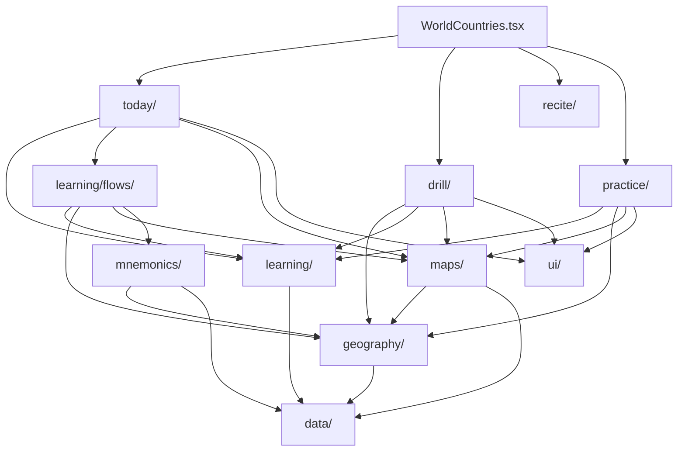

# World Countries

## Agent loading

Before modifying this feature, read this document and
`src/features/world-countries/AGENTS.md`. Load `../CORE.md` for shared
learning, mnemonic, UI, or storage behavior; load `../PERSISTENCE.md` for
persisted state, identifiers, migrations, reset, or backup; and load
`../SYSTEM.md` for public exports or app integration.

## Purpose and entry points

World Countries opens on a map-centered **Home**. Home is the default guided
entry: it shows World mastery, the interactive World map, a Journey continuation
attached to the map, and an independent Review/practice opportunity in the
right rail. A transient **Continent hub** provides the same guided composition
over a Continent-scoped active Country population.
**Playground** is the learner-facing top-level freeform activity destination for Recite, Quiz,
non-recording Practice, and configurable recorded Drill. **Progress** is a
derived supporting view, not a separate evidence or analytics system.

The stable feature root is Home. Home and Continent guided surfaces keep
Review and Journey context in the right rail, while the geography left rail
provides a concise current-scope Progress entry after its geography list.
Playground uses its own breadcrumb/back context to return to the originating
Home or Continent hub. The user-facing entry hierarchy is Home -> Continent
hub / Progress / Playground -> existing workflow owners. Structural authoring
is contextual rather than a separate workflow:

- Drill's existing World Geography rail authors Continent order.
- Drill's existing Continent Geography rail authors Subregion order.
- Learning's stable Subregion rail authors Country order and the existing
  Subregion mnemonic.

`WorldCountries.tsx` resolves the Settings country-set policy once, provides
the active population, and continues to own the top-level Home/Continent/
Playground composition. It composes those entry views with the existing Today,
Drill, Recite, Quiz, Practice, and Learning owners; the underlying workflow
semantics and ownership remain unchanged.
`WorldCountriesDrill.tsx` owns the Drill setup coordinator, Drill and Learn &
Practise purpose selection, active sessions, and results. Geography metadata
changes reach mounted consumers through the feature-owned geography subscription
signal rather than coordinator-owned refresh counters.

## Ownership

- `data/` owns canonical Country, Continent, Subregion identity, membership,
  geopolitical classification, and bundled reference data. `Country.capital`
  is the canonical Capital answer; `landBorders.ts` owns the reviewed static
  land-border pair graph and its effective active-population filtering queries.
- `geography/` owns active-population queries, effective World -> Continent ->
  Subregion -> Country ordering, the shared pure World-wide Subregion-scope
  normalization/toggling/count/label/effective-membership seam, order metadata,
  the semantic order-saving seam used by contextual editors, and the
  feature-owned geography subscription signal published after successful
  metadata mutations.
- `learning/` owns recall skills, answer matching, evidence adapters,
  raw per-target history, Today introduction and review scheduling,
  proficiency, pure session mechanics, durable Subregion learning facts and
  their feature-local subscription signal, Learning Readiness, and reusable
  guided Learning flows.
- `practice/` owns non-recording Practice execution and presentation reusable
  outside the Drill entry point, including the map-backed Learn & Practise
  path, transient Practice results, and the top-level Capitals and Neighbours
  Quizzes. Quiz is a Practice-semantic user-facing area with transient
  randomized runs, scoring, miss review, and retry; it owns no evidence,
  milestones, preferences, scheduling, or other durable learner state.
- `today/` owns the derived guided plan, independent curriculum and
  Review/practice opportunities, bounded due-review and targeted consolidation
  queues with retry state, guided setup/checkpoint states, and delegation into
  existing Learning flows. Its Review opportunity chooses scheduled due review
  before bounded unfinished-core consolidation; curriculum Learning remains
  independently available. It consumes learning, geography, maps, and
  feature-local UI but not Drill or Recite internals.
- `learning/flows/` owns Country and Capital Learning UI and orchestration.
  Learning modes own their milestone writes; the guided UI is not Drill
  implementation detail.
- `maps/` owns SVG loading, Country-to-SVG translation, overview and learning
  map presentation, the authored `SubregionId` learning-frame registry, and
  the workflow-neutral semantic camera-intent boundary. Active learning and
  recall callers request one intent at a time: default/overview,
  Subregion-learning, explicit Country fit, or target-local neighbourhood.
  The map layer resolves Country/Subregion identities to SVG IDs and
  viewBox coordinates. It also owns generic caller-controlled Country
  visibility, explicit Country fitting, target-centric local-neighbourhood
  zoom, and task-scoped answer-selection interaction points,
  map-owned synthetic dot metadata for visually weak source geography,
  representative learning anchors, map-owned pointer-intent resolution,
  existing Country sequence annotations, and workflow-neutral geographic
  callbacks.
- `mnemonics/` owns World Countries mnemonic target IDs, geography mnemonic
  adapters, backup behavior, read presentation, the reusable contextual
  Subregion mnemonic editor, and the feature-local mnemonic subscription over
  shared core mnemonic persistence.
- `drill/` owns Drill selection, preferences, four Drill modes,
  Learn & Practise purpose selection, recorded Drill sessions, Drill results,
  and World/Continent order authoring in the existing Geography rails. It also
  owns the feature-local, mutually exclusive
  Geography/proficiency setup scope. It does not expose a Drill Subregion
  detail or Country-order editor; it delegates non-recording Practice
  execution and presentation to `practice/`.
- `ui/` owns feature-local panels, breadcrumbs, hierarchy rows, inline reorder
  and opt-in Country click-sequence presentation, shared active map-task,
  task-context, and session-progress presentation, map-surface/dock
  presentation, task-dock status/action styling,
  the reusable World/Continent Geography selection rail and its common copy,
  the shared typed-answer lifecycle for primary World Countries recall, shared
  reusable answer-kind semantics across active workflows, and draft movement
  without persistence policy. Workflows provide the active answer kind from
  their task or skill. The typed-answer seam owns native
  submit handling, blank prevention, map-relative answer-feedback overlay,
  feedback state, focus/reset, and the shared 500 ms / 1800 ms lifecycle;
  multi-answer Practice workflows reuse that feedback presentation/lifecycle
  while retaining their own repeated-answer state and transitions. Workflow
  owners provide classification, disclosure copy, evidence, and transitions.
  The form dock owns answer entry and does not repeat result copy.
  Fuzzy is the interactive feedback exception by default: its overlay owns
  Continue and transient mini spelling practice, initially focuses Mini
  practise spelling, and creates no evidence. Drill-launched Learn & Practise
  flows may opt eligible incorrect answers into the same transient remediation
  controls; ordinary Drill, Today, and Recite incorrect answers retain their
  existing correction/retry lifecycle.
- `recite/` owns the ordered World Countries Recite setup, its three typed-recall
  modes, transient setup/session state, current-run outcomes, completion flow,
  and mode-specific latest-outcome status. It consumes geography, answer
  matching, map, and UI seams without importing Drill internals.

There is no broad feature `domain/`, `persistence/`, or `common/` layer and no
compatibility wrapper for the removed authoring workflow.

There is no `quiz/` package. `practice/` owns the user-facing Quiz
orchestration. Capitals uses the purpose-neutral finite
`learning/recallSession.ts` Country/skill cursor; Neighbours uses a separate
Practice-owned multi-answer run/session because one target accepts several
Country answers. Neither model owns evidence, persistence, rails, or maps.

The entry hierarchy is Home, transient Continent exploration, Playground, and
derived Progress. Progress remains a derived supporting view entered from the
geography/progress left rail rather than a second progress authority. The
activity semantics remain exactly Drill, Learning, and
Practice; Quiz is Practice and does not introduce an Assessment semantic.
Today remains the owner of guided planning/review and delegation into the
existing Learning flows even though its learner-facing presentation is now the
Home/Continent guided surface. Review/practice and curriculum Learning are
separate derived opportunities: the former is owned by the right rail and the
map dock owns the latter. When Today launches Learning, the completed Learning
surface can present a parent-provided next Journey handoff: the flow writes its
durable milestone first, Today observes the feature-local learning revision,
and the latest derived curriculum recommendation remains authoritative for a
direct Country-to-Capital or later Journey continuation. Review and weak-spot
practice remain independently selectable from Home rather than becoming a
completion handoff. If there is no further Journey recommendation, completion
returns to the current World/Continent guided surface. Direct Learn & Practise
and temporary proficiency Learning remain caller-owned and do not receive a
fabricated Today handoff.

Mounted World Countries consumers subscribe directly to the external state they
derive: geography metadata, durable Subregion learning, and World Countries
mnemonics each publish through a feature-local revision signal. Workflow
coordinators do not carry generic version counters solely to force a re-read.

## Activity model

Today derives its plan from raw core evidence and applicable Learning
milestones. It reviews only `location-to-country` and `country-to-capital`,
derives the current whole-Subregion Learning recommendation independently of
Review, and when no scheduled work is due it can expose a bounded, scope-local
consolidation queue containing only introduced, non-mastered core targets. All
queues, retry state, actions, and checkpoints remain transient; consolidation
uses the same typed free-recall/evidence seam as guided review.

Target introduction is intentionally separate from curriculum readiness:
successful evidence can make an atomic target eligible for review or
consolidation, but it does not by itself establish the whole-Subregion Country
Learning layer. Today keeps recommending Country Learning until that layer has
its durable `countriesLearnedAt` milestone, except when every active
`location-to-country` target has historically satisfied the existing two-date
explicit free-recall mastery evidence. That display/planning-only fallback
avoids redundant Country Learning without writing a synthetic milestone; it
uses historical qualification rather than current post-failure proficiency.
Later failures therefore remain visible to current Mastery and Review without
re-opening the Learning track. Once Countries are established by either route,
Capital Learning may be layered on top; the durable milestone meaning remains
unchanged. Capital Learning uses the same distinction: `capitalsLearnedAt`
establishes the Capital layer, while a display/planning-only fallback may treat
every active `country-to-capital` target with historical two-date explicit
free-recall mastery evidence as already known without writing a synthetic
milestone.

Today exposes all derived due candidates for urgency/counts, then snapshots at
most 8 candidates into a bounded interleaved review block. Priority
tiers remain authoritative: latest failures, missing successful typed recall,
then scheduled/overdue review. Interleaving prefers unseen Countries, a
different Continent, a different Subregion, and a different skill within the
active tier before using the existing due-candidate rank, so variety never
displaces more urgent work.

The plan also derives the underlying curriculum recommendation independently
of review priority. It computes the same readiness-based next action for each
active Subregion, then chooses the first available action in effective order
as the planner recommendation. Home/Continent resolves one transient active
Subregion: an explicit learner selection wins while it remains in the active
population, otherwise the planner-derived focus is used. When no curriculum
recommendation exists, the first incomplete core-recall Subregion remains
recall orientation only and is not presented as unfinished Journey curriculum;
review/consolidation queue order does not choose the active focus. The Review
opportunity exposes the bounded block that will launch, while Home support copy
distinguishes it from total due work when those values differ.

The 8-item Review/consolidation block is a repeatable learner choice rather
than a daily or visit gate. After a completed block, Today refreshes retained
evidence and can expose the next scheduler-derived block immediately while
work remains; blocks never auto-chain. Within-block delayed retries remain
owned by the existing Review queue.

Guided Country and Capital Learning retain their staged Meet, Find/Recall,
Mix, and Final recall pedagogy. The normal forward action from a completed
practice checkpoint starts Final recall directly; the final-gate state remains
available for legitimate Back/resume navigation. Learning and Review
completion surfaces use existing milestone/evidence truth. Checkpoint docks
own completion and next-action narration while map context remains scope
orientation. Completed Review counters are transient Home feedback rather than
another progress authority.

The derived Progress view keeps World -> Continent and Continent -> Subregion
hierarchy. Its rows combine complete-country totals, the existing core recall
state distribution, and, for Subregions, the existing Journey presentation.
Scope progress also derives the primary Mastery percentage from currently
mastered atomic core skills divided by active atomic core skills. The strict
complete-Country count remains supporting context rather than the percentage
denominator; for example, 9/10 mastered core skills can accompany 4/5 fully
mastered Countries. Continent rows also show a core-recall-complete region
rollup. Progress rails
explain scope and state semantics and do not choose Review or Journey actions.

World Countries review spacing is also derived from retained raw attempts. The
fixed `1, 3, 7, 14, 30, 60` day ladder advances on clean typed-recall days and
regresses one level for an isolated lapse or two levels for repeated
difficulty. Multiple attempts on one local date count as one event; difficulty
is not persisted and clears after two clean recall days. The guided Home
presents the resulting reason as concise `Why now` summary counts and the
Review flow gives a per-prompt `Why now` explanation, including repeated
difficulty and useful overdue wording. Current atomic recall proficiency is
also projected from this retained history: an isolated failure lowers one
band (Mastered -> Strong), repeated difficulty can lower it further through
Developing to Weak, and a retry cannot restore Mastered without two new
qualifying explicit-recall dates. `hasEverMastered` remains historical
evidence for the established-layer fallback and is never cleared by a later
mistake.

Continent, Playground, and Progress are transient views within the Home
composition. Existing workflow entry points remain reachable from Playground,
and Drill has a
non-persisted Purpose selector:

- **Drill**: `Countries`, `Countries + Capitals`, `Countries from Capitals`,
  and `Country for Shape`. These are the only `WorldCountriesDrillMode` values
  and may write atomic Drill evidence according to their defined semantics.
  Country for Shape uses the ordinary Country-name answer lifecycle while the
  map adapter isolates the target's source geometry and explicitly fits it;
  incorrect feedback reveals the active Countries in that target's Subregion
  on the same mounted map and highlights the target.
- **Learn & Practise**: Learning (`Learn Countries`, `Learn Capitals`) and
  non-recording Practice (`Locate Countries`, `Locate Capitals`, `Capitals`). Learning writes
  only the durable milestone owned by its active mode. Practice retains only
  transient answers, accuracy, progress, and results.

- **Quiz**: a top-level non-recording Practice experience with Capitals and
  Neighbours types. Capitals keeps its randomized Country → Capital flow.
  Neighbours uses the shared World-wide Subregion scope for target candidates,
  resolves required land-border neighbours from the canonical `data/` graph
  filtered to the active Country population, and snapshots unique targets,
  Country records, and effective neighbours at launch. Both types keep score,
  miss review, Retry missed, New quiz, and Change setup transient. Neighbours'
  multi-answer state is Practice-owned and does not use Drill preferences or
  presentation; active-run membership/order and effective neighbours are
  unaffected by later Settings or geography changes. During an active
  Neighbours run, session tools own found progress, hints, reveal, and
  secondary review state in the standard PageLayout right rail; expanded mode
  keeps the task progress, map, and answer/checkpoint dock without a workflow
  companion. The center checkpoint dock owns the complete resolved-neighbour
  summary and sole explicit continuation. Each resolved target waits at an
  explicit checkpoint for the Quiz coordinator to advance it, and no
  completion timer advances the run.

### World mastery overview

World-level Drill setup exposes a compact, derived World core-mastery summary
above the World map. It aggregates the existing Country core recall state over
the active Country population, so the population is both the denominator and
the source of every displayed state count. A Country is complete only when the
existing Location → Country and Country → Capital core skills are Mastered;
Capital → Country remains an additional skill.

The summary is non-persisted presentation state. It is independent of Drill
purpose and mode, while activity-specific map progress, Learning Readiness, and
Recite outcomes remain separate concepts.

Drill and Recite consume the same feature-local geography seam for a World-wide
selection of stable `SubregionId` values.
`WorldCountriesDrill.tsx` keeps `setupContinent` as transient setup navigation:
opening a Continent, returning to World, and opening a different Continent do
not change the selected scope. World setup derives each Continent's unchecked,
mixed, or checked state from the selected Subregions; full-Continent actions
are bulk operations over those IDs. The World rail and summary are the
authoritative selection surfaces, while the World map remains navigation. The
same reusable selection rail/copy is used by Recite; Drill persists its
configured selection while Recite keeps its setup selection transient.

Geography-backed Drill, non-recording Practice, Learn Countries, and Learn
Capitals may span multiple Continents. Ordered Country membership follows the
effective World Continent, Subregion, and Country order, and Learning advances
between selected Subregions with each flow receiving its active Continent.
Proficiency remains the mutually exclusive, Continent-scoped alternative
scope source.

Learn & Practise uses the derived Drill selection. Selected Subregions run
sequentially in effective geographic order, and each uses its effective
Country order from `geography/`. An already completed Subregion remains
eligible for intentional repetition.

At Continent setup, Geography and proficiency are alternative scope sources.
Weak/Developing proficiency scope derives from the current Drill perspective,
or from the skill exercised by the selected non-recording Practice activity.
The resolved Country membership is ordered through `geography/` and snapshotted
into the active Drill/Practice session when it starts. Learn Countries and Learn
Capitals may also snapshot a non-empty proficiency Country scope for a temporary
Learning run. That run never writes a Subregion milestone or reinterprets its
Country set as a Subregion; durable Learning milestones still require complete
Subregion scope.

World Countries Learning introduces items in bounded Sets. The persisted
`New items per set` setting is snapshotted when a multi-Subregion Learning run
starts and applied independently to each Subregion. The feature-local plan
partitions each effective Country order without exceeding the selected maximum
or creating a one-item tail. Country Learning uses Review, map Location, and
typed Country-name Practice for each Set; Capital Learning uses Review and
typed Country-to-Capital Practice. After the second and later Sets, cumulative
Combined practice is inserted before the next Set, with a required full-scope
Combined practice before Final recall. A one-Set scope has no duplicate
Combined stage.

Active Learning keeps its context rail registered from walkthrough through
in-session Location, Practice, Combined, and Final recall phases. The
walkthrough rail is the rich authoring presentation; later in-session phases
use a reduced, non-authoring inline orientation with the geography, staged
scope, and full ordered Subregion visible rather than a nested stage card.
Set-local phases identify and emphasize
the current Set, mark preceding Sets as completed for this Learning pass, and
keep upcoming Countries subdued. Combined phases present the cumulative
introduced scope without a current-Set claim, while Final phases present the
full scope without Set-state distinctions. Walkthrough maps use the same
full-order sequence labels as the rail while rendering only the active Set as
the unmuted working scope. Map metadata names the active Set or combined scope
and the full Subregion count. The full order remains the authoring surface, so
Set emphasis does not restrict Country-order editing or change staged
membership.

All temporary Learning Practice scopes use the shared
`core/scoring/roundScheduler.ts` through a feature-local adapter with a
non-limiting speed threshold and actual answer latency. Location, Country-name,
Capital, and Combined scopes each start fresh scheduler state. Only the
whole-Subregion ordered Final recall writes the owning Learning milestone;
journey and scheduler state are not persisted.

The learner-facing Journey is a derived presentation over existing Subregion
milestones and recall/proficiency evidence. Its guided learning path is
Countries -> Capitals -> Region learned; long-term Mastery is a separate
recall outcome built through Review and practice. No journey-step,
current-Continent, curriculum focus, or active Subregion selection field is
persisted. The Country
Learning milestone satisfies the Countries layer and is sufficient to layer
Capital Learning on top; historically qualified Country recall is a
non-persisted fallback for already-known Countries, while partial target
practice is not. Capital Learning is likewise established by its durable
milestone or historically qualified Country-to-Capital recall, while incidental
Capital practice remains insufficient. Capital learning extends existing
Country knowledge and does not reset Country evidence. Once both layers are
established, Region learned is complete even when core recall is still
developing; current Mastery becomes Mastered only when the existing core recall
evidence is complete. On Home and the
Continent hub, Today resolves one active Subregion from the transient explicit
selection or the planner-derived default. That same focus drives the geography
rail selection, Journey presentation, map outline, dock action, and Learning
launch. A selected learned Subregion remains active and shows its completed
Journey/Mastery state without a curriculum CTA; it does not silently fall back
to another planner region. The selection is not persisted and is cleared or
ignored when it leaves the active scope/population. World Home associates the
active Subregion with its containing Continent row while preserving the same
map progress. Normal Home/Continent maps use one primary status at a time:
Not learned is neutral, Countries learned is a warm-neutral diagonal pattern,
and an established Countries + Capitals layer is presented as solid Recall
health. Early recall, Weak, Developing, Strong, and Mastered use the shared
warm-to-green solid palette. The learner-facing map ladder therefore has seven
states: Not learned, Countries learned, Early recall, Weak, Developing,
Strong, and Mastered. The Learning patterns are derived from durable
Subregion milestones or the existing historical established-layer fallback;
they do not add per-Country flags or a new store. While Capital Learning is
active after the Country layer is established, the diagonal pattern remains
the stable underlying status through walkthrough, practice, mix, and final
recall. When the Capital Learning milestone is completed, the Learning pattern
is removed and the map moves directly to the current solid Recall-health state.
Durable guided Learning completion can expose a
same-focus Country-to-Capital handoff before a later planner-derived
next-region handoff; it keeps an explicit return action and never auto-starts
that recommendation. The attached Today task dock owns the active Journey
continuation and identifies its scope, while the right rail owns the
independent Review/weak-spot opportunity. Review remains independent of the
active Learning focus, and the Journey panel remains orientation rather than a
second next-action authority.

Guided Learning presents the internal staged phases with learner-facing
language: Meet, Find, Recall, Mix, and Final recall. One-Set learner-facing
context uses the item or pair count without meaningless Set 1 ceremony;
multi-Set plans retain truthful Set identity. The walkthrough rail keeps
geography, Set/count context, the full order, order authoring, and eligible
mnemonic support in one compact orientation surface. It does not expose
implementation-shaped numbered steps or duplicate progress/stage narration;
active and Final phases retain a quiet, read-only context rail.
World Progress summarizes Continents; Continent Progress summarizes
Subregions.

During active scheduler-driven Learning Practice, the flows expose temporary
scheduler progress through the feature-local task-context seam on the shared
map surface. The progress section is session-scoped and phase-specific; the
Learning context rail does not duplicate it. Active Drill,
Practice, Recite, Today Review, and map-backed Learning phases also provide
semantic task/context/progress data to the shared World Countries map-activity
surface; setup, overview, readiness, and completion screens retain their own
presentation. Active Learning uses learner-facing progress language rather than
exposing the internal Learning Readiness label. Home and Continent guided rails
present Review/practice and Journey as sibling choices: the right rail owns the
Review opportunity and Journey orientation, while the map dock owns the
primary Journey continuation. Review does not suppress Learning, and the
Journey panel does not duplicate the dock action. The compact Learning context
rail stays present through Final recall as a quiet, full-scope, read-only
orientation surface.

## Learning Readiness

Durable Learning Readiness is derived from `countriesLearnedAt` and
`capitalsLearnedAt` and has exactly three internal curriculum states:
`NOT_LEARNED`, `COUNTRIES_LEARNED`, and
`COUNTRIES_AND_CAPITALS_LEARNED`. The last is a curriculum milestone and
handoff boundary, not a separate learner-facing map-status rung. Normal map
presentation exposes only Not learned and Countries learned during Learning,
using `#5A5E66` as the neutral base and a `#3E3719` diagonal pattern at 0.46
opacity, 1.8 width, and 11 pitch for Countries learned; both Learning layers
complete then hand off to solid Recall health. A display-only Drill-evidence
bridge may promote a Subregion to Countries learned when every active Country
has current Location -> Country proficiency of Developing or better. It never
writes a Learning milestone or changes Drill evidence. This Drill setup
readiness is not the Today curriculum gate: the guided planner requires the
durable Country milestone or the separate complete-recall fallback described
above before recommending Capital Learning.

World Countries maps use the shared quiet treatment of `#202326` background,
`#2A2D33` / 1.05 Country borders, and `#DDE0E5` labels at 0.8 opacity.
Geographic selection uses `#73CDD4`; answer-domain task accents remain owned by
the existing Country/Capital answer semantics.

Today map status uses the established-layer form of this truth: a durable
layer is authoritative, while the existing all-active-Country historical
`hasEverMastered` fallback may establish the display/planning signal without
writing a milestone. `Early recall` is a Recall-health label for internal
`unpractised`, not a global synonym for an untouched Country; primary ladder
surfaces gate it until both Learning layers are established. Later failures can weaken current recall and increase
Review urgency, but do not reopen a Learning pattern. The Home legend and
Country accessible descriptions expose the current status in text: Learning
lists Not learned and Countries learned with a real diagonal pattern swatch;
Recall health lists Early recall, Weak, Developing, Strong, and Mastered with
solid swatches. Dedicated readiness surfaces may use text to describe the
internal Countries + Capitals milestone, but do not add a third map pattern.

The standalone Learn Capitals flow remains runnable from its intentional
non-Today entry points. The Today guided recommendation uses the Country
establishment gate above rather than target introduction alone.

Recite is a sibling activity with exactly three ordered modes: Countries,
Countries + Capitals, and Countries from Capitals. It resolves the same
World-wide selected Subregions and Countries through `geography/`, snapshots
that effective order when a run starts, and keeps retries, reveals, and
completion outcomes inside `recite/`. Recite uses typed free recall and never
writes Drill evidence, Learning milestones, Learning Readiness, or Maintenance
evidence. Its setup retains only a transient global Subregion selection, mode,
and map assistance; it may span multiple Continents and incomplete sessions
are discarded without persistence. During an active multi-Continent run the
map and read-only Geography rail follow the current prompt Country's
Continent, while the rail remains grouped in effective World/Subregion order.

Recite progress remains stored independently by mode. Countries setup derives
its displayed status from the stronger of the latest Countries and Countries +
Capitals outcomes, while Countries + Capitals and Countries from Capitals remain
mode-isolated views. Active sessions suppress historical setup status and use
only current-run outcomes. `GeographyOverviewMap` and the underlying SVG
controller accept
caller-selected hidden Country IDs; hidden geometry, labels, hover, clicks, and
accessible descriptions are suppressed generically, without map-layer Recite
semantics. Active Recite maps are non-interactive geographic scaffolds. Recite,
Today, Drill typed recall, standalone Practice, and Learning typed Practice and
Final recall use the feature-local typed-answer lifecycle. Exact answers
transition automatically after the shared success dwell; ordinary resolved
incorrect answers transition after the correction dwell. Recite is the workflow
exception: an incorrect answer keeps the expected answer hidden, then resets
the same prompt for another focused attempt, while Reveal / Skip resolves and
advances automatically after the correction dwell.

Applicable active Today, Drill, Learning, Practice, Quiz, and Recite
learning/recall surfaces use the authored frame for their current Subregion,
independent of workflow, prompt order, retry state, or Country/Capital answer
kind. A Country change inside one Subregion changes target presentation only;
the frame changes when the Subregion changes. Setup, navigation, selection,
progress, and authoring maps retain their default or explicit overview
semantics. Neighbours and Country-for-Shape retain their stronger explicit
target-local and Country-fit cameras respectively.

## Contextual authoring rules

- The effective hierarchy order comes from `geography/` for World, Continent,
  Subregion, and Country lists.
- During Learning walkthrough, the visible rail list is the authoring surface.
  `Edit order` transforms that list in place; it never opens a modal, overlay,
  drawer, second rail, side panel, or separate screen. The persistent
  non-walkthrough Learning rail keeps the same order read-only for orientation.
- World and Continent Drill rails edit only their represented hierarchy.
  Learning rails edit Country order only.
- The Learning Subregion Country editor keeps drag/drop available and may opt
  into an inline `Click order` mode. Click mode starts an empty local sequence
  over the current full Country draft, gives selected Countries contiguous
  1-based positions, and keeps Save disabled until the complete membership is
  selected exactly once. While active, the map is the primary pointer surface
  for that same sequence and receives the full order-authoring membership,
  even when the current Learning stage is a smaller subset; the rail remains
  the synchronized status and keyboard-accessible secondary surface. A
  complete sequence becomes the current full draft and saves through the same
  `geography/orderAuthoring.ts` seam; an incomplete sequence is discarded when
  returning to drag/drop.
- Draft changes are local to the mounted context. Save writes through
  `geography/orderAuthoring.ts`; Cancel or unmount discards the draft. Reset
  canonical and map auto-order are draft-only actions requiring explicit Save.
- Subregion learning maps may render Country sequence annotations. World and
  Continent overview maps do not render custom Continent or Subregion names;
  their left rails remain the visible hierarchy-order surface. Maps never
  persist order.
- A failed order write keeps the editor open with its draft and a recoverable
  error. Existing best-effort storage helpers may silently swallow browser
  storage failures, so reliable detection of every failure is not required.
- The stable Learning Subregion walkthrough rail exposes `Edit mnemonics` for
  the existing Subregion mnemonic target. Order and mnemonic authoring are
  hidden in the reduced in-session rail, ordered recall, active recall, and
  completion.
- Drill gives concise Country-order guidance in its existing setup/map context.
  It does not add a Subregion detail, Country list, or navigation shortcut.

## Decision rules and dependencies

- Canonical identity belongs in `data/`; user order belongs in `geography/`.
  Country IDs are intrinsic canonical record data and must never be inferred
  from array position. `COUNTRY_RECORDS` owns both canonical Country identity
  and canonical Country order; user-order metadata may reorder stable IDs
  without changing identity.
- `GeographyOverviewMap` and `CountryLearningMap` report clicks and hover
  neutrally; callers decide selection, navigation, and learning behavior.
- During Learning Country `Click order`, `InlineOrderEditor` remains the sole
  click-sequence owner. The Learning flow routes both rail and map activation
  into that owner, while `CountryLearningMap` receives the full authoring
  membership plus semantic Country-ID position labels as presentation inputs;
  staged Learning scope must not narrow order-authoring map clickability.
- `learning/flows/` may use geography and maps but never Drill internals.
- Active Learning map-backed phases use a flow-local map host with the feature
  `ui/` map surface/dock presentation. The host owns the mounted map while
  flow stages change; phase-specific content owns task status, controls, and
  dynamic map presentation through that host.
- Active World Countries map sessions use one feature-local task/activity
  presentation seam. Workflow owners provide direction, cue, compact hidden-
  rail context, and meaningful progress; the shared UI adapts that semantic
  input between standard and expanded MapSurface presentations. Expanded mode
  promotes only essential task context and progress while keeping the map and
  compact interaction dominant. The active task is rendered once, without
  redundant activity or answer-kind badges; accessible form and map labels
  remain workflow-owned.
- `MapSurface` keeps lightweight context above a relative map container and
  supports optional map metadata, a centered map-relative feedback overlay,
  explicit overlay, attached, and stacked dock placement, and the one common
  World Countries expand/collapse affordance. Expansion publishes the generic
  transient `expanded-center` PageLayout presentation, keeps the same map and
  dock mounted, reserves the complete bottom task row before fitting the active
  SVG/viewBox as contain sizing within the actual remaining desktop map slot.
  The map controller retains semantic camera intent separately from the
  concrete viewBox, derives the expanded viewBox from that intent plus the
  measured slot aspect ratio, and recomputes it through the existing resize
  lifecycle without accumulating camera drift. Standard presentation keeps
  the source or normal semantic camera framing. Authored Subregion learning
  frames are finite map-coordinate metadata and are not generated from target
  geometry; an unresolvable frame falls back to the complete authoritative
  regional map. The map controller's target-centric neighbourhood
  intent resolves target geometry components against required context-Country
  geometry, keeps the smallest stable component set that covers those
  relationships, and adds bounded nearest local path samples (with a
  conservative bbox fallback) without fitting complete context-Country bounds;
  generic Country zoom keeps
  its full selected-bounds contract. Expansion resets when the owning surface
  unmounts or the viewport leaves `xl`.
  `MapSurface` may also compose an expanded-only generic companion beside the
  primary dock for callers that need it. Drill promotes its Country-position
  and step-progress semantics into a compact expanded header summary instead
  of supplying a bottom progress companion. `TaskDock`
  provides compact navigation, checkpoint, form,
  hint, and completion variants; checkpoint and completion docks compose their
  status copy and action group as one unit at desktop widths. Typed Practice,
  Final Recall, and typed Drill use the form dock below the map so answer entry
  does not obscure map labels; review navigation remains a compact map overlay,
  while multiple-choice and location-click interactions may remain attached
  below the map. Learning flows choose placement by task rather than treating
  every dock as a generic card. Overlay docks attach at desktop widths and fall
  back to normal flow below `xl`.
- Primary typed World Countries recall uses `ui/WorldCountriesTypedAnswer`.
  Its owner-provided prompt key clears stale value and feedback, and its
  explicit accessible answer label is separate from visual placeholder copy.
  Enter, the Check button, and native form submission share one deduplicated
  path. Exact, fuzzy, incorrect, and revealed feedback is presented in the
  centered map-relative overlay; the dock contains only answer entry and
  answerable-state actions. Exact feedback lasts 500 ms; incorrect and
  revealed feedback lasts 1800 ms. There is no generic post-answer Continue
  or Next action. Fuzzy remediation is the accepted-answer exception by
  default: its inline overlay practice requires two consecutive exact
  spellings, focuses the spelling input while open, then focuses Continue on
  completion. Drill-launched Learn & Practise may expose the same remediation
  choice after an incorrect answer; selecting it holds that feedback until
  Continue or mini-practice completion. Today delayed-retry Skip and Recite
  Reveal / Skip remain answerable-state actions owned by those workflows.
- Active Drill, Practice, Recite, Today Review, and map-backed Learning tasks
  use the shared World Countries task/activity presentation: a direction when
  meaningful, one main cue, compact session context, and workflow-owned
  progress. They do not repeat an explicit `ANSWER · COUNTRY` /
  `ANSWER · CAPITAL` badge or redundant activity chrome in the active task or
  dock. Standard presentation keeps selected geography in the left rail, the
  task/map/interaction in the center, and workflow status/actions in the right
  rail. Expanded presentation uses one dominant task card and an optional
  secondary progress-only card for useful hidden-rail context; it does not
  recreate the rails or move progress into a separate workflow-specific
  header. Reusable answer-kind semantics are shared across active World
  Countries workflows: Country-answer highlights use cyan `#0891b2` and
  Capital-answer highlights use violet `#8b5cf6` across Drill, Practice, Today
  Review, Learning, and Recite. This active-task palette is separate from
  setup, progress, proficiency, status, result, and geography palettes.
- `SvgMapController` owns one explicit task-assistance layer for map-answer
  candidates and an intentional task target. Generic `selectableIds`,
  hoverable IDs, highlighted/progress state, semantic colors, click-handler
  presence, and map level never activate tiny-Country assistance. For an active
  answer-selection task, each candidate owns zero or more task interaction
  points. Points may be derived from compact source geometry or supplied as
  authored synthetic dots for a source Country whose genuine map geometry is
  not a usable dot-like target at the displayed scale; configured synthetic
  dots replace, rather than add to, derived component clouds. A
  location-question/task target is separate and owns at most one
  representative learning anchor; explicit multi-dot metadata is authoritative
  only for that deliberate representative decision. `SvgMapView` carries the
  generic task contract separately from ordinary map interaction, while
  `CountryLearningMap` translates canonical Country IDs and map definitions
  into SVG-level task data. Source Country paths remain authoritative for
  discovery, semantic styling, identity, direct hits, and `getBBox()`-based
  zoom. A single map-owned pointer-intent resolver evaluates exact assisted
  source geometry, then the nearest bounded interaction region, then ordinary
  selectable source geometry; its `{ Country, interaction point? }` result
  drives task hover color, local marker/ring emphasis, and click dispatch.
  Generated task geometry is presentation-only (`pointer-events` does not
  decide identity), is placed in root SVG user space through source/root CTM
  conversion, and uses screen coordinates for pointer distance and
  screen-space sizing. Positions and radii are recomputed on resize, zoom, and
  presentation changes. Hidden Countries have no task target or interaction
  point. When task assistance is absent, ordinary maps render only their
  original SVG geometry. Native geometry-derived points and authored synthetic
  dots use the same task interaction/presentation pipeline; synthetic dots are
  task-scoped map presentation and never alter canonical geography or ordinary
  map rendering.
- The generic `SvgMapGroupOutline` presentation seam supports optional
  outline/halo effect and underlay/overlay placement. Geography adapters
  translate caller-owned per-Country edge treatments into grouped,
  multipart-safe underlays. Persistent edge layers render below source Country
  paths while existing transient hover, selection, task, and answer styling
  remains in the overlay layer; hidden or muted Countries are omitted and the
  declarative render reconstructs the edge and recall fill after interaction.
- The generic `SvgMapCountryPattern` presentation seam renders caller-owned
  diagonal or crosshatch fills from SVG `<pattern>` definitions. World
  Countries Learning uses only the diagonal variant; the generic seam retains
  crosshatch capability for workflow-neutral callers. Geography
  adapters translate per-Country patterns to every authored multipart path;
  muted, hidden, task, and focus treatments retain precedence and declarative
  rerenders restore the semantic pattern or solid fill. World Countries uses
  the seam for neutral Learning presentation while retaining group outlines
  for generic focus/selection and other workflows.
- For the same map source, Continent, effective scope membership, and
  intentional zoom behavior, Learning updates map highlights, names, hover,
  and sequence annotations declaratively. Workflow phase alone must not
  remount the SVG or show its loading placeholder again.
- Learning Review arrows are traversal-only and stop at item boundaries.
  Safe `Enter` targets the single visible primary action in non-editing states;
  native controls retain their key behavior, and feature shortcuts are
  suppressed for modifiers, repeats, editable controls, absent/disabled
  actions, and timer-owned feedback. Ready/gate status uses polite accessible
  status semantics and focuses its primary action after transition.
- Active Drill question queues are constructed at session start and are not
  mutated by later order edits. Random versus In-order Drill scheduling is
  independent from authored geographic order.
- Recite question queues are constructed at session start from effective
  Subregion/Country order and are not mutated by later population or order
  changes. Recite mode and map assistance are fixed for the run; only the
  typed prompt/task controls advance it.
- Standard PageLayout geometry, `useRails`, `useLayoutHeader`, drawer behavior,
  and rail widths remain unchanged. `MapSurface` may publish the transient
  expanded-center presentation through the shared PageLayout context; this
  generically suppresses registered header and rail presentation without
  moving expansion state or breakout CSS into Today, Drill, Practice, Learning,
  or Recite.
- Today follows the World Countries map-centered spatial grammar: the map and
  immediate primary task stay in the center, geographic context stays in the
  left rail, and Today workflow/session status and controls stay in the right
  rail. Today owns this presentation and remains independent from Drill
  workflow internals.

## Persistence

- Existing World, Continent, and Subregion metadata keys and schemas remain
  unchanged.
- The feature exposes order-only Settings export/import/reset through the
  existing version-3 Geography JSON family. Export returns raw saved World,
  Continent, and Subregion metadata without materializing canonical rows;
  restore replaces all three saved metadata collections, reset clears them,
  and neither action writes Geography mnemonics or learning/activity state.
- `world-countries-subregion-learning` retains independent milestone fields
  and active membership fingerprint behavior.
- Geography mnemonics remain in the shared IndexedDB `mnemonics` store with
  existing `geo:*` target IDs.
- `world-countries-drill-preferences` remains the owner of the selected
  World-wide Subregion IDs, actual Drill mode, and Drill order. New writes have
  the shape `{ subregionIds, mode, order }`; they do not persist setup
  navigation, derived Continent state, scope counts, or Country IDs. Reads
  continue to accept the legacy `{ continent, subregionIds, mode, order }`
  shape and preserve all valid selected Subregions across the World. Purpose
  state and Learn & Practise mode are not added to this schema.
- Proficiency filter selection and any resolved Country membership remain
  transient Drill setup/session state; no resolved Country list or new
  persistence key is stored.
- `major-settings` owns the persisted World Countries `New items per set`
  preference (`3`, `4`, `5`, or `all`), defaulting to `3`. No intermediate
  Learning plan, scheduler, or resume record is persisted.
- `world-countries-recite-progress` owns versioned latest-completed Recite
  outcomes keyed by `(ReciteMode, CountryId)`, including completion timestamps.
  It stores no flattened session sequence, setup preference, incomplete run, or
  prompt history. Recite outcomes are independent from Drill attempts and
  Learning milestones.
- Atomic Drill and Today review evidence continue to use the existing attempts
  store and `world-countries:<skill>:<CountryId>` IDs. Practice never writes it.
- Capitals and Neighbours Quiz are transient Practice: they write no attempts,
  Drill preferences/proficiency, Learning milestones/readiness, Today state,
  Recite progress, Quiz history, or other durable learner signal. Their setup,
  active Country snapshots, question order, outcomes, results, and missed
  retries live only for the mounted Quiz area. Neighbours keeps its
  multi-answer target state separate from the single-answer Capitals records.
- Today reads raw core evidence through `learning/recallHistory.ts` and writes
  ordinary `recall` evidence through the existing feature adapter. It owns no
  schedule, plan, queue, retry, or checkpoint persistence.
- A persisted legacy Drill `mode: "capitals"` remains invalid under the
  current four-mode union and falls back to the normal `countries` default.
  No migration is performed.

## Invariants

- Country IDs and Subregion IDs are runtime identity; persistence and
  workflows do not reconstruct identity from labels or SVG IDs.
- Effective hierarchy order can reorder existing members but cannot add
  Countries or Subregions.
- Contextual authoring is non-recording. It does not start Learning, Practice,
  Drill, or Recite and does not write evidence, proficiency, milestones,
  Practice progress, Drill preferences, or mnemonic data when saving order.
- Drill setup and active recall are separate phases. Practice is separate in
  presentation and durable effects even when it shares session mechanics.
- Geographic Learning completion is per Subregion and per owned milestone.
  Proficiency Learning completion is temporary and does not create a partial
  Subregion milestone. Successful Learn Capitals completion never clears or
  fabricates Countries learning.
- Durable Learning completion may be presented to learners as Countries learned
  or Capitals learned; internal establishment/readiness names and milestone
  semantics remain unchanged.
- Active Drill recall suppresses map progress treatments until feedback.
- Geography and proficiency scope sources are never combined. Selecting
  proficiency clears Subregions; selecting a Subregion, Entire Continent, or
  a map Country clears proficiency filters.
- Proficiency-derived Drill/Practice sessions retain their concrete Country
  membership for the session lifetime, even if later evidence changes.
- Proficiency-derived Learning runs retain their concrete Country membership for
  the run lifetime and do not write Learning milestones.
- Country-set changes do not delete attempts or change atomic target IDs.
- Temporary Set and Combined scheduler progress is session-only and never
  writes Drill evidence or Learning milestones.
- Primary typed-answer interaction is workflow-neutral presentation and
  lifecycle only. Classification, answer disclosure, evidence, queue or
  scheduler mutation, Recite outcomes, and Learning repair semantics remain
  owned by Today, Drill, Learning, or Recite.
- Final recall is mandatory for Learning completion; skipped temporary scopes
  cannot fabricate Ready state or completion evidence.
- Workflow folders do not depend on sibling workflow internals.
- Quiz run membership, Country records, and question order are snapshots;
  live Settings/geography changes affect only a later run.
- World Countries persistence does not modify unrelated feature state.

## Source anchors

- `src/features/world-countries/WorldCountries.tsx`
- `src/features/world-countries/WorldCountriesPlay.tsx`
- `src/features/world-countries/drill/WorldCountriesDrill.tsx`
- `src/features/world-countries/drill/DrillSetup.tsx`
- `src/features/world-countries/ui/WorldMasterySummary.tsx`
- `src/features/world-countries/geography/effectiveOrder.ts`
- `src/features/world-countries/geography/subregionScope.ts`
- `src/features/world-countries/today/WorldCountriesToday.tsx`
- `src/features/world-countries/today/GuidedHomeRails.tsx`
- `src/features/world-countries/today/WorldCountriesProgressView.tsx`
- `src/features/world-countries/today/journeyPresentation.ts`
- `src/features/world-countries/today/TodayReviewSession.tsx`
- `src/features/world-countries/today/todayPlan.ts`
- `src/features/world-countries/learning/recallHistory.ts`
- `src/features/world-countries/learning/todayIntroduction.ts`
- `src/features/world-countries/learning/reviewSchedule.ts`
- `src/features/world-countries/drill/DrillSetupRails.tsx`
- `src/features/world-countries/ui/GeographySelectionRail.tsx`
- `src/features/world-countries/drill/drillProficiencyScope.ts`
- `src/features/world-countries/drill/drillProgressPresentation.ts`
- `src/features/world-countries/recite/WorldCountriesRecite.tsx`
- `src/features/world-countries/practice/WorldCountriesQuiz.tsx`
- `src/features/world-countries/practice/CapitalQuizSession.tsx`
- `src/features/world-countries/practice/practiceRun.ts`
- `src/features/world-countries/learning/recallSession.ts`
- `src/features/world-countries/geography/worldScope.ts`
- `src/features/world-countries/ui/WorldCountriesTypedAnswer.tsx`
- `src/features/world-countries/recite/reciteSession.ts`
- `src/features/world-countries/recite/reciteProgress.ts`
- `src/features/world-countries/recite/recitePresentation.ts`
- `src/features/world-countries/drill/DrillSession.tsx`
- `src/features/world-countries/ui/WorldCountriesAnswerFeedback.tsx`
- `src/features/world-countries/ui/MiniSpellingPractice.tsx`
- `src/features/world-countries/learning/flows/CountryLearningFlow.tsx`
- `src/features/world-countries/learning/flows/CapitalLearningFlow.tsx`
- `src/features/world-countries/learning/stagedLearningPlan.ts`
- `src/features/world-countries/learning/schedulerLearningSession.ts`
- `src/features/world-countries/learning/stagedCountryLearningFlow.ts`
- `src/features/world-countries/learning/stagedCapitalLearningFlow.ts`
- `src/features/world-countries/learning/flows/GuidedLearningRails.tsx`
- `src/features/world-countries/geography/queries.ts`
- `src/features/world-countries/geography/orderBackup.ts`
- `src/features/world-countries/geography/geographyRefresh.ts`
- `src/features/world-countries/geography/orderAuthoring.ts`
- `src/features/world-countries/maps/GeographyOverviewMap.tsx`
- `src/features/world-countries/maps/learningAnchors.ts`
- `src/features/world-countries/maps/learningAnchors.test.ts`
- `src/features/world-countries/maps/geographyMapAdapter.ts`
- `src/features/world-countries/learning/CountryLearningMap.tsx`
- `src/features/world-countries/mnemonics/GeographyMnemonicEditor.tsx`
- `src/features/world-countries/ui/InlineOrderEditor.tsx`
- `src/app/layout/PageLayoutContext.tsx`

The durable Learning-versus-Practice boundary remains recorded in ADR 0024.
