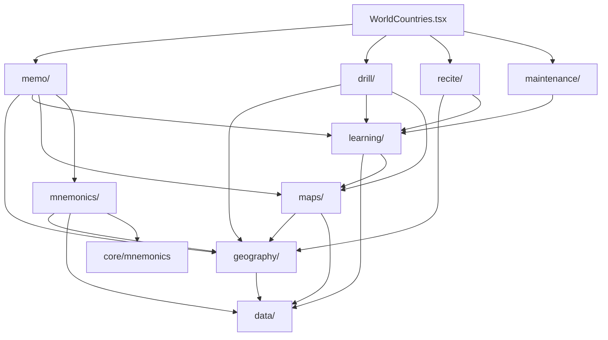

# World Countries

## Agent loading

Before modifying this feature, read
`src/features/world-countries/AGENTS.md` and this document. Normally remain in
`src/features/world-countries/` plus direct dependencies.

Load additional context only when triggered:

- shared learning, mnemonic, UI, or storage behavior →
  [CORE.md](../CORE.md);
- persisted state, identifiers, migration, reset, or backup →
  [PERSISTENCE.md](../PERSISTENCE.md);
- public exports, app integration, or cross-feature ownership →
  [SYSTEM.md](../SYSTEM.md).

Do not scan sibling features or load ADR 0007–0011 for ordinary work. The
current result of those decisions is documented here.

## Purpose

World Countries is one application with three user-directed activities:
Memo teaches geography and authors memory structures; Drill is deliberate
practice over a chosen scope; Recite is complete ordered recall. Maintenance is
a separate system-directed review capability. The feature owns canonical
geography, geography-specific learning and mnemonic adapters, map
infrastructure, workflows, and World Countries persistence.
Subregion Memo contains sibling Country and Country → Capital initial-learning
tracks.

## Entry points

- `WorldCountries.tsx` composes Memo, Drill, Recite, and a high-level
  Maintenance entry; capability rules do not belong here.
- `index.ts` is the public boundary.
- `memo/WorldCountriesMemo.tsx` is the implemented instructional workflow
  entry.
- `drill/WorldCountriesDrill.tsx`, `recite/WorldCountriesRecite.tsx`, and
  `maintenance/WorldCountriesMaintenance.tsx` are their workflow entries.
- `maps/workarea/MapWorkarea.tsx` is an experimental app-visible map surface.

## Ownership

- `data/` — canonical Country, Continent, Subregion identity, membership,
  classification, and bundled reference data. `Country.capital` is the
  canonical Capital answer taught by World Countries; Subregions define the
  Country scope and never duplicate Capital data.
- `geography/` — geography queries, user-authored ordering metadata at both
  hierarchy levels (Continent → Subregion order and Subregion → Country order),
  the effective-order resolvers, and metadata persistence.
- `learning/` — reusable World Countries recall semantics: skill-specific
  answer matching, Country + skill target IDs, atomic evidence adapters,
  feature-local proficiency/mastery, core-vs-additional Country aggregation,
  direct Country-population scope progress, reusable learning map presentation,
  pure Memo session mechanics, and durable Subregion Memo learning facts. Capital
  Memo recalls Country → Capital; Drill also defines the independent Location
  → Country and Capital → Country skills.
- `maps/` — SVG controller/view, map definitions/assets, Country-to-SVG
  adapters, the reusable World/Continent `GeographyOverviewMap` presentation,
  temporary display-label overrides, and experimental workarea. Overview-map
  callbacks are workflow-neutral; callers interpret geographic clicks.
- `mnemonics/` — feature target IDs, geography mnemonic semantics, feature
  backup envelope, and adapters over shared mnemonic storage.
- `memo/` — instructional navigation, maps, mnemonic UI, Memo rail
  composition, Subregion Country and Capital learning orchestration, and one shared
  sortable learning-order editor (`LearningOrderEditor`) used at both hierarchy
  levels for Continent Subregion order and Subregion Country order, including
  the best-effort "Order left to right" map action.
- `drill/` — Drill-only setup and preferences, Continent/Subregion selection,
  four recall-mode definitions, visible Country scheduling, active session
  orchestration, and results. A Drill mode is a workflow combination of
  atomic learning skills; it is not part of learning-evidence identity.
- `recite/`, `maintenance/` — sibling workflow owners for complete recall and
  review selection. They may consume shared World Countries evidence without
  importing Drill internals.

There is no World Countries Quiz architecture. Do not recreate `quiz/`, broad
feature-local `domain/` or `persistence/` layers, generic `common/`, a root
`learning.ts`, or compatibility wrappers for removed internal paths.

## Decision rules

- Canonical geography content or identity belongs in `data/`.
- Queries and user-specific Subregion metadata/order belong in `geography/`.
- Answer evaluation, reusable recall/session mechanics, and learning state
  belong in `learning/`; Memo-specific orchestration stays in `memo/`.
- Drill geographic selection belongs in `drill/` and always contains exactly
  one Continent plus current Subregion IDs from canonical geography. Country
  membership is derived at runtime; a flattened Country scope is never
  persisted.
- `learning/` owns the atomic skills `location-to-country`,
  `country-to-capital`, and `capital-to-country`, and centrally constructs
  their opaque shared-learning IDs. `location-to-country` and
  `country-to-capital` are core skills; `capital-to-country` is additional.
  `Countries + Capitals` combines the first two skills but has no combined
  evidence identity.
- SVG loading, DOM behavior, assets, definitions, and ID translation belong in
  `maps/`; learning policy does not.
- Geography mnemonic target construction, metadata, and backup rules belong in
  `mnemonics/`; generic record/image mechanics stay in `core/mnemonics`.
- A capability shared by workflows must not be owned by one workflow folder.
  Workflow folders are siblings and do not import one another's internals.
- Pure and impure modules may share a capability owner. Do not create generic
  `domain/` or `persistence/` buckets solely to separate them technically.
- `WorldCountries.tsx` composes capabilities. It does not decide membership,
  learning transitions, scheduling, map translation, or mnemonic identity.

## Dependencies

Unless stated otherwise, arrows mean dependency:

The feature also consumes `core/types`, `core/storage`, `core/mnemonics`, and
narrow app integration contracts for settings, overlays, and page rails.
`MapWorkarea` and Memo's feature-owned rail composition publish rails through
the current app layout integration seam.

## Persistence

- `world-countries-subregion-metadata` stores user-authored
  `SubregionMetadata.countryOrder` rows through `geography/`.
- `world-countries-continent-metadata` stores user-authored
  `ContinentMetadata.subregionOrder` rows (keyed by stable `ContinentId`)
  through `geography/`.
- `world-countries-subregion-learning` stores durable Subregion Memo completion
  facts through `learning/`: `countriesLearnedAt` and `capitalsLearnedAt` are
  independent fields. A companion membership fingerprint is used to discard
  completion rows that predate a canonical Subregion membership change.
- Geography mnemonics use the shared IndexedDB `mnemonics` store with `geo:*`
  target IDs. Subregion mnemonic records also retain the Country IDs/order they
  describe so stale stories can be detected.
- Country–Capital mnemonic records use `geo:country-capital:<CountryId>` and are
  owned by `mnemonics/`. This identifies optional Country ↔ Capital content,
  not Memo completion or future per-target learning performance.
- Drill preferences use the feature-owned `world-countries-drill-preferences`
  localStorage key and contain only the last Continent, Subregion IDs, and
  Drill mode. They are convenience state, not learning evidence.
- Drill attempts use the existing domain-neutral `core/learning` adapter and
  the shared IndexedDB `attempts` store. Atomic IDs are constructed by
  `learning/recallTargets.ts` in the `world-countries:<skill>:<CountryId>`
  namespace. Country → Capital evidence from `Countries + Capitals` therefore
  shares history with `Capitals`; no mnemonic target ID is reused. Attempts
  preserve recall/recognition evidence and their recorded local calendar date;
  World Countries atomic attempts are not age- or count-pruned.
- The feature's version-3 JSON backup envelope contains Geography mnemonics,
  Subregion metadata, and Continent metadata; the import also accepts the
  version-2 (mnemonics plus Subregion metadata) and older mnemonic-only
  formats.

Load [PERSISTENCE.md](../PERSISTENCE.md) before changing any of these. World
Countries structural work may reset its own state when necessary, but must not
change Pi, Major System, Cards, global settings, or shared database ownership.

## Public boundary

Consumers outside this feature import from `@/features/world-countries`.
`index.ts` currently exports only `WorldCountries` and `MapWorkarea`, matching
the app mode registry. Internal stores, queries, session mechanics, mnemonic
adapters, and map adapters remain private until a real external consumer exists.

## Invariants

- `Country.id` and `Country.subregionId` are required runtime identity. Normal
  code reads them directly and does not reconstruct them from labels, dataset
  positions, slugs, or SVG IDs.
- `CountryId` and SVG ID are distinct. Translation belongs in `maps/`; workflows
  and persistence use `CountryId`.
- `data/` is authoritative for Continent → Subregion and Subregion → Country
  membership and classification. `ContinentMetadata.subregionOrder` and
  `SubregionMetadata.countryOrder` change order only; they cannot add non-member
  Subregions or Countries. Resetting an order removes the override and falls back
  to canonical Geography order.
- `SubregionMetadata.countryOrder` and `ContinentMetadata.subregionOrder` are the
  durable user-authored sequences. Memo's order editors keep drag-and-drop
  changes in a local draft until the user explicitly saves; keyboard-accessible
  reordering is required at both levels.
- Continent Memo presents Subregions in effective learning order and exposes the
  Continent-level order editor on the Subregions rail. Future complete Continent
  Recite traverses the effective Subregion order and, within each Subregion, its
  effective Country order; the flattened Continent sequence is derived from the
  hierarchy and never persisted.
- `learning/countryLearningFlow.ts` owns pure state and transitions;
  `memo/subregion/CountryLearningFlow.tsx` owns Memo UI orchestration.
- `learning/capitalLearningFlow.ts` owns pure Capital walkthrough, shuffled
  Country → Capital recall, clean-round qualification, and transitions;
  `memo/subregion/CapitalLearningFlow.tsx` owns its Memo UI orchestration.
- `SubregionLearningState` owns only coarse Memo completion timestamps. Future
  per-Country/per-skill performance belongs to the atomic World Countries
  learning-evidence model and must not reuse mnemonic IDs. The evidence is
  keyed by Country + recall skill and is independent for each direction.
- Drill setup offers one Continent, Entire Continent (all current Subregions),
  or a subset of that Continent's Subregions. Countries, Capitals, and
  Countries from Capitals all use the same derived Country population.
- Drill setup and active recall are separate phases. During active recall the
  setup controls are absent; after all selected Countries have been processed,
  results can start another run or return to setup.
- Map-based Drill modes schedule Countries as visible units. In
  `Countries + Capitals`, a wrong Location → Country answer is followed by a
  Country → Capital attempt for the canonical mapped Country, never for the
  learner's guessed Country. Both attempts are recorded independently.
- Memo overview rail composition owns the World → Continent → Subregion
  navigation and scope presentation: World Continents and progress use the left
  rail, Continent Subregions and progress use the left rail, and Subregion
  learning context/order uses the left rail while the Country-learning
  Subregion mnemonic uses the right rail. Capital learning removes that
  Subregion mnemonic rail; the active Country–Capital mnemonic appears in the
  walkthrough right rail, and a correction mnemonic appears in that rail only
  after a wrong recall answer. Memo's safe learning phases retain the compact
  learning context and mnemonic rails; recall starts with no answer-revealing
  rail content, and completion omits the rails. The full Subregion order editor
  opens in a larger overlay; the compact order remains feature context in the
  left rail.
- `SvgMapController` remains imperative and framework-independent. It owns SVG
  loading, validation, discovery, styling, hover, labels, highlights, zoom,
  listeners, and cleanup—not geography learning rules. Temporary label
  overrides are per-controller presentation state and must not mutate the
  discovered `SvgMapCountry.name` metadata or bundled SVG assets.
- `SvgMapView.tsx` is the React adapter around that controller.
- `learning/CountryLearningMap.tsx` is the reusable feature map presentation used
  by Memo and Drill; workflow folders do not import one another's internals.
- `maps/GeographyOverviewMap.tsx` owns World/Continent exploration, grouped
  hover synchronization, geographic click reporting, scope muting, and
  selection presentation. Memo-specific learned coloring stays in its thin
  `memo/MemoMap.tsx` wrapper; Drill-specific selection and navigation stay in
  `drill/`.
- `learning/CountryLearningMap.tsx` remains the individual Country learning and
  recall map; it is not replaced by the overview map.
- Workflow folders do not depend on sibling workflow internals.
- World Countries persistence does not modify unrelated feature state.
- Atomic skill proficiency is derived as `UNPRACTISED`, `WEAK`, `DEVELOPING`,
  `STRONG`, or `MASTERED`. Mastery requires successful explicit free recall on
  two distinct recorded local calendar dates after the latest failure;
  recognition and legacy successes improve proficiency but cannot establish
  mastery. Any incorrect attempt starts a new evidence boundary, and time or
  additional success alone never removes mastery.
- Country completeness means all core skills are mastered. Additional skill
  mastery is reported separately and cannot make a complete Country
  incomplete. Subregion, Continent, and World progress count current canonical
  Countries directly and default to core Country completion.
- Drill session accuracy is transient and distinct from durable proficiency,
  mastery, and Country completeness. Drill setup and results maps present the
  current mode's durable progress perspective with a legend while keeping
  geographic scope selection visually separate. Multi-skill results expose
  per-skill summaries. Active recall maps do not render target-revealing
  progress.
- Capital learning starts without requiring `countriesLearnedAt`, while the
  overview still recommends Countries first.
- Completed Country and Capital tracks expose parallel review and direct
  practice actions; Capital review starts the walkthrough, while Capital
  practice starts a fresh shuffled recall session.
- Capital walkthroughs use effective `SubregionMetadata.countryOrder`; Capital
  recall uses a temporary balanced shuffled bag and persists no session state.
- Capital completion requires a full current Country set in one clean shuffled
  round. An error disqualifies that round; only a subsequent fresh clean round
  can set `capitalsLearnedAt`.

## Source anchors

- `src/features/world-countries/WorldCountries.tsx`
- `src/features/world-countries/index.ts`
- `src/features/world-countries/data/countries.ts`
- `src/features/world-countries/data/subregions.ts`
- `src/features/world-countries/geography/queries.ts`
- `src/features/world-countries/geography/continentMetadataStore.ts`
- `src/features/world-countries/learning/countryLearningFlow.ts`
- `src/features/world-countries/learning/capitalLearningFlow.ts`
- `src/features/world-countries/learning/capitalLearningCompletion.ts`
- `src/features/world-countries/learning/recallTargets.ts`
- `src/features/world-countries/learning/recallAnswerMatching.ts`
- `src/features/world-countries/learning/recallProgress.ts`
- `src/features/world-countries/learning/recallMastery.ts`
- `src/features/world-countries/learning/scopeProgress.ts`
- `src/features/world-countries/learning/progressPresentation.ts`
- `src/features/world-countries/learning/useWorldCountriesCountryColors.ts`
- `src/features/world-countries/learning/subregionLearningStore.ts`
- `src/features/world-countries/drill/WorldCountriesDrill.tsx`
- `src/features/world-countries/drill/drillSelection.ts`
- `src/features/world-countries/drill/drillSessionState.ts`
- `src/features/world-countries/drill/drillPreferences.ts`
- `src/features/world-countries/maps/SvgMapController.ts`
- `src/features/world-countries/maps/GeographyOverviewMap.tsx`
- `src/features/world-countries/learning/CountryLearningMap.tsx`
- `src/features/world-countries/mnemonics/geographyMnemonics.ts`
- `src/features/world-countries/memo/WorldCountriesMemo.tsx`
- `src/features/world-countries/memo/WorldCountriesMemoRails.tsx`

## Historical rationale

The current architecture described above resolves:

- [ADR 0007](../../adr/0007-world-countries-memo.md)
- [ADR 0008](../../adr/0008-subregion-identity-metadata-country-order.md)
- [ADR 0009](../../adr/0009-subregion-memo-country-learning-workflow.md)
- [ADR 0010](../../adr/0010-world-countries-feature-architecture.md)
- [ADR 0011](../../adr/0011-world-countries-capability-ownership-correction.md)

These ADRs are not required to understand the current structure. Load a
specific one only when historical rationale is needed.
