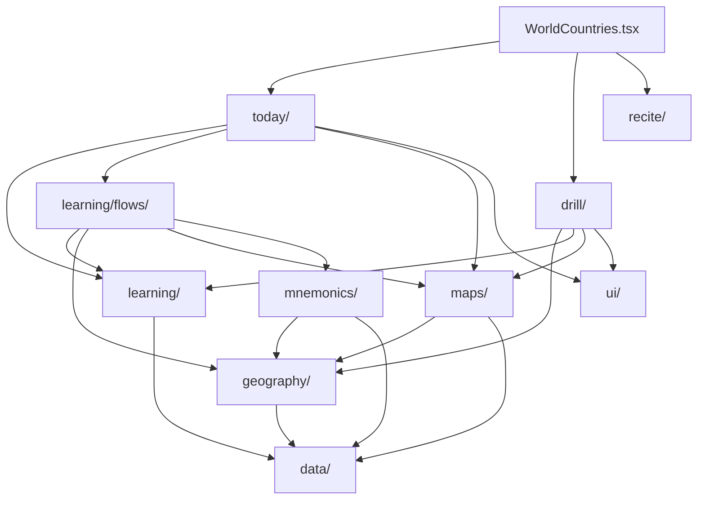

# World Countries

## Agent loading

Before modifying this feature, read this document and
`src/features/world-countries/AGENTS.md`. Load `../CORE.md` for shared
learning, mnemonic, UI, or storage behavior; load `../PERSISTENCE.md` for
persisted state, identifiers, migrations, reset, or backup; and load
`../SYSTEM.md` for public exports or app integration.

## Purpose and entry points

World Countries has three user-directed activities: **Today**, **Drill**, and
**Recite**. Today is the default map-centered plan for due core review and the
next guided Learning flow. Structural authoring is contextual rather than a
separate workflow:

- Drill's existing World Geography rail authors Continent order.
- Drill's existing Continent Geography rail authors Subregion order.
- Learning's stable Subregion rail authors Country order and the existing
  Subregion mnemonic.

`WorldCountries.tsx` resolves the Settings country-set policy once, provides
the active population, and composes Today, Drill, and Recite.
`WorldCountriesDrill.tsx` owns the Drill setup coordinator, Drill and Learn &
Practise purpose selection, active sessions, results, and the refresh boundary
that lets contextual authoring affect subsequent Learning presentation.

## Ownership

- `data/` owns canonical Country, Continent, Subregion identity, membership,
  geopolitical classification, and bundled reference data. `Country.capital`
  is the canonical Capital answer.
- `geography/` owns active-population queries, effective World -> Continent ->
  Subregion -> Country ordering, order metadata, the semantic order-saving
  seam used by contextual editors, and the feature-owned refresh signal used
  by mounted setup views after successful order writes.
- `learning/` owns recall skills, answer matching, evidence adapters,
  raw per-target history, Today introduction and review scheduling,
  proficiency, pure session mechanics, durable Subregion learning facts,
  Learning Readiness, and reusable guided Learning flows.
- `today/` owns the derived Today plan, bounded due-review queue and retry
  state, Today setup/checkpoint states, and delegation into existing Learning
  flows. It consumes learning, geography, maps, and feature-local UI but not
  Drill or Recite internals.
- `learning/flows/` owns Country and Capital Learning UI and orchestration.
  Learning modes own their milestone writes; the guided UI is not Drill
  implementation detail.
- `maps/` owns the renderer-neutral `GeographyOverviewMap` overview boundary,
  the locally bundled D3 orthographic globe and its canonical geography
  adapter, SVG loading, Country-to-SVG translation, and learning map
  presentation. The overview globe is primary and the existing SVG overview
  is a one-way fallback. The existing SVG path also owns generic
  caller-controlled Country visibility and explicit Country zoom, task-scoped
  answer-selection interaction points,
  map-owned synthetic dot metadata for visually weak source geography,
  representative learning anchors, map-owned pointer-intent resolution,
  existing Country sequence annotations, and workflow-neutral geographic
  callbacks. Globe camera/gesture state is transient renderer state; it does
  not change geography, learning, or persistence state.
- `mnemonics/` owns World Countries mnemonic target IDs, geography mnemonic
  adapters, backup behavior, read presentation, and the reusable contextual
  Subregion mnemonic editor.
- `drill/` owns Drill selection, preferences, four Drill modes,
  Learn & Practise purpose selection, shared session mechanics, Drill and
  Practice presentation, results, and World/Continent order authoring in the
  existing Geography rails. It also owns the feature-local, mutually exclusive
  Geography/proficiency setup scope. It does not expose a Drill Subregion
  detail or Country-order editor.
- `ui/` owns feature-local panels, breadcrumbs, hierarchy rows, inline reorder
  presentation, map-surface/dock presentation, task-dock status/action styling,
  the shared typed-answer lifecycle for primary World Countries recall, and
  draft movement without persistence policy. The typed-answer seam owns native
  submit handling, blank prevention, map-relative answer-feedback overlay,
  feedback state, focus/reset, and the shared 500 ms / 1800 ms lifecycle;
  workflow owners provide classification, disclosure copy, evidence, and
  transitions. The form dock owns answer entry and does not repeat result copy.
  Fuzzy is the interactive feedback exception by default: its overlay owns
  Continue and transient mini spelling practice, initially focuses Mini
  practise spelling, and creates no evidence. Drill-launched Learn & Practise
  flows may opt eligible incorrect answers into the same transient remediation
  controls; ordinary Drill, Today, and Recite incorrect answers retain their
  existing correction/retry lifecycle.
- `recite/` owns the ordered World Countries Recite setup, its three typed-recall
  modes, transient setup/session state, current-run outcomes, completion flow,
  and mode-specific latest-outcome status. It consumes geography, answer
  matching, map, and UI seams without importing Drill internals.

`CountryLearningMap`, `SvgMapView`, and `SvgMapController` remain the
precision/source-geometry renderer path for learning, answer-selection
assistance, and Country-for-Shape. Globe geometry is not a prompt source for
`shape-to-country`.

There is no broad feature `domain/`, `persistence/`, or `common/` layer and no
compatibility wrapper for the removed authoring workflow.

## Activity model

Today derives its plan from raw core evidence and applicable Learning
milestones. It reviews only `location-to-country` and `country-to-capital`,
prioritizes due review before recommending new whole-Subregion Learning, and
keeps its queue, retry state, and checkpoints transient.

The shell exposes `[ Today ] [ Drill ] [ Recite ]`, with Today selected by
default. Drill has a non-persisted Purpose selector:

- **Drill**: `Countries`, `Countries + Capitals`, `Countries from Capitals`,
  and `Country for Shape`. These are the only `WorldCountriesDrillMode` values
  and may write atomic Drill evidence according to their defined semantics.
  Country for Shape uses the ordinary Country-name answer lifecycle while the
  map adapter isolates the target's source geometry and explicitly fits it;
  incorrect feedback reveals the active Countries in that target's Subregion
  on the same mounted map and highlights the target.
- **Learn & Practise**: Learning (`Learn Countries`, `Learn Capitals`) and
  non-recording Practice (`Locate Countries`, `Locate Capitals`, `Capitals`). Learning writes
  only the durable milestone owned by its active mode. Practice retains only
  transient answers, accuracy, progress, and results.

### World mastery overview

World-level Drill setup exposes a compact, derived World core-mastery summary
above the World map. It aggregates the existing Country core recall state over
the active Country population, so the population is both the denominator and
the source of every displayed state count. A Country is complete only when the
existing Location → Country and Country → Capital core skills are Mastered;
Capital → Country remains an additional skill.

The summary is non-persisted presentation state. It is independent of Drill
purpose and mode, while activity-specific map progress, Learning Readiness, and
Recite outcomes remain separate concepts.

Learn & Practise uses the derived Drill selection. Selected Subregions run
sequentially in effective geographic order, and each uses its effective
Country order from `geography/`. An already completed Subregion remains
eligible for intentional repetition.

At Continent setup, Geography and proficiency are alternative scope sources.
Weak/Developing proficiency scope derives from the current Drill perspective,
or from the skill exercised by the selected non-recording Practice activity.
The resolved Country membership is ordered through `geography/` and snapshotted
into the active Drill/Practice session when it starts. Learn Countries and Learn
Capitals may also snapshot a non-empty proficiency Country scope for a temporary
Learning run. That run never writes a Subregion milestone or reinterprets its
Country set as a Subregion; durable Learning milestones still require complete
Subregion scope.

World Countries Learning introduces items in bounded Sets. The persisted
`New items per set` setting is snapshotted when a multi-Subregion Learning run
starts and applied independently to each Subregion. The feature-local plan
partitions each effective Country order without exceeding the selected maximum
or creating a one-item tail. Country Learning uses Review, map Location, and
typed Country-name Practice for each Set; Capital Learning uses Review and
typed Country-to-Capital Practice. After the second and later Sets, cumulative
Combined practice is inserted before the next Set, with a required full-scope
Combined practice before Final recall. A one-Set scope has no duplicate
Combined stage.

All temporary Learning Practice scopes use the shared
`core/scoring/roundScheduler.ts` through a feature-local adapter with a
non-limiting speed threshold and actual answer latency. Location, Country-name,
Capital, and Combined scopes each start fresh scheduler state. Only the
whole-Subregion ordered Final recall writes the owning Learning milestone;
journey and scheduler state are not persisted.

During active scheduler-driven Learning Practice, the flows expose temporary
scheduler progress through the feature-local progress seam in the right rail.
The progress section is session-scoped and phase-specific; the map and task
surface remain unchanged.

## Learning Readiness

Durable Learning Readiness is derived from `countriesLearnedAt` and
`capitalsLearnedAt` and has exactly three states: Not learned, Countries
learned, and Countries + Capitals learned. A display-only Drill-evidence
bridge may promote a Subregion to Countries learned when every active Country
has current Location -> Country proficiency of Developing or better. It never
writes a Learning milestone or changes Drill evidence.

Learn Capitals is runnable before Countries learning and recommends, but does
not require, Countries first.

Recite is a sibling activity with exactly three ordered modes: Countries,
Countries + Capitals, and Countries from Capitals. It resolves selected
Subregions and Countries through `geography/`, snapshots that effective order
when a run starts, and keeps retries, reveals, and completion outcomes inside
`recite/`. Recite uses typed free recall and never writes Drill evidence,
Learning milestones, Learning Readiness, or Maintenance evidence. Its setup
retains only transient per-Continent Subregion selections, mode, and map
assistance; incomplete sessions are discarded without persistence.

Recite setup colors Countries by the latest completed outcome for the selected
Recite mode. Active sessions suppress historical status and use only current-run
outcomes. `GeographyOverviewMap` and the underlying SVG controller accept
caller-selected hidden Country IDs; hidden geometry, labels, hover, clicks, and
accessible descriptions are suppressed generically, without map-layer Recite
semantics. Active Recite maps are non-interactive geographic scaffolds. Recite,
Today, Drill typed recall, standalone Practice, and Learning typed Practice and
Final recall use the feature-local typed-answer lifecycle. Exact answers
transition automatically after the shared success dwell; ordinary resolved
incorrect answers transition after the correction dwell. Recite is the workflow
exception: an incorrect answer keeps the expected answer hidden, then resets
the same prompt for another focused attempt, while Reveal / Skip resolves and
advances automatically after the correction dwell.

## Contextual authoring rules

- The effective hierarchy order comes from `geography/` for World, Continent,
  Subregion, and Country lists.
- The visible rail list is the authoring surface. `Edit order` transforms that
  list in place; it never opens a modal, overlay, drawer, second rail, side
  panel, or separate screen.
- World and Continent Drill rails edit only their represented hierarchy.
  Learning rails edit Country order only.
- Draft changes are local to the mounted context. Save writes through
  `geography/orderAuthoring.ts`; Cancel or unmount discards the draft. Reset
  canonical and map auto-order are draft-only actions requiring explicit Save.
- Subregion learning maps may render Country sequence annotations. World and
  Continent overview maps do not render custom Continent or Subregion names;
  their left rails remain the visible hierarchy-order surface. Maps never
  persist order.
- A failed order write keeps the editor open with its draft and a recoverable
  error. Existing best-effort storage helpers may silently swallow browser
  storage failures, so reliable detection of every failure is not required.
- The stable Learning Subregion rail exposes `Edit mnemonics` for the existing
  Subregion mnemonic target whenever the rail is visible. Order and mnemonic
  authoring are hidden during ordered recall, active recall, and completion.
- Drill gives concise Country-order guidance in its existing setup/map context.
  It does not add a Subregion detail, Country list, or navigation shortcut.

## Decision rules and dependencies

- Canonical identity belongs in `data/`; user order belongs in `geography/`.
- `GeographyOverviewMap` and `CountryLearningMap` report clicks and hover
  neutrally; callers decide selection, navigation, and learning behavior.
- `GeographyOverviewMap` owns the World/Continent overview renderer policy:
  bundled orthographic globe first, existing SVG overview fallback on one-time
  globe initialization/data failure. Workflow owners do not choose the
  renderer. Globe source IDs and geometry stay under `maps/`, while Country
  identity and hierarchy membership remain canonical feature data.
- `learning/flows/` may use geography and maps but never Drill internals.
- Active Learning map-backed phases use a flow-local map host with the feature
  `ui/` map surface/dock presentation. The host owns the mounted map while
  flow stages change; phase-specific content owns task status, controls, and
  dynamic map presentation through that host.
- `MapSurface` keeps lightweight context above a relative map container and
  supports optional map metadata, a centered map-relative feedback overlay,
  explicit overlay, attached, and stacked dock placement, and the one common
  World Countries expand/collapse affordance. Expansion publishes the generic
  transient `expanded-center` PageLayout presentation, keeps the same map and
  dock mounted, fits the map and its required task controls within the
  available desktop viewport, and resets when the owning surface unmounts or
  the viewport leaves `xl`. `TaskDock`
  provides compact navigation, checkpoint, form,
  hint, and completion variants; checkpoint and completion docks compose their
  status copy and action group as one unit at desktop widths. Typed Practice,
  Final Recall, and typed Drill use the form dock below the map so answer entry
  does not obscure map labels; review navigation remains a compact map overlay,
  while multiple-choice and location-click interactions may remain attached
  below the map. Learning flows choose placement by task rather than treating
  every dock as a generic card. Overlay docks attach at desktop widths and fall
  back to normal flow below `xl`.
- Primary typed World Countries recall uses `ui/WorldCountriesTypedAnswer`.
  Its owner-provided prompt key clears stale value and feedback, and its
  explicit accessible answer label is separate from visual placeholder copy.
  Enter, the Check button, and native form submission share one deduplicated
  path. Exact, fuzzy, incorrect, and revealed feedback is presented in the
  centered map-relative overlay; the dock contains only answer entry and
  answerable-state actions. Exact feedback lasts 500 ms; incorrect and
  revealed feedback lasts 1800 ms. There is no generic post-answer Continue
  or Next action. Fuzzy remediation is the accepted-answer exception by
  default: its inline overlay practice requires two consecutive exact
  spellings, focuses the spelling input while open, then focuses Continue on
  completion. Drill-launched Learn & Practise may expose the same remediation
  choice after an incorrect answer; selecting it holds that feedback until
  Continue or mini-practice completion. Today delayed-retry Skip and Recite
  Reveal / Skip remain answerable-state actions owned by those workflows.
- `SvgMapController` owns one explicit task-assistance layer for map-answer
  candidates and an intentional task target. Generic `selectableIds`,
  hoverable IDs, highlighted/progress state, semantic colors, click-handler
  presence, and map level never activate tiny-Country assistance. For an active
  answer-selection task, each candidate owns zero or more task interaction
  points. Points may be derived from compact source geometry or supplied as
  authored synthetic dots for a source Country whose genuine map geometry is
  not a usable dot-like target at the displayed scale; configured synthetic
  dots replace, rather than add to, derived component clouds. A
  location-question/task target is separate and owns at most one
  representative learning anchor; explicit multi-dot metadata is authoritative
  only for that deliberate representative decision. `SvgMapView` carries the
  generic task contract separately from ordinary map interaction, while
  `CountryLearningMap` translates canonical Country IDs and map definitions
  into SVG-level task data. Source Country paths remain authoritative for
  discovery, semantic styling, identity, direct hits, and `getBBox()`-based
  zoom. A single map-owned pointer-intent resolver evaluates exact assisted
  source geometry, then the nearest bounded interaction region, then ordinary
  selectable source geometry; its `{ Country, interaction point? }` result
  drives task hover color, local marker/ring emphasis, and click dispatch.
  Generated task geometry is presentation-only (`pointer-events` does not
  decide identity), is placed in root SVG user space through source/root CTM
  conversion, and uses screen coordinates for pointer distance and
  screen-space sizing. Positions and radii are recomputed on resize, zoom, and
  presentation changes. Hidden Countries have no task target or interaction
  point. When task assistance is absent, ordinary maps render only their
  original SVG geometry. Native geometry-derived points and authored synthetic
  dots use the same task interaction/presentation pipeline; synthetic dots are
  task-scoped map presentation and never alter canonical geography or ordinary
  map rendering.
- For the same map source, Continent, effective scope membership, and
  intentional zoom behavior, Learning updates map highlights, names, hover,
  and sequence annotations declaratively. Workflow phase alone must not
  remount the SVG or show its loading placeholder again.
- Learning Review arrows are traversal-only and stop at item boundaries.
  Safe `Enter` targets the single visible primary action in non-editing states;
  native controls retain their key behavior, and feature shortcuts are
  suppressed for modifiers, repeats, editable controls, absent/disabled
  actions, and timer-owned feedback. Ready/gate status uses polite accessible
  status semantics and focuses its primary action after transition.
- Active Drill question queues are constructed at session start and are not
  mutated by later order edits. Random versus In-order Drill scheduling is
  independent from authored geographic order.
- Recite question queues are constructed at session start from effective
  Subregion/Country order and are not mutated by later population or order
  changes. Recite mode and map assistance are fixed for the run; only the
  typed prompt/task controls advance it.
- Standard PageLayout geometry, `useRails`, `useLayoutHeader`, drawer behavior,
  and rail widths remain unchanged. `MapSurface` may publish the transient
  expanded-center presentation through the shared PageLayout context; this
  generically suppresses registered header and rail presentation without
  moving expansion state or breakout CSS into Today, Drill, Practice, Learning,
  or Recite.
- Today follows the World Countries map-centered spatial grammar: the map and
  immediate primary task stay in the center, geographic context stays in the
  left rail, and Today workflow/session status and controls stay in the right
  rail. Today owns this presentation and remains independent from Drill
  workflow internals.

## Persistence

- Existing World, Continent, and Subregion metadata keys and schemas remain
  unchanged.
- The feature exposes order-only Settings export/import/reset through the
  existing version-3 Geography JSON family. Export returns raw saved World,
  Continent, and Subregion metadata without materializing canonical rows;
  restore replaces all three saved metadata collections, reset clears them,
  and neither action writes Geography mnemonics or learning/activity state.
- `world-countries-subregion-learning` retains independent milestone fields
  and active membership fingerprint behavior.
- Geography mnemonics remain in the shared IndexedDB `mnemonics` store with
  existing `geo:*` target IDs.
- `world-countries-drill-preferences` remains the owner of the last Continent,
  selected Subregion IDs, actual Drill mode, and Drill order. Purpose state and
  Learn & Practise mode are not added to this schema.
- Proficiency filter selection and any resolved Country membership remain
  transient Drill setup/session state; no resolved Country list or new
  persistence key is stored.
- `major-settings` owns the persisted World Countries `New items per set`
  preference (`3`, `4`, `5`, or `all`), defaulting to `3`. No intermediate
  Learning plan, scheduler, or resume record is persisted.
- `world-countries-recite-progress` owns versioned latest-completed Recite
  outcomes keyed by `(ReciteMode, CountryId)`, including completion timestamps.
  It stores no flattened session sequence, setup preference, incomplete run, or
  prompt history. Recite outcomes are independent from Drill attempts and
  Learning milestones.
- Atomic Drill and Today review evidence continue to use the existing attempts
  store and `world-countries:<skill>:<CountryId>` IDs. Practice never writes it.
- Today reads raw core evidence through `learning/recallHistory.ts` and writes
  ordinary `recall` evidence through the existing feature adapter. It owns no
  schedule, plan, queue, retry, or checkpoint persistence.
- A persisted legacy Drill `mode: "capitals"` remains invalid under the
  current four-mode union and falls back to the normal `countries` default.
  No migration is performed.

## Invariants

- Country IDs and Subregion IDs are runtime identity; persistence and
  workflows do not reconstruct identity from labels or SVG IDs.
- Effective hierarchy order can reorder existing members but cannot add
  Countries or Subregions.
- Contextual authoring is non-recording. It does not start Learning, Practice,
  Drill, or Recite and does not write evidence, proficiency, milestones,
  Practice progress, Drill preferences, or mnemonic data when saving order.
- Drill setup and active recall are separate phases. Practice is separate in
  presentation and durable effects even when it shares session mechanics.
- Geographic Learning completion is per Subregion and per owned milestone.
  Proficiency Learning completion is temporary and does not create a partial
  Subregion milestone. Successful Learn Capitals completion never clears or
  fabricates Countries learning.
- Active Drill recall suppresses map progress treatments until feedback.
- Geography and proficiency scope sources are never combined. Selecting
  proficiency clears Subregions; selecting a Subregion, Entire Continent, or
  a map Country clears proficiency filters.
- Proficiency-derived Drill/Practice sessions retain their concrete Country
  membership for the session lifetime, even if later evidence changes.
- Proficiency-derived Learning runs retain their concrete Country membership for
  the run lifetime and do not write Learning milestones.
- Country-set changes do not delete attempts or change atomic target IDs.
- Temporary Set and Combined scheduler progress is session-only and never
  writes Drill evidence or Learning milestones.
- Primary typed-answer interaction is workflow-neutral presentation and
  lifecycle only. Classification, answer disclosure, evidence, queue or
  scheduler mutation, Recite outcomes, and Learning repair semantics remain
  owned by Today, Drill, Learning, or Recite.
- Final recall is mandatory for Learning completion; skipped temporary scopes
  cannot fabricate Ready state or completion evidence.
- Workflow folders do not depend on sibling workflow internals.
- World Countries persistence does not modify unrelated feature state.
- Globe rotation, focus pose, projection scale, and pointer gesture state are
  transient and are never persisted.

## Source anchors

- `src/features/world-countries/WorldCountries.tsx`
- `src/features/world-countries/drill/WorldCountriesDrill.tsx`
- `src/features/world-countries/drill/DrillSetup.tsx`
- `src/features/world-countries/ui/WorldMasterySummary.tsx`
- `src/features/world-countries/geography/effectiveOrder.ts`
- `src/features/world-countries/today/WorldCountriesToday.tsx`
- `src/features/world-countries/today/TodayReviewSession.tsx`
- `src/features/world-countries/today/todayPlan.ts`
- `src/features/world-countries/learning/recallHistory.ts`
- `src/features/world-countries/learning/todayIntroduction.ts`
- `src/features/world-countries/learning/reviewSchedule.ts`
- `src/features/world-countries/drill/DrillSetupRails.tsx`
- `src/features/world-countries/drill/drillProficiencyScope.ts`
- `src/features/world-countries/drill/drillProgressPresentation.ts`
- `src/features/world-countries/recite/WorldCountriesRecite.tsx`
- `src/features/world-countries/ui/WorldCountriesTypedAnswer.tsx`
- `src/features/world-countries/recite/reciteSession.ts`
- `src/features/world-countries/recite/reciteProgress.ts`
- `src/features/world-countries/recite/recitePresentation.ts`
- `src/features/world-countries/drill/DrillSession.tsx`
- `src/features/world-countries/ui/WorldCountriesAnswerFeedback.tsx`
- `src/features/world-countries/ui/MiniSpellingPractice.tsx`
- `src/features/world-countries/learning/flows/CountryLearningFlow.tsx`
- `src/features/world-countries/learning/flows/CapitalLearningFlow.tsx`
- `src/features/world-countries/learning/stagedLearningPlan.ts`
- `src/features/world-countries/learning/schedulerLearningSession.ts`
- `src/features/world-countries/learning/stagedCountryLearningFlow.ts`
- `src/features/world-countries/learning/stagedCapitalLearningFlow.ts`
- `src/features/world-countries/learning/flows/GuidedLearningRails.tsx`
- `src/features/world-countries/geography/queries.ts`
- `src/features/world-countries/geography/orderBackup.ts`
- `src/features/world-countries/geography/geographyRefresh.ts`
- `src/features/world-countries/geography/orderAuthoring.ts`
- `src/features/world-countries/maps/GeographyOverviewMap.tsx`
- `src/features/world-countries/maps/OrthographicGlobe.tsx`
- `src/features/world-countries/maps/globeGeography.ts`
- `src/features/world-countries/maps/globeFocus.ts`
- `src/features/world-countries/maps/learningAnchors.ts`
- `src/features/world-countries/maps/learningAnchors.test.ts`
- `src/features/world-countries/maps/geographyMapAdapter.ts`
- `src/features/world-countries/learning/CountryLearningMap.tsx`
- `src/features/world-countries/mnemonics/GeographyMnemonicEditor.tsx`
- `src/features/world-countries/ui/InlineOrderEditor.tsx`
- `src/app/layout/PageLayoutContext.tsx`

The durable Learning-versus-Practice boundary remains recorded in ADR 0024.
