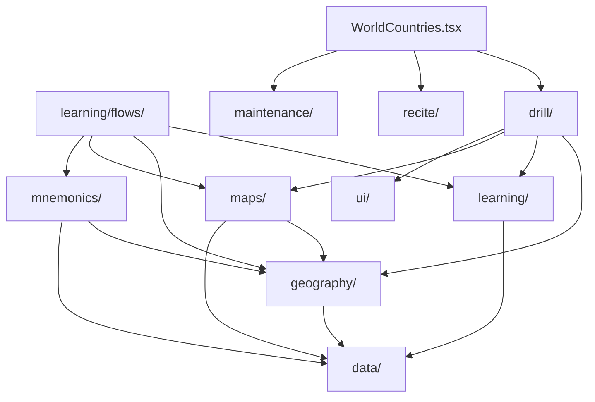

# World Countries

## Agent loading

Before modifying this feature, read this document and
`src/features/world-countries/AGENTS.md`. Load `../CORE.md` for shared
learning, mnemonic, UI, or storage behavior; load `../PERSISTENCE.md` for
persisted state, identifiers, migrations, reset, or backup; and load
`../SYSTEM.md` for public exports or app integration.

## Purpose and entry points

World Countries has two user-directed activities: **Drill** and **Recite**.
**Due review** is a separate system-directed Maintenance action. Structural
authoring is contextual rather than a separate workflow:

- Drill's existing World Geography rail authors Continent order.
- Drill's existing Continent Geography rail authors Subregion order.
- Learning's stable Subregion rail authors Country order and the existing
  Subregion mnemonic.

`WorldCountries.tsx` resolves the Settings country-set policy once, provides
the active population, and composes Drill, Recite, and Maintenance.
`WorldCountriesDrill.tsx` owns the Drill setup coordinator, Drill and Learn &
Practise purpose selection, active sessions, results, and the refresh boundary
that lets contextual authoring affect subsequent Learning presentation.

## Ownership

- `data/` owns canonical Country, Continent, Subregion identity, membership,
  geopolitical classification, and bundled reference data. `Country.capital`
  is the canonical Capital answer.
- `geography/` owns active-population queries, effective World -> Continent ->
  Subregion -> Country ordering, order metadata, the semantic order-saving
  seam used by contextual editors, and the feature-owned refresh signal used
  by mounted setup views after successful order writes.
- `learning/` owns recall skills, answer matching, evidence adapters,
  proficiency, pure session mechanics, durable Subregion learning facts,
  Learning Readiness, and reusable guided Learning flows.
- `learning/flows/` owns Country and Capital Learning UI and orchestration.
  Learning modes own their milestone writes; the guided UI is not Drill
  implementation detail.
- `maps/` owns SVG loading, Country-to-SVG translation, overview and learning
  map presentation, existing Country sequence annotations, and workflow-neutral
  geographic callbacks.
- `mnemonics/` owns World Countries mnemonic target IDs, geography mnemonic
  adapters, backup behavior, read presentation, and the reusable contextual
  Subregion mnemonic editor.
- `drill/` owns Drill selection, preferences, exactly three Drill modes,
  Learn & Practise purpose selection, shared session mechanics, Drill and
  Practice presentation, results, and World/Continent order authoring in the
  existing Geography rails. It also owns the feature-local, mutually exclusive
  Geography/proficiency setup scope. It does not expose a Drill Subregion
  detail or Country-order editor.
- `ui/` owns feature-local panels, breadcrumbs, hierarchy rows, inline reorder
  presentation, map-surface/dock presentation, task-dock status/action styling,
  and draft movement without persistence policy.
- `recite/` owns the ordered World Countries Recite setup, its three typed-recall
  modes, transient setup/session state, current-run outcomes, completion flow,
  and mode-specific latest-outcome status. It consumes geography, answer
  matching, map, and UI seams without importing Drill internals.
- `maintenance/` is a separate sibling workflow owner. It may consume shared
  World Countries evidence without importing Drill internals.

There is no broad feature `domain/`, `persistence/`, or `common/` layer and no
compatibility wrapper for the removed authoring workflow.

## Activity model

The shell exposes `[ Drill ] [ Recite ]` and a separate `Due review` action.
Drill has a non-persisted Purpose selector:

- **Drill**: `Countries`, `Countries + Capitals`, and `Countries from
  Capitals`. These are the only `WorldCountriesDrillMode` values and may
  write atomic Drill evidence according to their defined semantics.
- **Learn & Practise**: Learning (`Learn Countries`, `Learn Capitals`) and
  non-recording Practice (`Locate Countries`, `Locate Capitals`, `Capitals`). Learning writes
  only the durable milestone owned by its active mode. Practice retains only
  transient answers, accuracy, progress, and results.

### World mastery overview

World-level Drill setup exposes a compact, derived World core-mastery summary
above the World map. It aggregates the existing Country core recall state over
the active Country population, so the population is both the denominator and
the source of every displayed state count. A Country is complete only when the
existing Location → Country and Country → Capital core skills are Mastered;
Capital → Country remains an additional skill.

The summary is non-persisted presentation state. It is independent of Drill
purpose and mode, while activity-specific map progress, Learning Readiness, and
Recite outcomes remain separate concepts.

Learn & Practise uses the derived Drill selection. Selected Subregions run
sequentially in effective geographic order, and each uses its effective
Country order from `geography/`. An already completed Subregion remains
eligible for intentional repetition.

At Continent setup, Geography and proficiency are alternative scope sources.
Weak/Developing proficiency scope derives from the current Drill perspective,
or from the skill exercised by the selected non-recording Practice activity.
The resolved Country membership is ordered through `geography/` and snapshotted
into the active Drill/Practice session when it starts. Learn Countries and Learn
Capitals may also snapshot a non-empty proficiency Country scope for a temporary
Learning run. That run never writes a Subregion milestone or reinterprets its
Country set as a Subregion; durable Learning milestones still require complete
Subregion scope.

World Countries Learning introduces items in bounded Sets. The persisted
`New items per set` setting is snapshotted when a multi-Subregion Learning run
starts and applied independently to each Subregion. The feature-local plan
partitions each effective Country order without exceeding the selected maximum
or creating a one-item tail. Country Learning uses Review, map Location, and
typed Country-name Practice for each Set; Capital Learning uses Review and
typed Country-to-Capital Practice. After the second and later Sets, cumulative
Combined practice is inserted before the next Set, with a required full-scope
Combined practice before Final recall. A one-Set scope has no duplicate
Combined stage.

All temporary Learning Practice scopes use the shared
`core/scoring/roundScheduler.ts` through a feature-local adapter with a
non-limiting speed threshold and actual answer latency. Location, Country-name,
Capital, and Combined scopes each start fresh scheduler state. Only the
whole-Subregion ordered Final recall writes the owning Learning milestone;
journey and scheduler state are not persisted.

## Learning Readiness

Durable Learning Readiness is derived from `countriesLearnedAt` and
`capitalsLearnedAt` and has exactly three states: Not learned, Countries
learned, and Countries + Capitals learned. A display-only Drill-evidence
bridge may promote a Subregion to Countries learned when every active Country
has current Location -> Country proficiency of Developing or better. It never
writes a Learning milestone or changes Drill evidence.

Learn Capitals is runnable before Countries learning and recommends, but does
not require, Countries first.

Recite is a sibling activity with exactly three ordered modes: Countries,
Countries + Capitals, and Countries from Capitals. It resolves selected
Subregions and Countries through `geography/`, snapshots that effective order
when a run starts, and keeps retries, reveals, and completion outcomes inside
`recite/`. Recite uses typed free recall and never writes Drill evidence,
Learning milestones, Learning Readiness, or Maintenance evidence. Its setup
retains only transient per-Continent Subregion selections, mode, and map
assistance; incomplete sessions are discarded without persistence.

Recite setup colors Countries by the latest completed outcome for the selected
Recite mode. Active sessions suppress historical status and use only current-run
outcomes. `GeographyOverviewMap` and the underlying SVG controller accept
caller-selected hidden Country IDs; hidden geometry, labels, hover, clicks, and
accessible descriptions are suppressed generically, without map-layer Recite
semantics. Active Recite maps are non-interactive geographic scaffolds.

## Contextual authoring rules

- The effective hierarchy order comes from `geography/` for World, Continent,
  Subregion, and Country lists.
- The visible rail list is the authoring surface. `Edit order` transforms that
  list in place; it never opens a modal, overlay, drawer, second rail, side
  panel, or separate screen.
- World and Continent Drill rails edit only their represented hierarchy.
  Learning rails edit Country order only.
- Draft changes are local to the mounted context. Save writes through
  `geography/orderAuthoring.ts`; Cancel or unmount discards the draft. Reset
  canonical and map auto-order are draft-only actions requiring explicit Save.
- Subregion learning maps may render Country sequence annotations. World and
  Continent overview maps do not render custom Continent or Subregion names;
  their left rails remain the visible hierarchy-order surface. Maps never
  persist order.
- A failed order write keeps the editor open with its draft and a recoverable
  error. Existing best-effort storage helpers may silently swallow browser
  storage failures, so reliable detection of every failure is not required.
- The stable Learning Subregion rail exposes `Edit mnemonics` for the existing
  Subregion mnemonic target whenever the rail is visible. Order and mnemonic
  authoring are hidden during ordered recall, active recall, and completion.
- Drill gives concise Country-order guidance in its existing setup/map context.
  It does not add a Subregion detail, Country list, or navigation shortcut.

## Decision rules and dependencies

- Canonical identity belongs in `data/`; user order belongs in `geography/`.
- `GeographyOverviewMap` and `CountryLearningMap` report clicks and hover
  neutrally; callers decide selection, navigation, and learning behavior.
- `learning/flows/` may use geography and maps but never Drill internals.
- Active Learning map-backed phases use a flow-local map host with the feature
  `ui/` map surface/dock presentation. The host owns the mounted map while
  flow stages change; phase-specific content owns task status, controls, and
  dynamic map presentation through that host.
- `MapSurface` keeps lightweight context above a relative map container and
  supports optional map metadata plus explicit overlay, attached, and stacked
  dock placement. `TaskDock` provides compact navigation, checkpoint, form,
  hint, and completion variants; checkpoint and completion docks compose their
  status copy and action group as one unit at desktop widths. Typed Practice,
  Final Recall, and typed Drill use the form dock below the map so answer entry
  does not obscure map labels; review navigation remains a compact map overlay,
  while multiple-choice and location-click interactions may remain attached
  below the map. Learning flows choose placement by task rather than treating
  every dock as a generic card. Overlay docks attach at desktop widths and fall
  back to normal flow below `xl`.
- For the same map source, Continent, effective scope membership, and
  intentional zoom behavior, Learning updates map highlights, names, hover,
  and sequence annotations declaratively. Workflow phase alone must not
  remount the SVG or show its loading placeholder again.
- Learning Review arrows are traversal-only and stop at item boundaries.
  Safe `Enter` targets the single visible primary action in non-editing states;
  native controls retain their key behavior, and feature shortcuts are
  suppressed for modifiers, repeats, editable controls, absent/disabled
  actions, and timer-owned feedback. Ready/gate status uses polite accessible
  status semantics and focuses its primary action after transition.
- Active Drill question queues are constructed at session start and are not
  mutated by later order edits. Random versus In-order Drill scheduling is
  independent from authored geographic order.
- Recite question queues are constructed at session start from effective
  Subregion/Country order and are not mutated by later population or order
  changes. Recite mode and map assistance are fixed for the run; only the
  typed prompt/task controls advance it.
- PageLayout geometry, `useRails`, `useLayoutHeader`, drawer behavior, and rail
  widths remain unchanged.

## Persistence

- Existing World, Continent, and Subregion metadata keys and schemas remain
  unchanged.
- The feature exposes order-only Settings export/import/reset through the
  existing version-3 Geography JSON family. Export returns raw saved World,
  Continent, and Subregion metadata without materializing canonical rows;
  restore replaces all three saved metadata collections, reset clears them,
  and neither action writes Geography mnemonics or learning/activity state.
- `world-countries-subregion-learning` retains independent milestone fields
  and active membership fingerprint behavior.
- Geography mnemonics remain in the shared IndexedDB `mnemonics` store with
  existing `geo:*` target IDs.
- `world-countries-drill-preferences` remains the owner of the last Continent,
  selected Subregion IDs, actual Drill mode, and Drill order. Purpose state and
  Learn & Practise mode are not added to this schema.
- Proficiency filter selection and any resolved Country membership remain
  transient Drill setup/session state; no resolved Country list or new
  persistence key is stored.
- `major-settings` owns the persisted World Countries `New items per set`
  preference (`3`, `4`, `5`, or `all`), defaulting to `3`. No intermediate
  Learning plan, scheduler, or resume record is persisted.
- `world-countries-recite-progress` owns versioned latest-completed Recite
  outcomes keyed by `(ReciteMode, CountryId)`, including completion timestamps.
  It stores no flattened session sequence, setup preference, incomplete run, or
  prompt history. Recite outcomes are independent from Drill attempts and
  Learning milestones.
- Atomic Drill evidence continues to use the existing attempts store and
  `world-countries:<skill>:<CountryId>` IDs. Practice never writes it.
- A persisted legacy Drill `mode: "capitals"` remains invalid under the
  current three-mode union and falls back to the normal `countries` default.
  No migration is performed.

## Invariants

- Country IDs and Subregion IDs are runtime identity; persistence and
  workflows do not reconstruct identity from labels or SVG IDs.
- Effective hierarchy order can reorder existing members but cannot add
  Countries or Subregions.
- Contextual authoring is non-recording. It does not start Learning, Practice,
  Drill, or Recite and does not write evidence, proficiency, milestones,
  Practice progress, Drill preferences, or mnemonic data when saving order.
- Drill setup and active recall are separate phases. Practice is separate in
  presentation and durable effects even when it shares session mechanics.
- Geographic Learning completion is per Subregion and per owned milestone.
  Proficiency Learning completion is temporary and does not create a partial
  Subregion milestone. Successful Learn Capitals completion never clears or
  fabricates Countries learning.
- Active Drill recall suppresses map progress treatments until feedback.
- Geography and proficiency scope sources are never combined. Selecting
  proficiency clears Subregions; selecting a Subregion, Entire Continent, or
  a map Country clears proficiency filters.
- Proficiency-derived Drill/Practice sessions retain their concrete Country
  membership for the session lifetime, even if later evidence changes.
- Proficiency-derived Learning runs retain their concrete Country membership for
  the run lifetime and do not write Learning milestones.
- Country-set changes do not delete attempts or change atomic target IDs.
- Temporary Set and Combined scheduler progress is session-only and never
  writes Drill evidence or Learning milestones.
- Final recall is mandatory for Learning completion; skipped temporary scopes
  cannot fabricate Ready state or completion evidence.
- Workflow folders do not depend on sibling workflow internals.
- World Countries persistence does not modify unrelated feature state.

## Source anchors

- `src/features/world-countries/WorldCountries.tsx`
- `src/features/world-countries/drill/WorldCountriesDrill.tsx`
- `src/features/world-countries/drill/DrillSetup.tsx`
- `src/features/world-countries/drill/WorldMasterySummary.tsx`
- `src/features/world-countries/drill/DrillSetupRails.tsx`
- `src/features/world-countries/drill/drillProficiencyScope.ts`
- `src/features/world-countries/drill/drillProgressPresentation.ts`
- `src/features/world-countries/recite/WorldCountriesRecite.tsx`
- `src/features/world-countries/recite/reciteSession.ts`
- `src/features/world-countries/recite/reciteProgress.ts`
- `src/features/world-countries/recite/recitePresentation.ts`
- `src/features/world-countries/drill/DrillSession.tsx`
- `src/features/world-countries/learning/flows/CountryLearningFlow.tsx`
- `src/features/world-countries/learning/flows/CapitalLearningFlow.tsx`
- `src/features/world-countries/learning/stagedLearningPlan.ts`
- `src/features/world-countries/learning/schedulerLearningSession.ts`
- `src/features/world-countries/learning/stagedCountryLearningFlow.ts`
- `src/features/world-countries/learning/stagedCapitalLearningFlow.ts`
- `src/features/world-countries/learning/flows/GuidedLearningRails.tsx`
- `src/features/world-countries/geography/queries.ts`
- `src/features/world-countries/geography/orderBackup.ts`
- `src/features/world-countries/geography/geographyRefresh.ts`
- `src/features/world-countries/geography/orderAuthoring.ts`
- `src/features/world-countries/maps/GeographyOverviewMap.tsx`
- `src/features/world-countries/maps/geographyMapAdapter.ts`
- `src/features/world-countries/learning/CountryLearningMap.tsx`
- `src/features/world-countries/mnemonics/GeographyMnemonicEditor.tsx`
- `src/features/world-countries/ui/InlineOrderEditor.tsx`
- `src/app/layout/PageLayoutContext.tsx`

The durable Learning-versus-Practice boundary remains recorded in ADR 0024.
