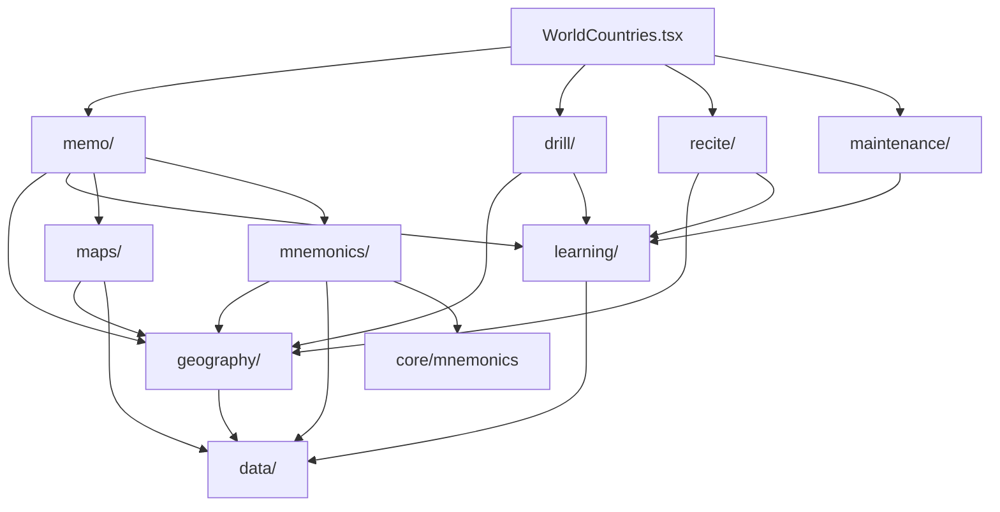

# World Countries

## Agent loading

Before modifying this feature, read
`src/features/world-countries/AGENTS.md` and this document. Normally remain in
`src/features/world-countries/` plus direct dependencies.

Load additional context only when triggered:

- shared learning, mnemonic, UI, or storage behavior →
  [CORE.md](../CORE.md);
- persisted state, identifiers, migration, reset, or backup →
  [PERSISTENCE.md](../PERSISTENCE.md);
- public exports, app integration, or cross-feature ownership →
  [SYSTEM.md](../SYSTEM.md).

Do not scan sibling features or load ADR 0007–0011 for ordinary work. The
current result of those decisions is documented here.

## Purpose

World Countries is one application with three user-directed activities:
Memo teaches geography and authors memory structures; Drill is deliberate
practice over a chosen scope; Recite is complete ordered recall. Maintenance is
a separate system-directed review capability. The feature owns canonical
geography, geography-specific learning and mnemonic adapters, map
infrastructure, workflows, and World Countries persistence.

## Entry points

- `WorldCountries.tsx` composes Memo, Drill, Recite, and a high-level
  Maintenance entry; capability rules do not belong here.
- `index.ts` is the public boundary.
- `memo/WorldCountriesMemo.tsx` is the implemented instructional workflow
  entry.
- `drill/WorldCountriesDrill.tsx`, `recite/WorldCountriesRecite.tsx`, and
  `maintenance/WorldCountriesMaintenance.tsx` are their workflow entries.
- `maps/workarea/MapWorkarea.tsx` is an experimental app-visible map surface.

## Ownership

- `data/` — canonical Country, Continent, Subregion identity, membership,
  classification, and bundled reference data.
- `geography/` — geography queries, user-authored Subregion metadata, effective
  Country order, and metadata persistence.
- `learning/` — answer matching, reusable session mechanics, pure learning-flow
  state, durable Subregion learning facts, and their store.
- `maps/` — SVG controller/view, map definitions/assets, Country-to-SVG
  adapters, temporary display-label overrides, and experimental workarea.
- `mnemonics/` — feature target IDs, geography mnemonic semantics, feature
  backup envelope, and adapters over shared mnemonic storage.
- `memo/` — instructional navigation, maps, mnemonic UI, Memo rail
  composition, Subregion country learning orchestration, and the sortable
  Subregion learning-order editor.
- `drill/`, `recite/`, `maintenance/` — sibling workflow owners for deliberate
  practice, complete recall, and review selection.

There is no World Countries Quiz architecture. Do not recreate `quiz/`, broad
feature-local `domain/` or `persistence/` layers, generic `common/`, a root
`learning.ts`, or compatibility wrappers for removed internal paths.

## Decision rules

- Canonical geography content or identity belongs in `data/`.
- Queries and user-specific Subregion metadata/order belong in `geography/`.
- Answer evaluation, reusable recall/session mechanics, and learning state
  belong in `learning/`; Memo-specific orchestration stays in `memo/`.
- SVG loading, DOM behavior, assets, definitions, and ID translation belong in
  `maps/`; learning policy does not.
- Geography mnemonic target construction, metadata, and backup rules belong in
  `mnemonics/`; generic record/image mechanics stay in `core/mnemonics`.
- A capability shared by workflows must not be owned by one workflow folder.
  Workflow folders are siblings and do not import one another's internals.
- Pure and impure modules may share a capability owner. Do not create generic
  `domain/` or `persistence/` buckets solely to separate them technically.
- `WorldCountries.tsx` composes capabilities. It does not decide membership,
  learning transitions, scheduling, map translation, or mnemonic identity.

## Dependencies

Unless stated otherwise, arrows mean dependency:

The feature also consumes `core/types`, `core/storage`, `core/mnemonics`, and
narrow app integration contracts for settings, overlays, and page rails.
`MapWorkarea` and Memo's feature-owned rail composition publish rails through
the current app layout integration seam.

## Persistence

- `world-countries-subregion-metadata` stores user-authored
  `SubregionMetadata.countryOrder` rows through `geography/`.
- `world-countries-subregion-learning` stores durable Subregion learning facts
  through `learning/`.
- Geography mnemonics use the shared IndexedDB `mnemonics` store with `geo:*`
  target IDs. Subregion mnemonic records also retain the Country IDs/order they
  describe so stale stories can be detected.
- The feature's version-2 JSON backup envelope contains both Geography
  mnemonics and Subregion metadata; the import also accepts the older
  mnemonic-only format.

Load [PERSISTENCE.md](../PERSISTENCE.md) before changing any of these. World
Countries structural work may reset its own state when necessary, but must not
change Pi, Major System, Cards, global settings, or shared database ownership.

## Public boundary

Consumers outside this feature import from `@/features/world-countries`.
`index.ts` currently exports only `WorldCountries` and `MapWorkarea`, matching
the app mode registry. Internal stores, queries, session mechanics, mnemonic
adapters, and map adapters remain private until a real external consumer exists.

## Invariants

- `Country.id` and `Country.subregionId` are required runtime identity. Normal
  code reads them directly and does not reconstruct them from labels, dataset
  positions, slugs, or SVG IDs.
- `CountryId` and SVG ID are distinct. Translation belongs in `maps/`; workflows
  and persistence use `CountryId`.
- `data/` is authoritative for Country membership and classification.
  `SubregionMetadata.countryOrder` changes order only; it cannot add non-member
  Countries.
- `SubregionMetadata.countryOrder` is the durable user-authored sequence. Memo's
  Subregion order editor keeps drag-and-drop changes in a local draft until the
  user explicitly saves; keyboard-accessible reordering is required.
- `learning/countryLearningFlow.ts` owns pure state and transitions;
  `memo/subregion/CountryLearningFlow.tsx` owns Memo UI orchestration.
- Memo overview rail composition owns the World → Continent → Subregion
  navigation and scope presentation: World Continents and progress use the left
  rail, Continent Subregions and progress use the left rail, and Subregion
  learning context/order uses the left rail while its mnemonic uses the right
  rail.
- Memo's safe learning phases retain the compact learning context and mnemonic
  rails; ordered recall and completion omit answer-revealing rails. The full
  Subregion order editor opens in a larger overlay; the compact order remains
  feature context in the left rail.
- `SvgMapController` remains imperative and framework-independent. It owns SVG
  loading, validation, discovery, styling, hover, labels, highlights, zoom,
  listeners, and cleanup—not geography learning rules. Temporary label
  overrides are per-controller presentation state and must not mutate the
  discovered `SvgMapCountry.name` metadata or bundled SVG assets.
- `SvgMapView.tsx` is the React adapter around that controller.
- Workflow folders do not depend on sibling workflow internals.
- World Countries persistence does not modify unrelated feature state.

## Source anchors

- `src/features/world-countries/WorldCountries.tsx`
- `src/features/world-countries/index.ts`
- `src/features/world-countries/data/countries.ts`
- `src/features/world-countries/data/subregions.ts`
- `src/features/world-countries/geography/queries.ts`
- `src/features/world-countries/learning/countryLearningFlow.ts`
- `src/features/world-countries/maps/SvgMapController.ts`
- `src/features/world-countries/mnemonics/geographyMnemonics.ts`
- `src/features/world-countries/memo/WorldCountriesMemo.tsx`
- `src/features/world-countries/memo/WorldCountriesMemoRails.tsx`

## Historical rationale

The current architecture described above resolves:

- [ADR 0007](../../adr/0007-world-countries-memo.md)
- [ADR 0008](../../adr/0008-subregion-identity-metadata-country-order.md)
- [ADR 0009](../../adr/0009-subregion-memo-country-learning-workflow.md)
- [ADR 0010](../../adr/0010-world-countries-feature-architecture.md)
- [ADR 0011](../../adr/0011-world-countries-capability-ownership-correction.md)

These ADRs are not required to understand the current structure. Load a
specific one only when historical rationale is needed.
